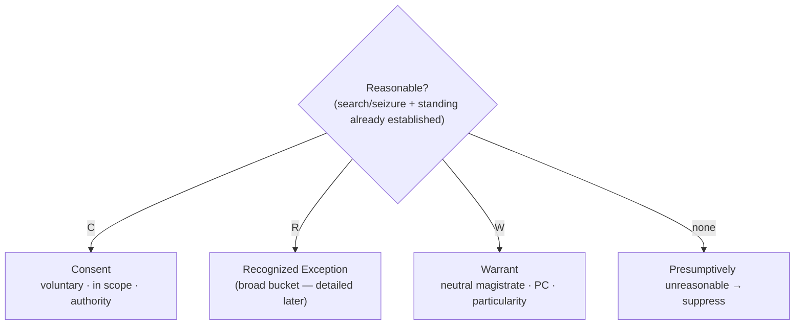

## Rule
Once you have established that a **search or seizure occurred** and that the claimant has **standing**, the only remaining question is whether the government action was **reasonable**. **C.R.E.W.** is the field checklist for that last step — a search or seizure is reasonable when it rests on **at least one** of three justifications:

- **C — Consent.** Voluntary consent by the person, or by a third party with **common authority** over the place or thing. Voluntariness is judged on the totality of the circumstances, and the search may not exceed the scope of the consent given.
- **R — Recognized Exception.** One of the established exceptions to the warrant requirement (e.g., exigent circumstances, search incident to arrest, the automobile exception, plain view, inventory, *Terry* frisks). This is the **broad bucket** — the full catalog is developed later in the course.
- **W — Warrant.** A valid warrant: issued by a **neutral magistrate**, on **probable cause**, **particularly describing** the place to be searched and the things to be seized.

If none of the three applies, the search or seizure is presumptively **unreasonable**, and its fruits are subject to suppression.

## Nuances & limits
- **The warrant is the baseline; consent and exceptions justify going without one.** Warrantless searches are presumptively unreasonable, subject only to a few established and well-delineated exceptions. That principle and its case law are developed in [[Fourth Amendment Framework]].
- **C.R.E.W. is the *reasonableness* step, not the threshold.** Don't reach for it until you have confirmed that a search/seizure occurred and the claimant has standing. If there was no Fourth Amendment event at all, no justification is needed. See [[Fourth Amendment Analysis Checklist]].
- **"Recognized Exception" is a placeholder for a whole syllabus.** Each exception has its own elements and scope limits; naming the bucket is not the same as satisfying an exception. Match the facts to a specific exception's requirements.
- **Articulate the justification.** Whichever letter you rely on, be ready to articulate *why* it applies and tie it to specific facts. See [[Three Golden Rules]] ("Strive for Five").

## Common pitfalls
- **Treating C.R.E.W. as the *whole* analysis.** It is only step 5 (reasonableness). A defective threshold or standing analysis is not cured by a good justification.
- **Assuming consent is automatically valid.** It must be voluntary and within scope; a third party must have actual (or apparent) common authority — see [[Abandonment]] on common authority.
- **Reciting an exception as a magic word.** "Exigent circumstances" or "plain view" without the facts the exception actually requires will not carry the reasonableness burden.

## Visual

## Sources
- C.R.E.W. is an instructor mnemonic, not a case. Its legal backbone — the warrant requirement and its recognized exceptions — is developed in [[Fourth Amendment Framework]] and the linked doctrine pages.
