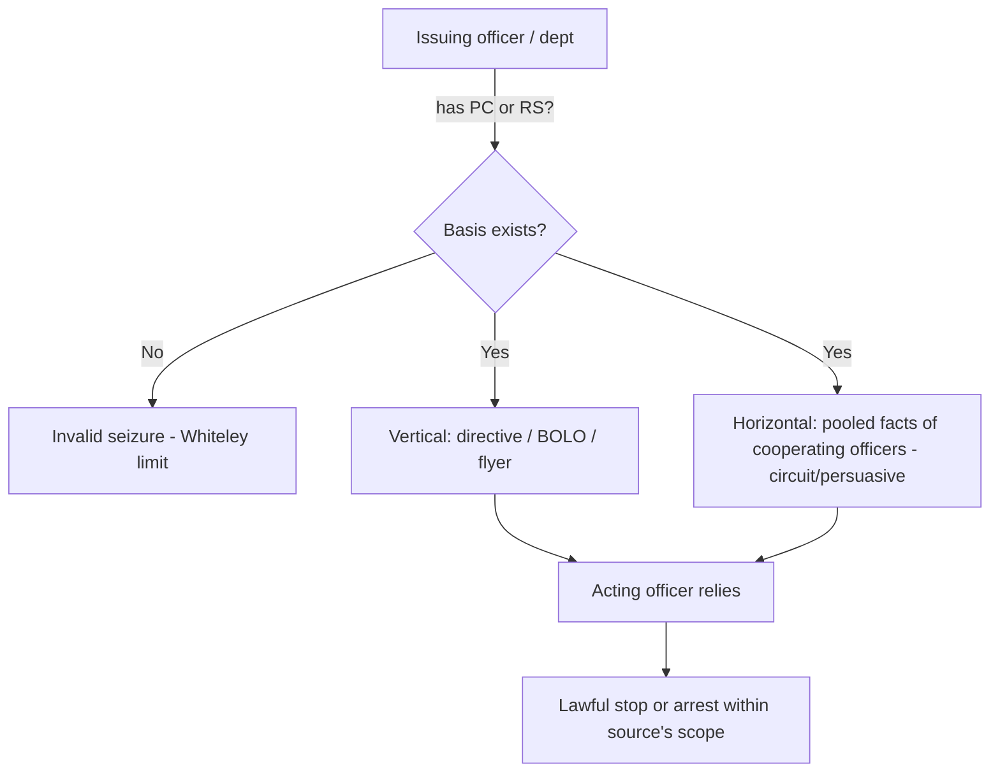

# Collective Knowledge and the Fellow-Officer Rule

## Rule

Under the collective-knowledge (fellow-officer) doctrine, the [[Probable Cause and Reasonable Suspicion|probable cause or reasonable suspicion]] held by one officer can be imputed to another who acts at his direction. An officer who makes a stop or arrest in objective reliance on a bulletin, flyer, or radio dispatch is presumed to be acting on the requisite quantum, and need not personally possess all the underlying facts. But the doctrine pools knowledge — it never manufactures it: if the issuing officer or department in fact lacked the necessary basis, the resulting [[Seizure of the Person|seizure]] is invalid regardless of the acting officer's good-faith reliance.

## Key cases

| Case | Holding (one line) | Weight | CourtListener |
|---|---|---|---|
| *Whiteley v. Warden*, 401 U.S. 560 (1971) | Officers may rely on a radio bulletin and assume the issuer had PC; but if the issuer lacked PC, reliance on fellow officers cannot cure the missing basis. | SCOTUS — binding | [opinion](https://www.courtlistener.com/opinion/108297/whiteley-v-warden-wyoming-state-penitentiary/) |
| *United States v. Hensley*, 469 U.S. 221 (1985) | Extends Whiteley to Terry stops: a stop in reliance on a wanted flyer is lawful only if the issuing department had reasonable suspicion grounded in articulable facts. | SCOTUS — binding | [opinion](https://www.courtlistener.com/opinion/111294/united-states-v-hensley/) |

## Nuances & limits

- **Two distinct modes.** *Vertical* imputation runs along a chain of command or communication: an officer-with-PC/RS issues a directive (BOLO, flyer, dispatch), and the acting officer may execute it without independently knowing the facts. *Horizontal* pooling aggregates the facts known across cooperating officers working a common investigation to satisfy the threshold collectively. Note the doctrine's scope: it supplies the *who-knew-what* layer beneath PC/RS — it imputes the quantum across officers and applies to searches, warrants, and arrests, not only to seizures of persons.
- **The Whiteley limit (source must actually have it).** *Whiteley* makes clear that "an otherwise illegal arrest cannot be insulated from challenge by the decision of the instigating officer to rely on fellow officers to make the arrest" (401 U.S. at 568). No basis at the source means no valid seizure downstream.
- **Hensley's RS extension and intrusiveness cap.** *Hensley* holds that reliance on a flyer justifies a stop "if a flyer or bulletin has been issued on the basis of articulable facts supporting a reasonable suspicion that the wanted person has committed an offense ... If the flyer has been issued in the absence of a reasonable suspicion, then a stop in the objective reliance upon it violates the Fourth Amendment" (469 U.S. at 232-33). The Court further conditioned admissibility on the stop being "not significantly more intrusive than would have been permitted the issuing department" (469 U.S. at 233) — the acting officer cannot exceed the scope the source's basis would have authorized. See [[Terry Stops and Reasonable Suspicion]].
- **Horizontal pooling is largely circuit-developed (persuasive).** No single SCOTUS holding adopts a pure horizontal-pooling rule; the imputation of pooled/aggregated reasonable suspicion among cooperating officers has been built out by the federal courts of appeals and should be labeled **persuasive (circuit-developed)**, not treated as a settled nationwide SCOTUS rule. *Whiteley* and *Hensley* squarely supply only the vertical, directive-based prong.

## Common pitfalls

- **Assuming the BOLO cures a missing factual basis.** A flyer, dispatch, or warrant request does not create PC or RS — it merely transmits whatever the issuer actually had. If suppression litigation traces the bulletin back to an empty factual basis, the seizure falls (*Whiteley*; *Hensley*). This recurs in dispatch-driven [[Traffic Stops]], where the acting officer's stop is only as good as the issuer's underlying basis.
- **Conflating vertical reliance with horizontal pooling.** Reliance on a directive (vertical) is anchored in binding SCOTUS authority; aggregating scattered facts among on-scene officers (horizontal) rests on persuasive circuit law. Instructors should keep the two prongs separate and not present pooled-knowledge theories as SCOTUS-blessed.
- **Forgetting the intrusiveness ceiling.** Under *Hensley*, the acting officer inherits the *scope* the source's quantum would justify; escalating beyond an RS stop on the strength of a flyer issued only on RS is unsupported.

## Visual

## Flashcards

Whiteley v. Warden — what does the fellow-officer rule allow, and where does it stop?::An officer may act on a radio bulletin and assume the issuer had PC; but if the issuing officer actually lacked PC, reliance on fellow officers cannot insulate the arrest (401 U.S. at 568).
United States v. Hensley — how does it extend Whiteley?::It applies the collective-knowledge rule to Terry stops: a stop on a wanted flyer is lawful only if the issuing department had reasonable suspicion grounded in articulable facts (469 U.S. at 232-33).
Vertical vs. horizontal collective knowledge?::Vertical = an officer acts on a directive from another who has PC/RS (binding SCOTUS, Whiteley/Hensley); horizontal = facts pooled across cooperating officers (largely circuit-developed, persuasive).
Does collective knowledge create probable cause?::No. It pools or imputes knowledge that already exists; it can never manufacture PC or RS that was never present at the source.

## Sources

- [Whiteley v. Warden, 401 U.S. 560 (1971)](https://www.courtlistener.com/opinion/108297/whiteley-v-warden-wyoming-state-penitentiary/)
- [United States v. Hensley, 469 U.S. 221 (1985)](https://www.courtlistener.com/opinion/111294/united-states-v-hensley/)
