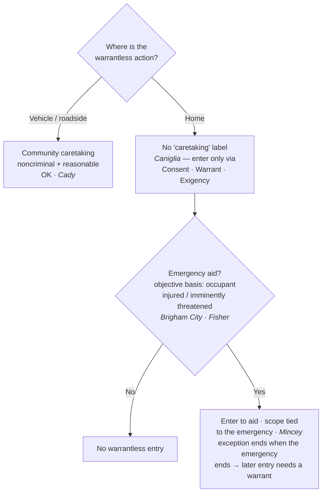

## Rule
Keep **three distinct doctrines** apart — do not collapse them into one "exigency" blur:

1. **Community caretaking** — a **vehicle / outside-the-home** concept. Police perform many functions with cars (disabled vehicles, accidents, impounds) that are "totally divorced" from criminal investigation, and a warrantless caretaking handling of a vehicle can be reasonable. *Cady v. Dombrowski*, 413 U.S. 433, 441 (1973). This is **not** exigency at all — it is a separate, vehicle-specific rationale. See [[Automobile Exception]].
2. **Emergency aid** — an **inside-the-home** doctrine and a **branch of exigent circumstances**: police may enter a home without a warrant when they have an **objectively reasonable basis** to believe an occupant is seriously injured or imminently threatened, and the officer's **subjective motive is irrelevant**. *Brigham City v. Stuart*, 547 U.S. 398, 400, 404 (2006); *Michigan v. Fisher*, 558 U.S. 45 (2009) (per curiam). See [[Arrest in the Home]].
3. **Exigent circumstances** — the **parent category**. Emergency aid is one branch; the family also includes hot pursuit, imminent destruction of evidence, and escape. Different triggers, different scopes.

These do **not** merge: there is **no freestanding "community caretaking" exception that authorizes warrantless entry into a home**. *Caniglia v. Strom*, 593 U.S. 194 (2021). To get into a house you need consent, a warrant, or a genuine exigency/emergency — the caretaking label is for the car at the roadside, not the front door.

## Key cases
| Case (Bluebook) | Holding in one line | Weight | CourtListener |
|---|---|---|---|
| *Cady v. Dombrowski*, 413 U.S. 433 (1973) | Coins "community caretaking functions" in the **vehicle** context; a warrantless caretaking search of an impounded car for a firearm was reasonable — the doctrine rests on the car/home distinction. | SCOTUS — binding | [link](https://www.courtlistener.com/opinion/108850/cady-v-dombrowski/) |
| *Mincey v. Arizona*, 437 U.S. 385 (1978) | **No "murder-scene" exception** — the seriousness of the crime does not by itself create exigency; but warrantless entry to render **immediate aid** (and a prompt sweep for other victims/a killer) is allowed, scope limited to the emergency. | SCOTUS — binding | [link](https://www.courtlistener.com/opinion/109905/mincey-v-arizona/) |
| *Brigham City v. Stuart*, 547 U.S. 398 (2006) | **Emergency-aid** entry of a home is lawful on an **objectively reasonable basis** to believe an occupant is seriously injured or imminently threatened; the officer's subjective motivation is irrelevant. | SCOTUS — binding | [link](https://www.courtlistener.com/opinion/145654/brigham-city-v-stuart/) |
| *Michigan v. Fisher*, 558 U.S. 45 (2009) (per curiam) | Applies *Brigham City*: emergency-aid entry upheld; officers need **no ironclad proof** of a serious injury and need not turn out to be right — the test is objective reasonableness at the moment of entry. | SCOTUS — binding | [link](https://www.courtlistener.com/opinion/1755/michigan-v-fisher/) |
| *Caniglia v. Strom*, 593 U.S. 194 (2021) | There is **no freestanding "community caretaking" exception** authorizing warrantless entry into the **home**; *Cady*'s rationale was vehicle-specific and does not transplant to the house. | SCOTUS — binding | [link](https://www.courtlistener.com/opinion/4883694/caniglia-v-strom/) |

## Nuances & limits
- **Caretaking is for cars, not crime — and the rationale is the car/home line.** Police "engage in what, for want of a better term, may be described as community caretaking functions, totally divorced from the detection, investigation, or acquisition of evidence relating to the violation of a criminal statute." *Cady*, 413 U.S. at 441. The doctrine grew out of the **ambulatory character of vehicles** and their lesser expectation of privacy — the constitutional difference between a car and a home. That car/home distinction is exactly why *Caniglia* was inevitable: the rationale does not carry the home's protection with it.
- **The emergency-aid standard (in-home) is objective and totality-based.** The controlling formulation:
  > "[P]olice may enter a home without a warrant when they have an objectively reasonable basis for believing that an occupant is seriously injured or imminently threatened with such injury." — *Brigham City*, 547 U.S. at 400.

  The trigger is the objective reasonableness of the belief at the moment of entry, not the officer's certainty about what is happening inside.
- **Subjective motive does not matter — both directions.** "The officer's subjective motivation is irrelevant." *Brigham City*, 547 U.S. at 404. A bad or mixed motive does not defeat an objectively reasonable entry, and a pure good-faith hunch with no objective basis does not create one.
- **No ironclad proof; judged at the moment of entry.** "This 'emergency aid exception' does not depend on the officers' subjective intent or the seriousness of any crime they are investigating when the emergency arises." *Fisher*, 558 U.S. at 47. And the inquiry "is not what [the officer] believed, but whether there was 'an objectively reasonable basis for believing' that medical assistance was needed, or persons were in danger." *Id.* at 49. Officers need not be right in hindsight.
- **Aid is allowed; crime-seriousness is not the trigger.** "[T]he Fourth Amendment does not bar police officers from making warrantless entries and searches when they reasonably believe that a person within is in need of immediate aid." *Mincey*, 437 U.S. at 392. But "[w]e decline to hold that the seriousness of the offense under investigation itself creates exigent circumstances of the kind that under the Fourth Amendment justify a warrantless search." *Id.* at 393–94. There is no "murder-scene" exception.
- **Scope is tied to the emergency — but the limit is not a freeze-after-aid.** The entry is justified only to address the emergency; once the injured are aided and the danger is resolved, the warrant exception ends and continued searching needs its own justification. *Mincey* rejected the generalized, days-long search of a homicide scene on exactly this ground. *Mincey*, 437 U.S. at 393. The flip side is **affirmative**: emergency responders may make a **prompt sweep for other victims or a perpetrator still on scene** — the scope limit forbids a *general crime-scene search*, not the immediate protective/rescue sweep itself.
- **The dissipation rule is general, not homicide-only — fire scenes show it too.** The same principle recurs outside homicide. An entry to fight a fire is an exigency needing no warrant, and "officials need no warrant to remain in a building for a reasonable time to investigate the cause of a blaze after it has been extinguished." *Michigan v. Tyler*, 436 U.S. 499, 510 (1978). But once that reasonable time lapses, "additional entries to investigate the cause of the fire must be made pursuant to the warrant procedures governing administrative searches." *Id.* at 511. *Michigan v. Clifford*, 464 U.S. 287 (1984) (**plurality** — weight accordingly) refines this: reasonableness "turns on several factors: whether there are legitimate privacy interests in the fire-damaged property . . . ; whether exigent circumstances justify the government intrusion . . . ; and, whether the object of the search is to determine the cause of fire or to gather evidence of criminal activity." *Id.* at 292. If "the primary object of the search is to gather evidence of criminal activity, a criminal search warrant may be obtained only on a showing of probable cause." *Id.* at 294. **Lesson:** the emergency-entry justification ends when the emergency ends; later evidence-gathering entries need a warrant — whether the scene is a homicide (*Mincey*) or a fire (*Tyler/Clifford*).
- **No caretaking shortcut into the home — but don't overstate *Caniglia*.** A recognition of the existence of "community caretaking" tasks, "like rendering aid to motorists in disabled vehicles, is not an open-ended license to perform them anywhere," and the lower court's caretaking rule "goes beyond anything this Court has recognized." *Caniglia*, 593 U.S. at 196–98. *Caniglia* refuses to extend the **caretaking label** to homes; it does **not** abolish exigent-circumstances or emergency-aid home entries. Welfare checks, suicide-prevention, and aid to the injured still run through *Brigham City* / *Fisher* / *Mincey* (the *Alito* and *Kavanaugh* concurrences say so expressly). Post-*Caniglia*, vehicle community-caretaking survives (*Cady*) while home welfare-checks must route through emergency aid / exigency — *Caniglia* polices the label, not the underlying emergency power.

## Common pitfalls
- **Importing "community caretaking" into the home.** Post-*Caniglia* this is the headline error: caretaking justifies handling a car at the roadside, not walking into a house. To enter a home you need consent, a warrant, or a genuine exigency/emergency aid.
- **Reading *Caniglia* as abolishing emergency-aid entries.** It does not. Emergency aid and exigent circumstances survive intact; *Caniglia* only rejects a freestanding caretaking exception for the home.
- **Collapsing the three doctrines.** Officers blur "exigent circumstances," "emergency aid," and "community caretaking." They have different triggers and scopes: emergency aid is a *branch* of exigency, while community caretaking is a *vehicle* doctrine that is not exigency at all. Naming the wrong doctrine in a report invites suppression.
- **Relying on the officer's good intentions.** The standard is **objective** (*Brigham City*, *Fisher*). A subjective hunch of trouble is not enough; conversely a bad subjective motive does not defeat an objectively reasonable entry.
- **Treating a serious crime as automatic exigency.** *Mincey*: seriousness alone is not exigency — no murder-scene exception.
- **Overstaying the emergency — and assuming it's a homicide-only rule.** Scope must stay tied to addressing the emergency; once it is resolved, continued warrantless searching is unlawful. This dissipation rule is **not** unique to murder scenes — fire scenes are the classic second example (*Tyler/Clifford*). A lawful initial entry does not bless a later evidence-gathering one.

## Visual

## Flashcards
- Where does "community caretaking" apply, and where does it not?::Vehicles / outside the home (*Cady*). It is **not** a freestanding exception for the home — *Caniglia* refused to extend the label to houses.
- State the emergency-aid standard for entering a home.::Police may enter without a warrant on an "objectively reasonable basis for believing that an occupant is seriously injured or imminently threatened with such injury"; subjective motive is irrelevant (*Brigham City*, 547 U.S. at 400, 404).
- Does *Caniglia* eliminate emergency-aid home entries?::No — it rejects only a freestanding *community-caretaking* exception for the home. Emergency aid and exigent circumstances survive (*Brigham City* / *Fisher* / *Mincey*).
- Is a serious crime, by itself, an exigency?::No — *Mincey*: there is no "murder-scene" exception; seriousness alone does not justify a warrantless search. Officers may still enter to render immediate aid, scope limited to the emergency.
- How much proof of injury does emergency aid require?::No ironclad proof, and officers need not be right; the test is objective reasonableness at the moment of entry — "not what [the officer] believed, but whether there was an objectively reasonable basis" (*Fisher*, 558 U.S. at 49).
- Name the three distinct doctrines this page keeps apart, and how they relate.::(1) **Community caretaking** — a vehicle doctrine, not exigency at all (*Cady*); (2) **emergency aid** — a home-entry doctrine that is one **branch** of (3) **exigent circumstances**, the parent category (hot pursuit, evidence-destruction, escape, emergency aid). Different triggers and scopes — don't collapse them.
- Does the "emergency over → exception ends" rule apply only to homicide scenes?::No — it is a general principle. Fire scenes are the classic second example: officials may remain a reasonable time to investigate a blaze's cause, but later evidence-gathering entries need a warrant (*Michigan v. Tyler*, 436 U.S. at 510–11; *Michigan v. Clifford* (plurality)).
- What sweep may emergency responders perform, and what is off-limits?::A **prompt sweep for other victims or a perpetrator** still on scene is allowed; a **general crime-scene search** is not (*Mincey*). The scope limit forbids the general search, not the immediate protective/rescue sweep.

## Sources
- *Cady v. Dombrowski*, 413 U.S. 433 (1973) — https://www.courtlistener.com/opinion/108850/cady-v-dombrowski/
- *Mincey v. Arizona*, 437 U.S. 385 (1978) — https://www.courtlistener.com/opinion/109905/mincey-v-arizona/
- *Brigham City v. Stuart*, 547 U.S. 398 (2006) — https://www.courtlistener.com/opinion/145654/brigham-city-v-stuart/
- *Michigan v. Fisher*, 558 U.S. 45 (2009) (per curiam) — https://www.courtlistener.com/opinion/1755/michigan-v-fisher/
- *Caniglia v. Strom*, 593 U.S. 194 (2021) — https://www.courtlistener.com/opinion/4883694/caniglia-v-strom/
- *Michigan v. Tyler*, 436 U.S. 499 (1978) — https://www.courtlistener.com/opinion/109874/michigan-v-tyler/
- *Michigan v. Clifford*, 464 U.S. 287 (1984) (plurality) — https://www.courtlistener.com/opinion/111057/michigan-v-clifford/
