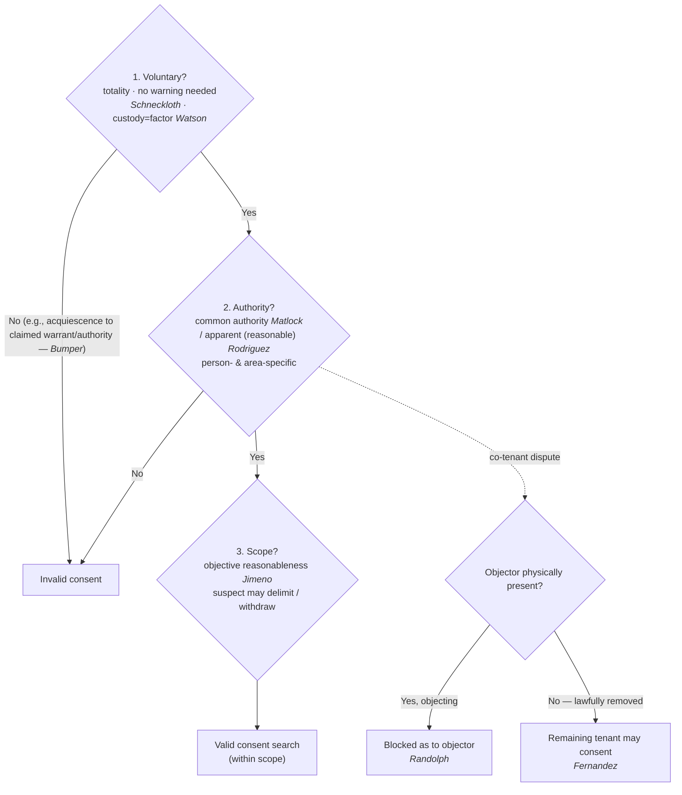

## Rule
Consent is a **recognized, warrant-free justification** for a search — the "C" of CREW. A consent search is valid only when **three prongs** all line up. (1) **Voluntariness** — consent must be voluntary, judged on the **totality of the circumstances**, with **no requirement** that the person be warned of, or know, the right to refuse. *Schneckloth v. Bustamonte*, 412 U.S. 218, 227 (1973); custody is a factor, not a veto, *United States v. Watson*, 423 U.S. 411, 424 (1976). But voluntariness has a **floor**: consent that is mere **acquiescence to a claim of lawful authority** (e.g., an officer's assertion that he has a warrant) is **not** voluntary. *Bumper v. North Carolina*, 391 U.S. 543, 548–50 (1968). (2) **Authority** — the consenter must have **actual common authority** over the place or effects (mutual use / joint access, not title), *United States v. Matlock*, 415 U.S. 164, 171 n.7 (1974), or **apparent authority** that a reasonable officer would credit, *Illinois v. Rodriguez*, 497 U.S. 177, 188 (1990). (3) **Scope** — the search may not exceed what a **reasonable person** would understand the consent to cover, and the suspect may **delimit** that scope. *Florida v. Jimeno*, 500 U.S. 248, 251–52 (1991). Among co-occupants, a **physically present, objecting** co-tenant defeats another's consent (*Georgia v. Randolph*) — but only while present; once lawfully removed, the remaining occupant may consent (*Fernandez v. California*).

## Key cases
| Case (Bluebook) | Holding in one line | Weight | CourtListener |
|---|---|---|---|
| *Schneckloth v. Bustamonte*, 412 U.S. 218 (1973) | Voluntariness of consent is a **totality-of-the-circumstances** question of fact; the government need **not** prove the person knew of the right to refuse (no Miranda-style warning required). | SCOTUS — binding | [link](https://www.courtlistener.com/opinion/108800/schneckloth-v-bustamonte/) |
| *Bumper v. North Carolina*, 391 U.S. 543 (1968) | **Voluntariness floor:** consent that is mere **acquiescence to a claim of lawful authority** (officer asserts a warrant) is **invalid** — the government cannot carry its burden by showing submission to claimed authority. | SCOTUS — binding | [link](https://www.courtlistener.com/opinion/107716/bumper-v-north-carolina/) |
| *United States v. Watson*, 423 U.S. 411 (1976) | **Custody alone** never demonstrates coerced consent; being under arrest is one **factor** in the voluntariness totality, not per se coercion. | SCOTUS — binding | [link](https://www.courtlistener.com/opinion/109352/united-states-v-watson/) |
| *United States v. Drayton*, 536 U.S. 194 (2002) / *Ohio v. Robinette*, 519 U.S. 33 (1996) | **No-warning rule:** officers need **not** advise of the right to refuse a search (*Drayton*) or tell a stopped motorist he is "free to go" (*Robinette*) for consent to be voluntary. | SCOTUS — binding | [Drayton](https://www.courtlistener.com/opinion/121153/united-states-v-drayton/) · [Robinette](https://www.courtlistener.com/opinion/118066/ohio-v-robinette/) |
| *United States v. Matlock*, 415 U.S. 164 (1974) | **Common authority** (mutual use / joint access, not property title) lets a co-occupant consent against an **absent** co-occupant who assumed the risk. | SCOTUS — binding | [link](https://www.courtlistener.com/opinion/108967/united-states-v-matlock/) |
| *Illinois v. Rodriguez*, 497 U.S. 177 (1990) | **Apparent authority** — a reasonable, even if mistaken, belief that the consenter had common authority validates the entry; judged by an objective standard. | SCOTUS — binding | [link](https://www.courtlistener.com/opinion/112475/illinois-v-rodriguez/) |
| *Florida v. Jimeno*, 500 U.S. 248 (1991) | **Scope** of consent = **objective reasonableness**; general consent to search a car for drugs reaches containers that could hold drugs; the suspect may **delimit** it. | SCOTUS — binding | [link](https://www.courtlistener.com/opinion/112595/florida-v-jimeno/) |
| *Georgia v. Randolph*, 547 U.S. 103 (2006) | A **physically present, expressly objecting** co-occupant's refusal prevails over another tenant's consent — invalid as to the objector. | SCOTUS — binding | [link](https://www.courtlistener.com/opinion/145669/georgia-v-randolph/) |
| *Fernandez v. California*, 571 U.S. 292 (2014) | *Randolph* applies only while the objector is **present**; once **objectively-reasonably removed** (e.g., arrested), the remaining occupant may validly consent. | SCOTUS — binding | [link](https://www.courtlistener.com/opinion/2654534/fernandez-v-california/) |

## Nuances & limits
- **Voluntariness is the whole prong-one ballgame — and no warning is required.** Whether consent was "voluntary" or "the product of duress or coercion, express or implied, is a question of fact to be determined from the totality of all the circumstances." *Schneckloth*, 412 U.S. at 227. Knowledge of the right to refuse is merely a factor: "While knowledge of the right to refuse consent is one factor to be taken into account, the government need not establish such knowledge as the *sine qua non* of an effective consent." *Id.* Unlike *Miranda*, there is **no consent-search warning**.
- **No "free to refuse / free to go" advisory is required either.** *Schneckloth*'s no-warning rule is concrete in the encounter context: officers "need not establish [knowledge of the right to refuse] as the *sine qua non* of an effective consent." *Drayton*, 536 U.S. at 206–07 (quoting *Schneckloth*, 412 U.S. at 227). In *Drayton*, "[a]lthough Officer Lang did not inform respondents of their right to refuse the search, he did request permission to search, and the totality of the circumstances indicates that their consent was voluntary." *Id.* at 207. Same for a traffic stop: the Fourth Amendment does not require that "a lawfully seized defendant must be advised that he is 'free to go' before his consent to search will be recognized as voluntary. We hold that it does not." *Robinette*, 519 U.S. at 35; "[I]t would be unrealistic to require police officers to always inform detainees that they are free to go before a consent to search may be deemed voluntary." *Id.* at 39–40. (*Robinette* arises in the stop context — see [[Traffic Stops]]; for the consent↔seizure boundary and when an encounter is consensual vs. a seizure, see [[Seizure of the Person]] and [[Terry Stops and Reasonable Suspicion]].)
- **But there is a floor: acquiescence to a claim of authority is not consent.** When the government relies on consent, "he has the burden of proving that the consent was, in fact, freely and voluntarily given. This burden cannot be discharged by showing no more than acquiescence to a claim of lawful authority." *Bumper*, 391 U.S. at 548–49. An officer who claims a warrant "announces in effect that the occupant has no right to resist the search. The situation is instinct with coercion—albeit colorably lawful coercion. Where there is coercion there cannot be consent." *Id.* at 550. So prong one is a spectrum: no warning is required (*Schneckloth* / *Drayton* / *Robinette*), but a false or bare assertion of authority converts "yes" into mere submission (*Bumper*).
- **Custody is a factor, not a veto.** Detained — even handcuffed — people **can** consent. In *Watson*, "[h]e had been arrested and was in custody, but his consent was given while on a public street, not in the confines of the police station. Moreover, the fact of custody alone has never been enough in itself to demonstrate a coerced confession or consent to search." 423 U.S. at 424. **Caveat on setting:** *Watson*'s consent arose on a public street; consent obtained from a person held **at the station** was a question *Schneckloth* expressly **reserved** (412 U.S. at 240–41 & n.29). The more custodial and coercive the setting, the heavier the government's burden on the totality.
- **Authority means actual common authority — or a reasonable belief in it.** Common authority "rests . . . on mutual use of the property by persons generally having joint access or control for most purposes, so that it is reasonable to recognize that any of the co-inhabitants has the right to permit the inspection in his own right and that the others have assumed the risk that one of their number might permit the common area to be searched." *Matlock*, 415 U.S. at 171 n.7. It is **mutual use, not property title** — and that is why "the consent of one who possesses common authority over premises or effects is valid as against the absent, nonconsenting person with whom that authority is shared." *Id.* at 170. (The assumption-of-risk logic links to [[Abandonment]]. It predates *Matlock*: in *Frazier v. Cupp*, 394 U.S. 731, 740 (1969), the defendant, "in allowing Rawls to use the bag and in leaving it in his house, must be taken to have assumed the risk that Rawls would allow someone else to look inside" — the co-user **Rawls**, a joint user, could consent to the bag's search.)
- **Authority is person- and area-specific.** Because authority flows from what the consenter actually shares, a driver's general consent to search "the car" does **not** automatically reach a **passenger's personal bag** the driver has no common authority over. Frame it as objective reasonableness plus common authority, not a bright line: the question is whether a reasonable officer would understand the consent — and the consenter's authority — to extend to that item.
- **Apparent authority must be objectively reasonable.** *Rodriguez* validates a warrantless entry "based upon the consent of a third party whom the police, at the time of the entry, reasonably believe to possess common authority over the premises, but who in fact does not do so." 497 U.S. at 179. The belief is "judged against an objective standard: would the facts available to the officer at the moment . . . 'warrant a man of reasonable caution in the belief' that the consenting party had authority over the premises?" *Id.* at 188. If a reasonable officer would **doubt** the authority, ambiguity triggers a duty to **inquire further** before relying on the consent (*id.* at 188–89).
- **Scope is objective, and the suspect controls it.** "The standard for measuring the scope of a suspect's consent under the Fourth Amendment is that of 'objective' reasonableness — what would the typical reasonable person have understood by the exchange between the officer and the suspect?" *Jimeno*, 500 U.S. at 251. General consent to search a car for drugs therefore reaches closed containers inside that might hold drugs. But the consenter sets the limits: "A suspect may of course delimit as he chooses the scope of the search to which he consents." *Id.* at 252.
- **Right to limit — and to withdraw — consent.** The right to **limit** scope at the outset is settled SCOTUS law (*Jimeno*'s "delimit as he chooses," 500 U.S. at 252). Federal circuits broadly recognize the corollary that consent, once given, may be **withdrawn or revoked** by an unequivocal act or statement before the search concludes, at which point the officer must stop absent independent justification. **Flag:** this withdrawal corollary is **circuit-level (persuasive), not a SCOTUS holding** — present it as a recognized principle anchored in *Jimeno*'s scope-control language, not as settled Supreme Court doctrine.
- **Co-occupants: present objector wins; removed objector loses the veto.** When co-tenants disagree, "a physically present co-occupant's stated refusal to permit entry prevails, rendering the warrantless search unreasonable and invalid as to him." *Randolph*, 547 U.S. at 106. But that holding "was limited to situations in which the objecting occupant is physically present." *Fernandez*, 571 U.S. at 296. Once the objector is lawfully gone, the remaining occupant may consent — the test asks not the officers' subjective intent but whether "the removal of the potential objector is not objectively reasonable." *Id.* at 302. A lawful arrest is fine; a **staged** removal to manufacture a "yes" is not.

## Common pitfalls
- **Thinking you must Mirandize or warn before asking to search.** *Schneckloth*: no warning required — but voluntariness is still scrutinized on the totality.
- **Believing you must tell someone they're "free to leave" or "free to refuse" first.** *Drayton* / *Robinette*: no such advisory is required; voluntariness is still totality-tested.
- **Claiming a warrant (or asserting a right to search) to pressure a "yes."** *Bumper*: consent that is mere acquiescence to claimed lawful authority is invalid — the government can't carry its burden with submission to asserted authority.
- **Assuming handcuffs or arrest automatically void consent.** *Watson*: custody is a factor, not per se coercion. (And the burden climbs as the setting grows more station-house and coercive.)
- **Treating any closed container as off-limits under a general consent.** *Jimeno*: general consent to search a car for drugs reaches containers that might hold drugs — unless the suspect limited it.
- **Letting a driver consent away a passenger's effects.** Authority is person-/area-specific (*Matlock* common authority); the driver lacks common authority over a passenger's personal bag.
- **Relying on "apparent authority" when a reasonable officer would doubt it.** *Rodriguez* requires the belief to be objectively reasonable; ambiguity triggers a duty to inquire.
- **Searching over a present co-tenant's objection — or manufacturing his removal.** *Randolph*: the present objector's "no" controls. *Fernandez*: removal must be objectively reasonable, not staged to get the other tenant's "yes."

## Visual

## Flashcards
- What are the three prongs of a valid consent search?::(1) Voluntariness (totality of circumstances, no warning needed — *Schneckloth*); (2) Authority (actual common authority *Matlock* or apparent authority *Rodriguez*); (3) Scope (objective reasonableness, suspect may delimit — *Jimeno*).
- Must police warn a person of the right to refuse before a consent search?::No — *Schneckloth*, 412 U.S. at 227: voluntariness is judged on the totality; knowledge of the right to refuse is one factor, not a prerequisite.
- Can a handcuffed or arrested person give valid consent?::Yes — *Watson*, 423 U.S. at 424: custody alone never demonstrates coercion; it is one factor in the voluntariness totality (heavier burden in a station-house setting).
- What is "common authority," and can it bind an absent co-occupant?::Mutual use / joint access or control (not property title); a co-occupant with it may consent against an **absent** co-occupant who assumed the risk (*Matlock*, 415 U.S. at 171 n.7).
- How does the law treat a present, objecting co-tenant versus one who is removed?::A physically present objector's refusal defeats the other tenant's consent (*Randolph*); once the objector is objectively-reasonably removed (e.g., arrested), the remaining occupant may consent (*Fernandez*).
- Is consent valid if a person only "agrees" after an officer says he has a warrant?::No — *Bumper*, 391 U.S. at 548–50: the government cannot meet its burden by showing mere acquiescence to a claim of lawful authority; a claimed warrant is "instinct with coercion," and "[w]here there is coercion there cannot be consent."
- Must officers tell someone they are "free to refuse" or "free to go" before consent counts?::No — *Drayton*, 536 U.S. at 206–07 (no advisory of the right to refuse a search) and *Robinette*, 519 U.S. at 35, 39–40 (no "free to go" advisory to a stopped motorist); voluntariness is still totality-tested.
- What does Frazier v. Cupp add to common authority?::Assumption of risk — by letting Rawls use the shared bag, the defendant "assumed the risk that Rawls would allow someone else to look inside" (*Frazier v. Cupp*, 394 U.S. at 740); a joint user can consent.

## Sources
- *Schneckloth v. Bustamonte*, 412 U.S. 218 (1973) — https://www.courtlistener.com/opinion/108800/schneckloth-v-bustamonte/
- *Bumper v. North Carolina*, 391 U.S. 543 (1968) — https://www.courtlistener.com/opinion/107716/bumper-v-north-carolina/
- *United States v. Watson*, 423 U.S. 411 (1976) — https://www.courtlistener.com/opinion/109352/united-states-v-watson/
- *United States v. Drayton*, 536 U.S. 194 (2002) — https://www.courtlistener.com/opinion/121153/united-states-v-drayton/
- *Ohio v. Robinette*, 519 U.S. 33 (1996) — https://www.courtlistener.com/opinion/118066/ohio-v-robinette/
- *Frazier v. Cupp*, 394 U.S. 731 (1969) — https://www.courtlistener.com/opinion/107913/frazier-v-cupp/
- *United States v. Matlock*, 415 U.S. 164 (1974) — https://www.courtlistener.com/opinion/108967/united-states-v-matlock/
- *Illinois v. Rodriguez*, 497 U.S. 177 (1990) — https://www.courtlistener.com/opinion/112475/illinois-v-rodriguez/
- *Florida v. Jimeno*, 500 U.S. 248 (1991) — https://www.courtlistener.com/opinion/112595/florida-v-jimeno/
- *Georgia v. Randolph*, 547 U.S. 103 (2006) — https://www.courtlistener.com/opinion/145669/georgia-v-randolph/
- *Fernandez v. California*, 571 U.S. 292 (2014) — https://www.courtlistener.com/opinion/2654534/fernandez-v-california/
