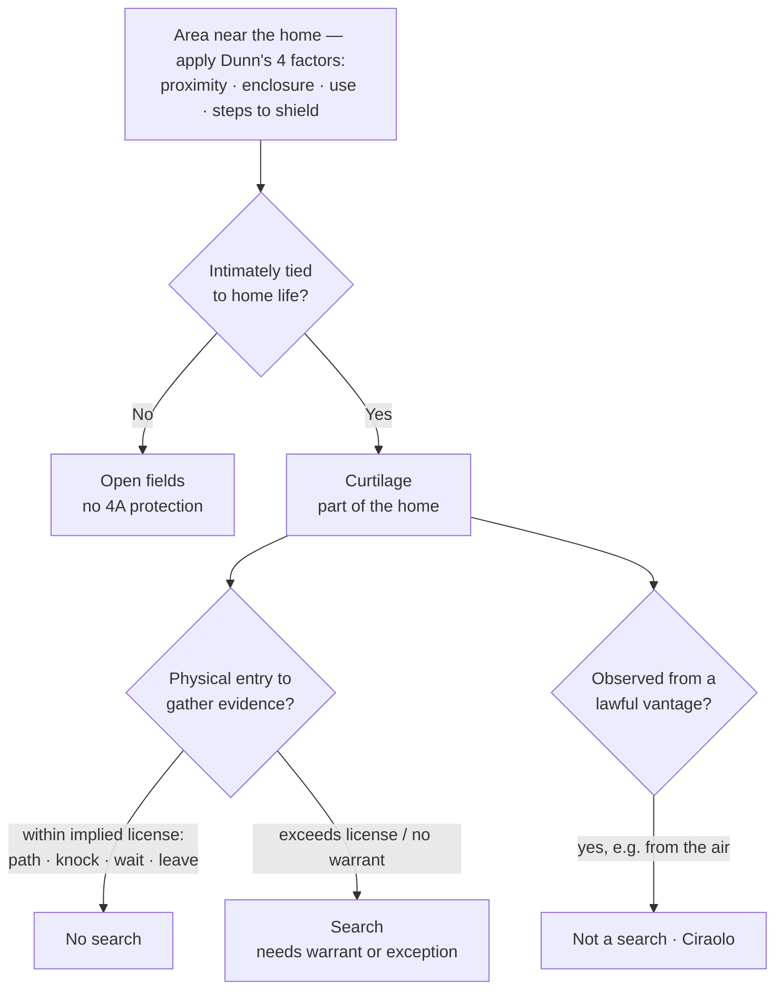

## Rule
**Curtilage** is "the area immediately surrounding and associated with the home" — the land "to which the activity of home life extends." It is treated as **part of the home itself** for Fourth Amendment purposes, so a physical intrusion onto curtilage to gather evidence is a **search** and is presumptively unreasonable without a warrant. *Florida v. Jardines*, 569 U.S. 1, 6–7 (2013). Beyond the curtilage lie the **open fields**, which receive **no** Fourth Amendment protection at all. *Oliver v. United States*, 466 U.S. 170, 176–81 (1984); *Hester v. United States*, 265 U.S. 57, 59 (1924). Whether a given spot is curtilage (protected) or open fields (not) is resolved by the **four-factor *Dunn* test**.

## Key cases
| Case (Bluebook) | Holding in one line | Weight | CourtListener |
|---|---|---|---|
| *Hester v. United States*, 265 U.S. 57 (1924) | Origin of the open-fields doctrine; Fourth Amendment protection of "persons, houses, papers, and effects" does **not** extend to open fields. | SCOTUS — binding | [link](https://www.courtlistener.com/opinion/100413/hester-v-united-states/) |
| *Oliver v. United States*, 466 U.S. 170 (1984) | Reaffirms open fields get no Fourth Amendment protection — even fenced, posted "No Trespassing" land; only curtilage carries the home's protection. | SCOTUS — binding | [link](https://www.courtlistener.com/opinion/111146/oliver-v-united-states/) |
| *California v. Ciraolo*, 476 U.S. 207 (1986) | Warrantless **naked-eye aerial observation** of a fenced curtilage from navigable airspace (1,000 ft) is **not** a search — no reasonable expectation of privacy from the air. | SCOTUS — binding | [link](https://www.courtlistener.com/opinion/111666/california-v-ciraolo/) |
| *United States v. Dunn*, 480 U.S. 294 (1987) | Sets the **four-factor test** for distinguishing curtilage from open fields (barn 60 yds from house, outside the fence, held not curtilage). | SCOTUS — binding | [link](https://www.courtlistener.com/opinion/111833/united-states-v-dunn/) |
| *Florida v. Jardines*, 569 U.S. 1 (2013) | A front porch is curtilage; bringing a drug-dog there exceeds the **implied license** to approach and knock, so it is a trespassory search. | SCOTUS — binding | [link](https://www.courtlistener.com/opinion/856347/florida-v-jardines/) |
| *Collins v. Virginia*, 584 U.S. 586 (2018) | The **automobile exception does not reach into curtilage** — no warrantless entry of a home or its curtilage to search a vehicle parked there. | SCOTUS — binding | [link](https://www.courtlistener.com/opinion/4501697/collins-v-virginia/) |

## Nuances & limits
- **Curtilage is protected; open fields are not.** "[O]pen fields do not provide the setting for those intimate activities that the Amendment is intended to shelter from government interference or surveillance." *Oliver*, 466 U.S. at 179. Same officer, same field of marijuana — the line that decides suppression is which side of it the ground falls on.
- **The *Dunn* four-factor test.** Curtilage questions are "resolved with particular reference to four factors: the proximity of the area claimed to be curtilage to the home, whether the area is included within an enclosure surrounding the home, the nature of the uses to which the area is put, and the steps taken by the resident to protect the area from observation by people passing by." *Dunn*, 480 U.S. at 301. Not a mechanical checklist — each bears on the central question: is the area so intimately tied to the home that it should be treated as part of it?
- **Two theories of search coexist.** *Jardines* decides on the **trespass / property** theory — revived in *United States v. Jones*, 565 U.S. 400 (2012) — under which a physical intrusion into a constitutionally protected area to gather evidence is itself a search, expressly noting the Court need not reach the *Katz* **reasonable-expectation-of-privacy** theory. Either theory can independently establish a search; *Katz* supplements, it did not replace, the property baseline.
- **Implied license is limited in scope.** A visitor's implied license to approach the home is narrow:
  > "This implicit license typically permits the visitor to approach the home by the front path, knock promptly, wait briefly to be received, and then (absent invitation to linger longer) leave. … it is generally managed without incident by the Nation's Girl Scouts and trick-or-treaters." — *Jardines*, 569 U.S. at 8.

  Exceed that scope — deploy a drug dog, or linger to snoop — and the lawful approach becomes a trespassory search. The license defines the **scope**, not merely the place.
- **Lawful vantage ≠ lawful entry.** Officers may look at curtilage from a place they are lawfully entitled to be — including the air (*Ciraolo*) or a public road — without it being a search. But the right to *observe* curtilage is not the right to *enter* it to search. *Collins*, 584 U.S. at 599.
- **Curtilage carries the home's protection against warrant exceptions.** *Collins* holds the automobile exception cannot be used to justify entering curtilage; the strong protection of the home extends out to its curtilage.

## Common pitfalls
- Treating a **driveway, porch, or attached carport** as fair game. *Collins* held a partially enclosed driveway top abutting the house was curtilage; *Jardines* held the front porch was. Proximity + the home-life connection, not the absence of a fence, controls.
- Reading *Ciraolo* as "anything visible is fair game." It permits **observation** from a lawful vantage; it does **not** authorize physically entering the curtilage. (*Collins*.)
- Assuming a **fence or "No Trespassing" sign** converts open fields into protected space — *Oliver* says it does not.
- Forgetting that the implied "knock-and-talk" license is **scope-limited** — overstaying or bringing investigative tools onto the porch converts a lawful approach into a search. (*Jardines*.)

## Visual

## Flashcards
- What is curtilage?::The area immediately surrounding and associated with the home, to which home life extends; treated as part of the home for 4A purposes (*Jardines*).
- Name *Dunn*'s four curtilage factors.::Proximity to the home; whether within an enclosure; the nature of the uses; the steps taken by the resident to protect the area from observation (480 U.S. at 301).
- Do open fields get Fourth Amendment protection?::No — *Hester*/*Oliver*: not even fenced, posted land. Only curtilage carries the home's protection.
- Why was the search in *Jardines* unlawful?::Bringing a drug dog onto the porch exceeded the implied license to approach, knock, wait, and leave — a trespass to gather evidence.
- Can the automobile exception justify entering curtilage?::No — *Collins*: no warrantless entry of a home or its curtilage to search a vehicle parked there.

## Sources
- *Hester v. United States*, 265 U.S. 57 (1924) — https://www.courtlistener.com/opinion/100413/hester-v-united-states/
- *Oliver v. United States*, 466 U.S. 170 (1984) — https://www.courtlistener.com/opinion/111146/oliver-v-united-states/
- *California v. Ciraolo*, 476 U.S. 207 (1986) — https://www.courtlistener.com/opinion/111666/california-v-ciraolo/
- *United States v. Dunn*, 480 U.S. 294 (1987) — https://www.courtlistener.com/opinion/111833/united-states-v-dunn/
- *Florida v. Jardines*, 569 U.S. 1 (2013) — https://www.courtlistener.com/opinion/856347/florida-v-jardines/
- *Collins v. Virginia*, 584 U.S. 586 (2018) — https://www.courtlistener.com/opinion/4501697/collins-v-virginia/
- *United States v. Jones*, 565 U.S. 400 (2012) — https://www.courtlistener.com/opinion/7350871/united-states-v-jones/ *(trespass-theory origin; cross-reference)*
