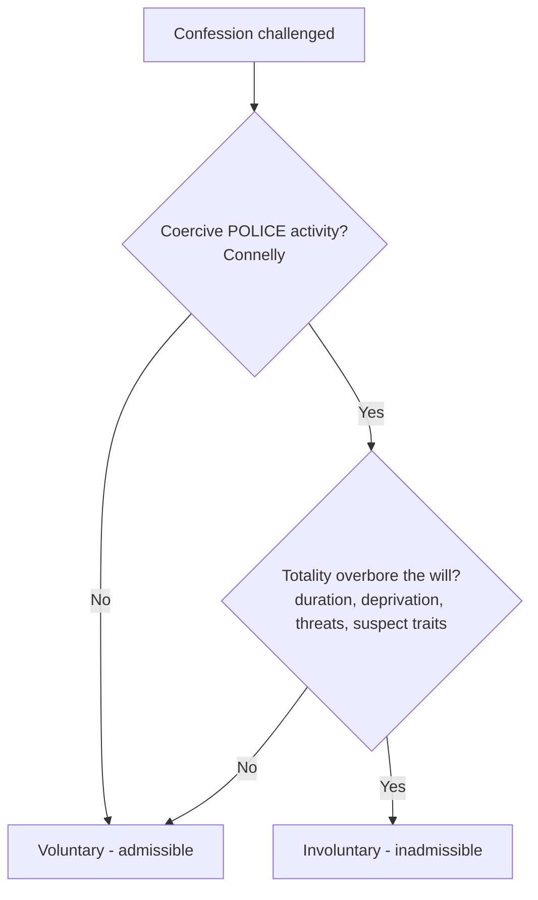

# Due-Process Voluntariness of Confessions

## Rule
The Due Process Clause bars the use of an involuntary confession — one produced by coercion that overbears the suspect's will — judged by the **totality of the circumstances** (interrogation length, deprivation of sleep/food/contact, threats or promises, and the suspect's individual characteristics). This due-process line predates and runs alongside [[Miranda and Custodial Interrogation|Miranda]]: a confession can be voluntary yet inadmissible for a Miranda defect, or Miranda-compliant yet still involuntary. Critically, the coercion must come from **police conduct** — absent coercive state activity, a confession is not "involuntary" for due-process purposes (*Connelly*).

## Key cases

| Case | Holding (one line) | Weight | CourtListener |
|------|--------------------|--------|---------------|
| *Brown v. Mississippi*, 297 U.S. 278 (1936) | A confession extracted by physical torture is involuntary; using it to convict violates due process (the founding case). | SCOTUS — binding | [opinion](https://www.courtlistener.com/opinion/102604/brown-v-mississippi/) |
| *Chambers v. Florida*, 309 U.S. 227 (1940) | Confessions wrung from helpless prisoners by prolonged, incommunicado interrogation are the product of compulsion and violate due process. | SCOTUS — binding | [opinion](https://www.courtlistener.com/opinion/103301/chambers-v-florida/) |
| *Ashcraft v. Tennessee*, 322 U.S. 143 (1944) | Thirty-six hours of continuous relay questioning without sleep is inherently coercive, rendering the confession involuntary. | SCOTUS — binding | [opinion](https://www.courtlistener.com/opinion/103981/ashcraft-v-tennessee/) |
| *Spano v. New York*, 360 U.S. 315 (1959) | Psychological overbearing — a friend's feigned distress plus persistent overnight questioning — made the confession involuntary; the will was overborne. | SCOTUS — binding | [opinion](https://www.courtlistener.com/opinion/105917/spano-v-new-york/) |
| *Arizona v. Fulminante*, 499 U.S. 279 (1991) | Admitting a coerced confession is trial error subject to harmless-error analysis (here the error was not harmless; conviction reversed). | SCOTUS — binding | [opinion](https://www.courtlistener.com/opinion/112566/arizona-v-fulminante/) |
| *Colorado v. Connelly*, 479 U.S. 157 (1986) | Coercive police activity is a necessary predicate to involuntariness; a mentally ill suspect's internal compulsion ("voices") does not make a confession involuntary. | SCOTUS — binding | [opinion](https://www.courtlistener.com/opinion/111779/colorado-v-connelly/) |
| *Frazier v. Cupp*, 394 U.S. 731, 739 (1969) | Police misrepresentation (a false claim that a codefendant had confessed) did not, by itself, render the confession involuntary. | SCOTUS — binding | [opinion](https://www.courtlistener.com/opinion/107913/frazier-v-cupp/) |

## Related cases across doctrines
These cases are treated in full on other doctrine pages but bear directly on due-process voluntariness, framed here for that inquiry.

| Case | Relevance to due-process voluntariness | Primary treatment | CourtListener |
|------|----------------------------------------|-------------------|---------------|
| *Oregon v. Elstad*, 470 U.S. 298 (1985) | Voluntariness is a freestanding inquiry separate from Miranda: an initial un-warned statement that was actually voluntary does not coerce or taint a later warned confession — only genuine coercion (not a mere Miranda omission) triggers the due-process bar. | [[Miranda Waiver and Invocation]] | [opinion](https://www.courtlistener.com/opinion/111364/oregon-v-elstad/) |
| *United States v. Patane*, 542 U.S. 630 (2004) | Reinforces that an un-warned but voluntary statement involves no due-process coercion; physical fruit of such a statement is admissible because there was no compelled/involuntary statement, only a prophylactic Miranda lapse. | [[Miranda Waiver and Invocation]] | [opinion](https://www.courtlistener.com/opinion/137003/united-states-v-patane/) |
| *Missouri v. Seibert*, 542 U.S. 600 (2004) | The deliberate question-first/warn-later interrogation tactic targets Miranda's safeguards, but the plurality's concern with intentionally undermining a suspect's free choice sits alongside the due-process voluntariness inquiry into whether sustained interrogation overbore the will. | [[Miranda Waiver and Invocation]] | [opinion](https://www.courtlistener.com/opinion/137002/missouri-v-seibert/) |
| *Schneckloth v. Bustamonte*, 412 U.S. 218 (1973) | Imports the confession-voluntariness framework wholesale: consent voluntariness is judged by the same totality-of-the-circumstances test the Court built from the due-process confession cases (*Brown*, *Chambers*, *Ashcraft*, *Spano*) — the canonical statement of the totality standard this doctrine uses. | [[Consent Searches]] | [opinion](https://www.courtlistener.com/opinion/108800/schneckloth-v-bustamonte/) |
| *Brewer v. Williams*, 430 U.S. 387 (1977) | The detective's "Christian burial speech" is the classic example of psychological pressure short of force; though decided on Sixth Amendment grounds, it illustrates the same overbearing-the-will concern (cf. *Spano*) that animates due-process voluntariness review of subtle interrogation tactics. | [[Sixth Amendment Right to Counsel]] | [opinion](https://www.courtlistener.com/opinion/109624/brewer-v-williams/) |

## Nuances & limits
- **Totality, not any single factor.** No one element is dispositive; courts weigh interrogation duration, physical deprivation, threats/promises, and the suspect's age, intelligence, and mental state together. *Ashcraft* (36 hours, deemed inherently coercive) and *Spano* (overnight psychological pressure) show that duration and sustained pressure can overbear the will even without physical force; *Brown* and *Chambers* mark the extreme end (torture, incommunicado compulsion).
- **Police coercion is the required predicate.** *Connelly* holds: "coercive police activity is a necessary predicate to the finding that a confession is not 'voluntary' within the meaning of the Due Process Clause of the Fourteenth Amendment" (479 U.S. at 167). A suspect's mental illness, intoxication, or internal compulsion — absent police overreaching — does not make a statement involuntary, however unreliable it may be.
- **The stakes are constitutional, not merely evidentiary.** *Chambers* warned that allowing convictions on confessions so obtained "would make of the constitutional requirement of due process of law a meaningless symbol" (309 U.S. at 240).
- **Deception is not automatically coercion.** *Frazier* confirms that some police misrepresentation (falsely claiming a codefendant confessed) does not, standing alone, render a confession involuntary; deception is one factor in the totality, not a per se rule.
- **An involuntary confession is not automatic reversal at trial.** Under *Fulminante*, erroneous admission of a coerced confession is trial error reviewed for harmless error under *Chapman* — though on those facts the error was not harmless and the conviction was reversed. (This affects remedy, not the underlying due-process violation.)
- This due-process voluntariness inquiry is **distinct from** [[Miranda Waiver and Invocation|Miranda waiver]] and from the [[Sixth Amendment Right to Counsel]]; suppression of an involuntary confession is independent of the [[The Exclusionary Rule|exclusionary]] analyses tied to those doctrines.

## Common pitfalls
- **Thinking Miranda warnings cure an involuntary confession.** They do not. A confession can clear Miranda yet still be suppressed as involuntary under the Due Process Clause; voluntariness is a separate, freestanding test from the [[Miranda and Custodial Interrogation|Miranda]] inquiry.
- **Ignoring the police-coercion requirement.** Officers and instructors sometimes assume any "unreliable" or "compelled-feeling" statement is involuntary. After *Connelly*, there is no due-process voluntariness problem without coercive police activity — the suspect's internal state alone is not enough.
- **Treating any deception as automatically coercive.** Per *Frazier*, lawful interrogation tactics (e.g., a false claim that a codefendant confessed) are not per se coercive; deception is weighed in the totality, but exaggerated or unfounded fears of suppression can chill legitimate technique.

## Recent developments & subsequent treatment
The *Connelly* police-coercion predicate and the *Frazier* "deception is not per se coercion" rule remain the SCOTUS baseline, but lower federal courts continue to police where lawful technique tips over into overbearing the will — particularly distinguishing tolerated deception about facts from intolerable misrepresentations of law and false promises of leniency. The following circuit application is **persuasive, not binding** outside its circuit, and illustrates how the totality test is being run today.

- **United States v. Young (10th Cir. 2020)** — Applying the *Connelly*/totality framework, the **Tenth Circuit (persuasive, not binding)** found a confession involuntary where an FBI agent falsely claimed to have spoken with the federal judge about the case and falsely promised the suspect could "buy down" / shorten his sentence with each truthful answer. The court held that while deception about facts is tolerated, misrepresentations of law and false promises of sentencing leniency are far less tolerable and here critically impaired the suspect's capacity for self-determination, overbearing his will; conviction reversed, judgment vacated, and remanded. [opinion](https://www.courtlistener.com/opinion/4766220/united-states-v-young/).

## Visual

## Sources
- [Brown v. Mississippi, 297 U.S. 278 (1936)](https://www.courtlistener.com/opinion/102604/brown-v-mississippi/)
- [Chambers v. Florida, 309 U.S. 227 (1940)](https://www.courtlistener.com/opinion/103301/chambers-v-florida/)
- [Ashcraft v. Tennessee, 322 U.S. 143 (1944)](https://www.courtlistener.com/opinion/103981/ashcraft-v-tennessee/)
- [Spano v. New York, 360 U.S. 315 (1959)](https://www.courtlistener.com/opinion/105917/spano-v-new-york/)
- [Arizona v. Fulminante, 499 U.S. 279 (1991)](https://www.courtlistener.com/opinion/112566/arizona-v-fulminante/)
- [Colorado v. Connelly, 479 U.S. 157 (1986)](https://www.courtlistener.com/opinion/111779/colorado-v-connelly/)
- [Frazier v. Cupp, 394 U.S. 731, 739 (1969)](https://www.courtlistener.com/opinion/107913/frazier-v-cupp/)
