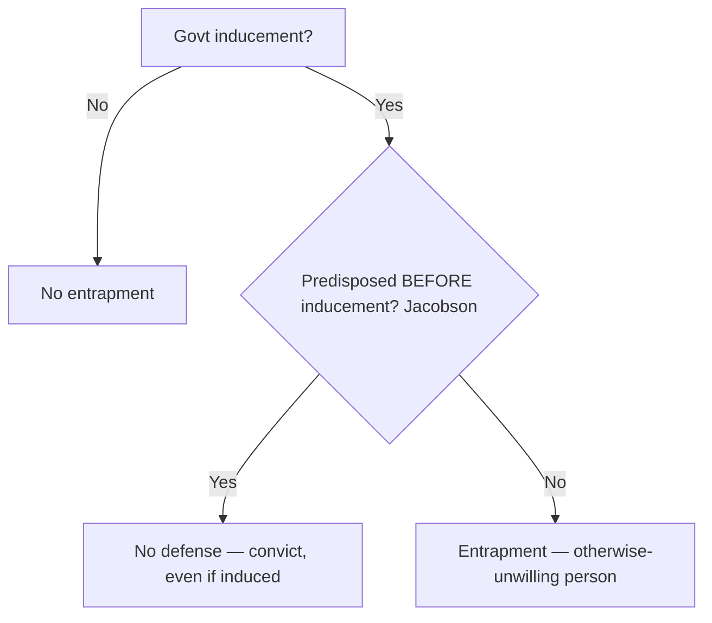

# Entrapment

## Rule
Entrapment is a substantive **defense to criminal liability** — not a Fourth Amendment suppression remedy. In federal court the test is **subjective**: it turns on the defendant's **predisposition** to commit the crime, not on the mere fact of government inducement. The government may furnish an *opportunity* to break the law, but it may not implant the criminal design in the mind of an otherwise-unwilling person and then lure that person into committing the offense. Once the defense raises inducement, the government must prove beyond a reasonable doubt that the defendant was predisposed.

## Key cases

| Case | Holding (one line) | Weight | CourtListener |
|------|--------------------|--------|---------------|
| *Sorrells v. United States*, 287 U.S. 435 (1932) | Recognizes entrapment as a defense; it arises when officials implant the criminal design in a person who had no previous disposition and then lure that otherwise-innocent person into the crime. | SCOTUS — binding | [opinion](https://www.courtlistener.com/opinion/101997/sorrells-v-united-states/) |
| *Sherman v. United States*, 356 U.S. 369 (1958) | Entrapment established as a matter of law where the government's informant implanted the design in an unwilling person (a recovering addict pressured by a fellow patient) and induced the crime. | SCOTUS — binding | [opinion](https://www.courtlistener.com/opinion/105681/sherman-v-united-states/) |
| *United States v. Russell*, 411 U.S. 423 (1973) | No entrapment where the defendant was predisposed, even though an agent supplied a hard-to-obtain but legal ingredient; the Court reaffirmed the predisposition test and rejected the objective test. | SCOTUS — binding | [opinion](https://www.courtlistener.com/opinion/108768/united-states-v-russell/) |
| *Jacobson v. United States*, 503 U.S. 540 (1992) | Where the government induces the crime it must prove predisposition existed independent of, and prior to, the inducement; 26 months of solicitation that itself created the predisposition defeats the prosecution as a matter of law. | SCOTUS — binding | [opinion](https://www.courtlistener.com/opinion/112720/jacobson-v-united-states/) |
| *Mathews v. United States*, 485 U.S. 58 (1988) | A defendant may raise entrapment even while denying one or more elements of the charged offense, whenever the evidence would let a reasonable jury find entrapment. | SCOTUS — binding | [opinion](https://www.courtlistener.com/opinion/112012/mathews-v-united-states/) |
| *Hampton v. United States*, 425 U.S. 484 (1976) | Neither the entrapment defense nor the Due Process Clause bars conviction of a predisposed defendant who sold government-supplied contraband; conceded predisposition defeats the defense. | SCOTUS — binding | [opinion](https://www.courtlistener.com/opinion/109437/hampton-v-united-states/) |

## Nuances & limits
- **Predisposition is the controlling fact.** Inducement alone is never entrapment. The dispositive question is whether the defendant was *ready and willing* before the government appeared (*Russell*, *Hampton*).
- **The Jacobson timing rule.** Predisposition must exist *before* the government's contact. In *Jacobson*, the Court treated this as settled, noting that "the proposition that the accused must be predisposed prior to contact with law enforcement officers is so firmly established that the Government conceded the point at oral argument" (503 U.S. at 549). Government conduct cannot manufacture the very predisposition it then points to.
- **Furnishing means or contraband is not entrapment** of a predisposed person. Supplying a legal-but-scarce ingredient (*Russell*) or even the contraband itself (*Hampton*) does not establish the defense and, on these facts, raised no due-process bar.
- **Denial plus entrapment.** A defendant need not admit the acts to claim entrapment. *Mathews* held: "even if the defendant denies one or more elements of the crime, he is entitled to an entrapment instruction whenever there is sufficient evidence from which a reasonable jury could find entrapment" (485 U.S. at 62).
- **Subjective vs. objective test (federal–state split).** Federal courts apply the *subjective* (predisposition) test. A minority/state approach uses an *objective* test focused on whether police conduct would induce a hypothetical law-abiding person. The objective test is a **non-federal alternative, illustrative only** — it does **not** govern in federal court. See [[Common Legal Terms]].

## Common pitfalls
- **Treating inducement as automatic entrapment.** Persuasion, opportunity, or even repeated requests do not entrap a *predisposed* person; predisposition controls.
- **Applying the objective test in federal court.** Officers and instructors sometimes ask "would this tactic induce an average person?" — that is the state/objective framing. Federal law asks about *this defendant's* predisposition.
- **Confusing entrapment with a Fourth Amendment / suppression remedy.** Entrapment does not suppress evidence; it is a **defense to liability** decided by the jury (or, when clear, as a matter of law).

## Visual

## Flashcards
- Is entrapment a suppression remedy or a substantive defense?::A substantive defense to criminal liability — it bars conviction; it does not suppress evidence.
- What test does federal law use for entrapment?::The subjective test — it focuses on the defendant's predisposition, not merely on government inducement.
- What is the Jacobson v. United States timing rule?::When the government induces the crime, it must prove the defendant was predisposed independent of, and prior to, the government's contact (503 U.S. at 549).
- Under Mathews v. United States, may a defendant deny the offense and still get an entrapment instruction?::Yes — even while denying one or more elements, the defendant is entitled to the instruction if sufficient evidence could let a reasonable jury find entrapment (485 U.S. at 62).
- Does supplying contraband to a predisposed defendant create entrapment (Hampton v. United States)?::No — neither entrapment nor due process bars convicting a predisposed defendant who sells government-supplied contraband.

## Sources
- [Sorrells v. United States, 287 U.S. 435 (1932)](https://www.courtlistener.com/opinion/101997/sorrells-v-united-states/)
- [Sherman v. United States, 356 U.S. 369 (1958)](https://www.courtlistener.com/opinion/105681/sherman-v-united-states/)
- [United States v. Russell, 411 U.S. 423 (1973)](https://www.courtlistener.com/opinion/108768/united-states-v-russell/)
- [Jacobson v. United States, 503 U.S. 540 (1992)](https://www.courtlistener.com/opinion/112720/jacobson-v-united-states/)
- [Mathews v. United States, 485 U.S. 58 (1988)](https://www.courtlistener.com/opinion/112012/mathews-v-united-states/)
- [Hampton v. United States, 425 U.S. 484 (1976)](https://www.courtlistener.com/opinion/109437/hampton-v-united-states/)
