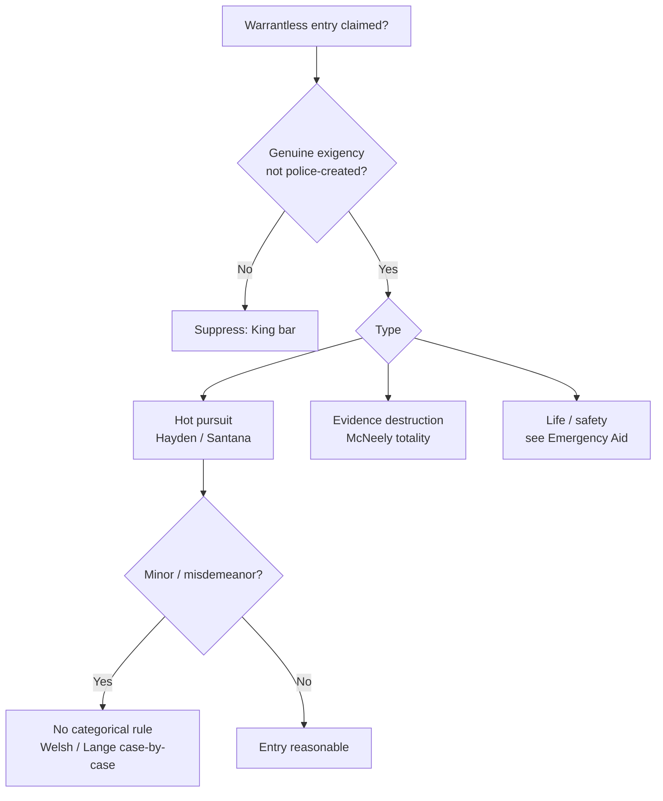

# Exigent Circumstances and Hot Pursuit

## Rule

Exigent circumstances are an exception to [[The Warrant Requirement]]: police may enter and search without a warrant when the exigencies of the situation make obtaining one impracticable (*Warden v. Hayden*, 387 U.S. at 298-99). The recognized exigencies are **hot pursuit** of a fleeing suspect, the **imminent destruction of evidence**, and a **risk to life or safety** (the last shading into emergency aid, treated on [[Community Caretaking and Emergency Aid]]). The exigency must be genuine and judged on the totality of the circumstances, the gravity of the underlying offense matters, and police may not manufacture the exigency by threatening to violate the Fourth Amendment.

## Key cases

| Case | Holding (one line) | Weight | CourtListener |
| --- | --- | --- | --- |
| *Warden v. Hayden*, 387 U.S. 294, 298-99 (1967) | Hot pursuit of a fleeing armed robber into a house is a valid warrantless entry and search where the exigencies made that course imperative. | SCOTUS — binding | [opinion](https://www.courtlistener.com/opinion/107465/warden-maryland-penitentiary-v-hayden/) |
| *United States v. Santana*, 427 U.S. 38 (1976) | A suspect in her own doorway is in a public place and cannot defeat a public arrest by retreating inside; hot pursuit justifies the entry that follows. | SCOTUS — binding | [opinion](https://www.courtlistener.com/opinion/109504/united-states-v-santana/) |
| *Welsh v. Wisconsin*, 466 U.S. 740 (1984) | Gravity of the offense is a key exigency factor; warrantless home entry for a minor, nonjailable offense should rarely be sanctioned. | SCOTUS — binding | [opinion](https://www.courtlistener.com/opinion/111173/welsh-v-wisconsin/) |
| *Lange v. California*, 594 U.S. 295 (2021) | Pursuit of a fleeing misdemeanor suspect does not categorically justify warrantless home entry; apply a case-by-case exigency assessment. | SCOTUS — binding | [opinion](https://www.courtlistener.com/opinion/4894407/lange-v-california/) |
| *Kentucky v. King*, 563 U.S. 452 (2011) | Police may rely on a self-created exigency unless they created it by engaging or threatening conduct that itself violates the Fourth Amendment. | SCOTUS — binding | [opinion](https://www.courtlistener.com/opinion/216733/kentucky-v-king/) |
| *Missouri v. McNeely*, 569 U.S. 141, 145, 156 (2013) | Natural metabolization of alcohol is not a per se exigency for a warrantless DUI blood draw; decide case-by-case on the totality. | SCOTUS — binding | [opinion](https://www.courtlistener.com/opinion/858288/missouri-v-mcneely/) |
| *Mitchell v. Wisconsin*, 588 U.S. 840 (2019) (plurality op.) | Where a DUI driver's unconsciousness forces hospitalization, police may almost always order a warrantless blood draw under exigency. | SCOTUS — binding | [opinion](https://www.courtlistener.com/opinion/9231242/mitchell-v-wisconsin/) |
| *Brigham City v. Stuart*, 547 U.S. 398 (2006) | Emergency aid: police may enter a home without a warrant on an objectively reasonable basis to believe an occupant is seriously injured or imminently threatened. | SCOTUS — binding | [opinion](https://www.courtlistener.com/opinion/145654/brigham-city-v-stuart/) |

## Nuances & limits

- **Hot pursuit begun in public continues inside.** *Santana* holds that "a suspect may not defeat an arrest which has been set in motion in a public place ... by the expedient of escaping to a private place" (427 U.S. at 43), and that "the pursuit here ended almost as soon as it began did not render it any the less a 'hot pursuit'" (427 U.S. at 43). See [[Arrest in the Home]] for the doorway/threshold line.
- **Gravity of the offense governs.** *Welsh* makes "the gravity of the underlying offense" "an important factor" in the exigency analysis (466 U.S. at 753), holding that the exception "should rarely be sanctioned when there is probable cause to believe that only a minor offense ... has been committed" (466 U.S. at 753).
- **No categorical misdemeanor-flight rule.** *Lange* — which resolved a split and is the controlling rule — holds that "pursuit of a fleeing misdemeanor suspect does not always—that is, categorically—justify a warrantless entry into a home" (594 U.S. at 297-98); officers must make a "case-by-case assessment of exigency" (594 U.S. at 298). Flight alone is not enough; an actual exigency (escape, evidence loss, harm) must be present.
- **No police-created exigency.** *King* permits reliance on a self-created exigency only "when the police do not create the exigency by engaging or threatening to engage in conduct that violates the Fourth Amendment" (563 U.S. at 462) — lawfully knocking and announcing is fine, and that lawful knock-and-announce at the door is the [[Knock and Talk]] approach.
- **Evidence dissipation is not automatic.** *McNeely* rejects a per se rule; the natural metabolization of alcohol does not by itself create exigency, so the totality controls. *Mitchell* (a plurality) carves out the unconscious-driver scenario, where warrantless blood draws are almost always permissible — though the plurality allows the defendant to rebut by showing a blood draw was not necessary to address the case's exigency.
- **Emergency aid lives next door.** Objective life-safety entries are governed by *Brigham City* — "police may enter a home without a warrant when they have an objectively reasonable basis for believing that an occupant is seriously injured or imminently threatened" (547 U.S. at 400), and "[t]he officer's subjective motivation is irrelevant" (547 U.S. at 404). Develop those entries on [[Community Caretaking and Emergency Aid]].
- **Boundary.** Authority to enter to *arrest on a warrant* is Payton/Steagald territory ([[Arrest in the Home]]); what officers may do once lawfully inside (sweeps, freezes) is [[Securing the Scene]]; vehicle mobility is the [[Automobile Exception]]; a search of the arrestee and grab area follows under [[Search Incident to Arrest]].

## Common pitfalls

- **Treating any fleeing suspect as automatic entry.** After *Lange* and *Welsh*, flight — especially for a minor or misdemeanor offense — does not by itself open the door. Articulate the specific exigency.
- **Manufacturing the exigency.** Under *King*, an exigency created by threatening to breach the Fourth Amendment (e.g., announcing an imminent unlawful entry to provoke evidence destruction) cannot be used to justify the entry. Lawful knock-and-announce is permissible.
- **Assuming dissipation alone is exigent.** *McNeely* forecloses a reflexive "the alcohol is leaving the blood" justification; build the totality, and confine the near-automatic rule to *Mitchell*'s unconscious-driver facts.

## Visual

## Flashcards

What exigency did *Warden v. Hayden* (1967) recognize?:: Hot pursuit — a warrantless entry and search of a house for a fleeing armed robber is valid where the exigencies of the situation made that course imperative.
Under *United States v. Santana* (1976), can a suspect defeat a public arrest by retreating into the home?:: No — a suspect may not defeat an arrest set in motion in a public place by escaping to a private one; hot pursuit justifies the warrantless entry that follows.
What is the controlling rule on misdemeanor flight after *Lange v. California* (2021)?:: Pursuit of a fleeing misdemeanor suspect does not categorically justify warrantless home entry; courts make a case-by-case exigency assessment.
What is the *Kentucky v. King* (2011) limit on police-created exigency?:: Police may rely on an exigency they created unless they created it by engaging or threatening to engage in conduct that itself violates the Fourth Amendment.
Does *Missouri v. McNeely* (2013) make BAC dissipation a per se exigency?:: No — the natural metabolization of alcohol is not a per se exigency; warrantless DUI blood draws are judged case-by-case on the totality.

## Sources

- [Warden v. Hayden](https://www.courtlistener.com/opinion/107465/warden-maryland-penitentiary-v-hayden/)
- [United States v. Santana](https://www.courtlistener.com/opinion/109504/united-states-v-santana/)
- [Welsh v. Wisconsin](https://www.courtlistener.com/opinion/111173/welsh-v-wisconsin/)
- [Lange v. California](https://www.courtlistener.com/opinion/4894407/lange-v-california/)
- [Kentucky v. King](https://www.courtlistener.com/opinion/216733/kentucky-v-king/)
- [Missouri v. McNeely](https://www.courtlistener.com/opinion/858288/missouri-v-mcneely/)
- [Mitchell v. Wisconsin](https://www.courtlistener.com/opinion/9231242/mitchell-v-wisconsin/)
- [Brigham City v. Stuart](https://www.courtlistener.com/opinion/145654/brigham-city-v-stuart/)
