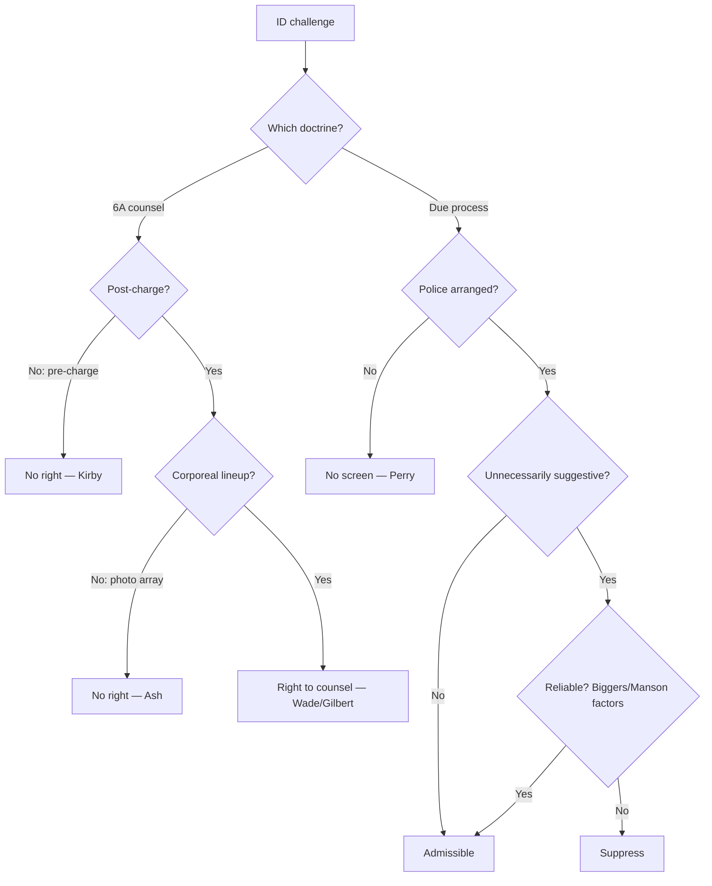

# Eyewitness Identification

## Rule

Two distinct federal doctrines govern challenges to eyewitness identifications. First, under the **Sixth Amendment**, a defendant has a right to counsel at a **post-charge corporeal lineup or showup** (a "critical stage"), but not at a pre-charge confrontation and not at a photographic array. Second, under the **Due Process Clause**, an identification is suppressed only when an **unnecessarily suggestive** procedure arranged by police creates a substantial likelihood of irreparable misidentification — and even a suggestive ID survives if it is nonetheless **reliable** under the totality of the circumstances. Reliability is the linchpin.

## Key cases

| Case | Holding (one line) | Weight | CourtListener |
| --- | --- | --- | --- |
| *United States v. Wade*, 388 U.S. 218, 236-37, 240-42 (1967) | Post-indictment lineup is a critical stage with a 6A right to counsel; an uncounseled lineup may taint a later in-court ID absent an independent source. | SCOTUS — binding | [opinion](https://www.courtlistener.com/opinion/107486/united-states-v-wade/) |
| *Gilbert v. California*, 388 U.S. 263, 272-74 (1967) | Testimony that the witness identified the accused at an uncounseled post-charge lineup is excluded per se — no harmless-error or reliability cure. | SCOTUS — binding | [opinion](https://www.courtlistener.com/opinion/107487/gilbert-v-california/) |
| *Stovall v. Denno*, 388 U.S. 293, 301-02 (1967) | An unnecessarily suggestive confrontation conducive to irreparable misidentification can violate due process; admissibility turns on the totality of the circumstances. | SCOTUS — binding | [opinion](https://www.courtlistener.com/opinion/107488/stovall-v-denno/) |
| *Neil v. Biggers*, 409 U.S. 188, 199-200 (1972) | Even an unnecessarily suggestive ID is admissible if reliable under the totality; reliability is judged by five factors. | SCOTUS — binding | [opinion](https://www.courtlistener.com/opinion/108639/neil-v-biggers/) |
| *Manson v. Brathwaite*, 432 U.S. 98, 113-14 (1977) | No per se exclusion for suggestive procedures; reliability is the linchpin under the Biggers factors, weighed against the corrupting effect of the suggestion. | SCOTUS — binding | [opinion](https://www.courtlistener.com/opinion/109693/manson-v-brathwaite/) |
| *Kirby v. Illinois*, 406 U.S. 682, 688-90 (1972) (plurality opinion) | The 6A right to counsel attaches only at or after the initiation of adversary judicial proceedings; a pre-charge ID is not a critical stage. | SCOTUS — binding | [opinion](https://www.courtlistener.com/opinion/108554/kirby-v-illinois/) |
| *United States v. Ash*, 413 U.S. 300 (1973) | No 6A right to counsel at a post-indictment photographic display — there is no trial-like confrontation because the accused is not present. | SCOTUS — binding | [opinion](https://www.courtlistener.com/opinion/108846/united-states-v-ash/) |
| *Perry v. New Hampshire*, 565 U.S. 228, 232-33, 248 (2012) | Due-process screening of ID reliability is required only when police arranged the suggestive circumstances; absent improper police conduct, the jury and cross-examination are the safeguards. | SCOTUS — binding | [opinion](https://www.courtlistener.com/opinion/620671/perry-v-new-hampshire/) |

## Related cases across doctrines

These cases are treated in full elsewhere but bear on this doctrine; each holding is framed below for the eyewitness-identification context.

| Case | Relevance to eyewitness identification | Primary treatment | CourtListener |
| --- | --- | --- | --- |
| *Rothgery v. Gillespie County*, 554 U.S. 191, 198, 213 (2008) | Fixes WHEN the Wade/Kirby right to counsel attaches at a lineup: the 6A attaches at the initial appearance before a magistrate where the accused learns the charge and his liberty is restricted — so a corporeal lineup conducted after that point is a critical stage requiring counsel, one before it is not. | [[Sixth Amendment Right to Counsel]] | [opinion](https://www.courtlistener.com/opinion/145785/rothgery-v-gillespie-county/) |
| *Texas v. Cobb*, 532 U.S. 162, 167-68, 173 (2001) | The Wade right to counsel at a post-charge lineup is offense-specific: counsel is required only for a lineup concerning the charged offense; a post-charge lineup investigating a different, uncharged offense is not a critical stage and triggers no Wade/Gilbert counsel right. | [[Sixth Amendment Right to Counsel]] | [opinion](https://www.courtlistener.com/opinion/118417/texas-v-cobb/) |

## Nuances & limits

- **The two doctrines are separate.** The Sixth Amendment counsel inquiry (Wade/Gilbert) and the due-process suggestiveness inquiry (Stovall/Biggers/Manson) are independent — an ID can pass one and fail the other. Tie counsel-at-lineup to attachment of the [[Sixth Amendment Right to Counsel]]. The due-process suggestiveness inquiry is a sibling of the due-process attack on confessions, the [[Due-Process Voluntariness of Confessions]] — both ask whether police conduct produced unreliable evidence.
- **Counsel attaches only post-charge, and only for corporeal confrontations.** Under *Kirby*, the right attaches at "the initiation of adversary judicial criminal proceedings—whether by way of formal charge, preliminary hearing, indictment, information, or arraignment" (406 U.S. at 689). *Ash* further limits it: no counsel at a **photographic** array because the accused is not present ("the Sixth Amendment does not grant the right to counsel at photographic displays conducted by the Government for the purpose of allowing a witness to attempt an identification of the offender" (413 U.S. at 321)).
- **Gilbert's per se rule is strict.** A *Gilbert* violation excludes the lineup-ID testimony outright; there is no reliability cure for the uncounseled-lineup defect (contrast the due-process branch, where reliability rescues). An in-court ID may still come in under *Wade* if it has an **independent source**.
- **Reliability rescues a suggestive ID.** *Biggers* lists the five factors: "the opportunity of the witness to view the criminal at the time of the crime, the witness' degree of attention, the accuracy of the witness' prior description of the criminal, the level of certainty demonstrated by the witness at the confrontation, and the length of time between the crime and the confrontation" (409 U.S. at 199-200). *Manson* makes the point explicit: "reliability is the linchpin in determining the admissibility of identification testimony for both pre- and post-Stovall confrontations. The factors to be considered are set out in Biggers" (432 U.S. at 114).
- **No police suggestion, no due-process screening.** *Perry* confines the due-process screen to suggestion **arranged by law enforcement**; suggestive circumstances arising by chance (e.g., a witness's own spontaneous viewing) are left to ordinary trial safeguards.

## Common pitfalls

- **Assuming counsel attaches at every lineup.** The right is limited to **post-charge corporeal** confrontations — not pre-charge showups (*Kirby*) and not photo arrays (*Ash*). Pre-charge field showups need no defense counsel.
- **Forgetting that reliability can save a suggestive ID.** Officers and instructors sometimes treat any suggestive procedure as automatically fatal. Under *Biggers/Manson*, a suggestive ID is still admissible if reliable under the five-factor totality — suppression is the exception, not the rule.
- **Applying due-process screening to non-police suggestion.** Per *Perry*, suggestion that police did not arrange does not trigger the due-process screen; the remedy there is cross-examination and jury instruction, not exclusion. Do not invoke a suppression remedy through the [[The Exclusionary Rule]] for chance suggestiveness.

## Visual

## Sources

- [United States v. Wade, 388 U.S. 218 (1967)](https://www.courtlistener.com/opinion/107486/united-states-v-wade/)
- [Gilbert v. California, 388 U.S. 263 (1967)](https://www.courtlistener.com/opinion/107487/gilbert-v-california/)
- [Stovall v. Denno, 388 U.S. 293 (1967)](https://www.courtlistener.com/opinion/107488/stovall-v-denno/)
- [Neil v. Biggers, 409 U.S. 188 (1972)](https://www.courtlistener.com/opinion/108639/neil-v-biggers/)
- [Manson v. Brathwaite, 432 U.S. 98 (1977)](https://www.courtlistener.com/opinion/109693/manson-v-brathwaite/)
- [Kirby v. Illinois, 406 U.S. 682 (1972)](https://www.courtlistener.com/opinion/108554/kirby-v-illinois/)
- [United States v. Ash, 413 U.S. 300 (1973)](https://www.courtlistener.com/opinion/108846/united-states-v-ash/)
- [Perry v. New Hampshire, 565 U.S. 228 (2012)](https://www.courtlistener.com/opinion/620671/perry-v-new-hampshire/)
