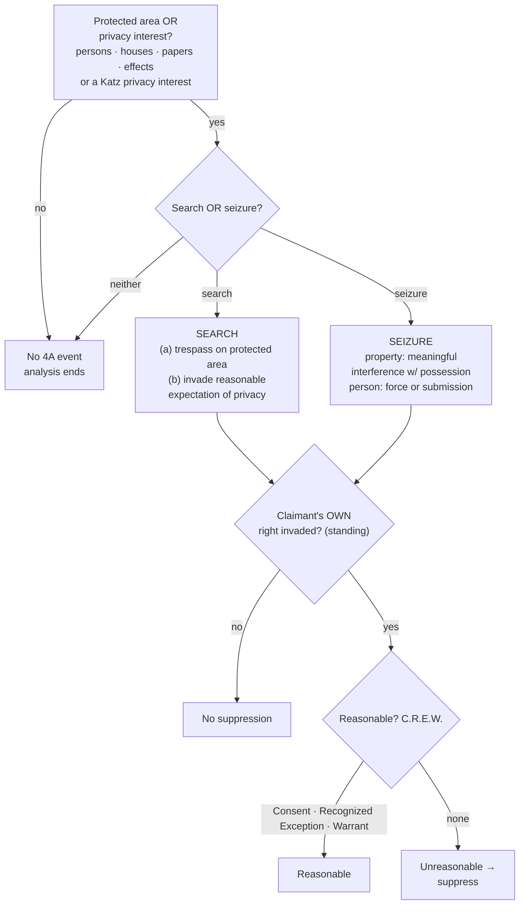

## Rule
The Fourth Amendment secures "[t]he right of the people to be secure in their persons, houses, papers, and effects, against unreasonable searches and seizures," and commands that "no Warrants shall issue, but upon probable cause." U.S. Const. amend. IV. It contains **two clauses**: a **reasonableness clause** (the general command that searches and seizures be reasonable) and a **warrant clause** (the requirements for issuing a warrant). It restrains **the government only** — not private parties acting on their own. *United States v. Jacobsen*, 466 U.S. 109, 113–14 (1984). Every problem is worked in the same order: (1) was a constitutionally protected area or interest involved; (2) did a **search** or **seizure** occur; (3) does the claimant have **standing** (were the claimant's *own* rights invaded); and (4) was the government action **reasonable** — justified by **C.R.E.W.**: **C**onsent, a **R**ecognized **E**xception, or a **W**arrant.

## Key cases
| Case (Bluebook) | Holding in one line | Weight | CourtListener |
|---|---|---|---|
| *Camara v. Municipal Court*, 387 U.S. 523 (1967) | Administrative inspections are Fourth Amendment searches; reasonableness has no ready test "other than by balancing the need to search against the invasion which the search entails." | SCOTUS — binding | [link](https://www.courtlistener.com/opinion/107473/camara-v-municipal-court-of-city-and-county-of-san-francisco/) |
| *United States v. Jacobsen*, 466 U.S. 109 (1984) | Defines a property seizure; the Amendment reaches only government action; once a private party exposes contents, a government inspection within that scope invades no remaining privacy. | SCOTUS — binding | [link](https://www.courtlistener.com/opinion/111143/united-states-v-jacobsen/) |
| *Walter v. United States*, 447 U.S. 649 (1980) | The government may not exceed the scope of a prior private search; FBI's screening of films the private party had not viewed was a separate, unlawful search. | SCOTUS — binding | [link](https://www.courtlistener.com/opinion/110314/walter-v-united-states/) |
| *Skinner v. Railway Labor Executives' Ass'n*, 489 U.S. 602 (1989) | A private party is a state actor when government participation is sufficient; turns "on the degree of the Government's participation in the private party's activities." | SCOTUS — binding | [link](https://www.courtlistener.com/opinion/112219/skinner-v-railway-labor-executives-assn/) |
| *Coolidge v. New Hampshire*, 403 U.S. 443 (1971) | Evidence produced by a genuinely private search does not implicate the Amendment; state action turns on all the circumstances. | SCOTUS — binding | [link](https://www.courtlistener.com/opinion/108377/coolidge-v-new-hampshire/) |
| *Arizona v. Hicks*, 480 U.S. 321 (1987) | Moving stereo equipment to read its serial numbers was a *new* search requiring probable cause — a minimal further intrusion is still a search. | SCOTUS — binding | [link](https://www.courtlistener.com/opinion/111834/arizona-v-hicks/) |

## Nuances & limits
- **Two definitions of "search."** A search occurs when the government either (a) **physically intrudes on a constitutionally protected area to obtain information** (the trespass theory) **or** (b) **invades a reasonable expectation of privacy** (*Katz*). The trespass theory needs a constitutionally protected *area* (persons, houses, papers, effects); the *Katz* theory protects a *reasonable expectation of privacy* and is **not** confined to those enumerated categories — "the Fourth Amendment protects people, not places." Either theory independently establishes a search; *Katz* supplemented the property baseline, it did not replace it. The deep treatment of Olmstead → *Katz* → *Jones* lives in [[Two Definitions of Search]] — don't re-derive it here.
- **Seizure of property** is "some meaningful interference with an individual's possessory interests in that property." *Jacobsen*, 466 U.S. at 113.
- **Seizure of a person** is a restraint on liberty of movement by physical force or by submission to a show of authority. Full treatment — *Mendenhall*, *Hodari D.*, *Torres*, and use-of-force reasonableness under *Graham* — is in [[Seizure of the Person]] and [[Use of Force]].
- **Reasonableness is the touchstone, and it is a balance.** "[T]here can be no ready test for determining reasonableness other than by balancing the need to search against the invasion which the search entails." *Camara*, 387 U.S. at 536–37. This balancing is the root of every later reasonableness inquiry. Operationally, reasonableness is satisfied through **C.R.E.W.** — Consent, a Recognized Exception, or a Warrant (see [[CREW]]; the full catalog of recognized exceptions is covered later in the course).
- **Standing is your own right, not anyone else's.** Fourth Amendment rights are personal: a defendant may suppress only evidence obtained by invading *his own* protected interest, not a third party's. Were the place searched or the thing seized *his*?
- **A trivial extra intrusion is still a search.** In *Hicks*, merely picking up turntables to read serial numbers "produced a new invasion of respondent's privacy unjustified by the exigent circumstance" and so required probable cause. 480 U.S. at 325. (Plain view is covered in full later — note it forward, don't expand it here.)
- **State action — the threshold for the whole Amendment.** "[T]he Fourth Amendment does not apply to a search or seizure, even an arbitrary one, effected by a private party on his own initiative," but it does apply "if the private party acted as an instrument or agent of the Government." *Skinner*, 489 U.S. at 614. Whether someone is such an agent "necessarily turns on the degree of the Government's participation in the private party's activities," resolved "in light of all the circumstances." *Id.* at 614–15 (quoting *Coolidge*, 403 U.S. at 487). A private party becomes a state actor when the government instigates, directs, or significantly encourages or participates in the search. *(The commonly taught two-part agency test — (1) government knowledge and acquiescence and (2) the private party's intent to assist law enforcement — is circuit gloss; treat it as persuasive, not a SCOTUS holding.)*
- **Private-search doctrine ("the cat is out of the bag").** Once a private party has searched and exposed contents, a later government inspection that does **not exceed the scope** of the private search invades no remaining expectation of privacy. *Jacobsen*, 466 U.S. at 115–17 (FedEx package opened by employees; DEA's later inspection lawful). Three sub-rules govern:
  1. **Cannot exceed the private search's scope.** A government search beyond what the private party already exposed is a separate search needing its own justification. *Walter*, 447 U.S. at 659 (the private "search merely frustrated that expectation in part. It did not . . . strip the remaining unfrustrated portion . . . of all Fourth Amendment protection").
  2. **Re-examination needs "virtual certainty."** Reopening or re-inspecting is permissible where there is "a virtual certainty that nothing else of significance" would be revealed beyond what the private party already disclosed. *Jacobsen*, 466 U.S. at 119.
  3. **Lawful right of access.** The officer must already have a lawful right of access to the item the private party searched.
- **Bill of Rights codified pre-existing rights.** The framing that the Amendment's "right of the people" was a *pre-existing* liberty, not a newly minted one, is reflected in *District of Columbia v. Heller*, 554 U.S. 570, 592 (2008) *(Second Amendment — cited only for the framing that the Bill of Rights was "widely understood to codify a pre-existing right, rather than to fashion a new one"; not Fourth Amendment authority).*
- **Right to be let alone.** The privacy lineage traces to Justice Brandeis's *Olmstead* dissent — developed in [[Two Definitions of Search]], not here.

## Common pitfalls
- **Skipping the threshold.** If no search or seizure occurred, there is nothing to justify — and no suppression remedy. Work the sequence in order; don't jump to warrant exceptions.
- **Asserting a third party's rights.** Officers and instructors conflate "the search was illegal" with "*this* defendant can suppress." Standing requires the claimant's *own* protected interest to have been invaded.
- **Treating private-party evidence as automatically clean.** It is clean only if the actor was genuinely private. If the government instigated, directed, or significantly participated, the private party is a state actor and the Amendment applies. *Skinner*.
- **Overrunning the private search.** *Walter* is the trap: the officer may stand in the private party's shoes but no further. Going beyond what the private party exposed — without independent justification or virtual certainty nothing new will appear — is a fresh search.
- **Forgetting that small intrusions count.** *Hicks*: moving an object a few inches to read a serial number is a search.

## Visual

## Flashcards
- What two clauses make up the Fourth Amendment?::The reasonableness clause (no unreasonable searches/seizures) and the warrant clause (no warrants but upon probable cause, particularly describing the place and things).
- What are the two definitions of a "search"?::(a) A physical intrusion on a constitutionally protected area to obtain information (trespass), or (b) an invasion of a reasonable expectation of privacy (*Katz*). Either suffices.
- How is a seizure of property defined?::"[S]ome meaningful interference with an individual's possessory interests in that property." *Jacobsen*, 466 U.S. at 113.
- Does the Fourth Amendment apply to a private party's search?::No — only to government action. But a private party who acts as an instrument or agent of the government is bound by it; it turns on the degree of government participation. *Skinner*; *Coolidge*.
- Under the private-search doctrine, when may officers inspect what a private party already searched?::Only within the scope the private party exposed (*Walter*), with virtual certainty nothing else of significance will be revealed (*Jacobsen*), and a lawful right of access to the item.
- What does C.R.E.W. stand for?::Consent, Recognized Exception, or Warrant — the three ways government action becomes reasonable.

## Sources
- *Camara v. Municipal Court*, 387 U.S. 523 (1967) — https://www.courtlistener.com/opinion/107473/camara-v-municipal-court-of-city-and-county-of-san-francisco/
- *United States v. Jacobsen*, 466 U.S. 109 (1984) — https://www.courtlistener.com/opinion/111143/united-states-v-jacobsen/
- *Walter v. United States*, 447 U.S. 649 (1980) — https://www.courtlistener.com/opinion/110314/walter-v-united-states/
- *Skinner v. Railway Labor Executives' Ass'n*, 489 U.S. 602 (1989) — https://www.courtlistener.com/opinion/112219/skinner-v-railway-labor-executives-assn/
- *Coolidge v. New Hampshire*, 403 U.S. 443 (1971) — https://www.courtlistener.com/opinion/108377/coolidge-v-new-hampshire/
- *Arizona v. Hicks*, 480 U.S. 321 (1987) — https://www.courtlistener.com/opinion/111834/arizona-v-hicks/
- *Katz v. United States*, 389 U.S. 347 (1967) — https://www.courtlistener.com/opinion/107564/katz-v-united-states/ *(search = privacy theory; cross-reference)*
- *United States v. Jones*, 565 U.S. 400 (2012) — https://www.courtlistener.com/opinion/7350871/united-states-v-jones/ *(search = trespass theory; cross-reference)*
- *District of Columbia v. Heller*, 554 U.S. 570 (2008) — https://www.courtlistener.com/opinion/145777/district-of-columbia-v-heller/ *(Second Amendment; cited only for "pre-existing right" framing)*
