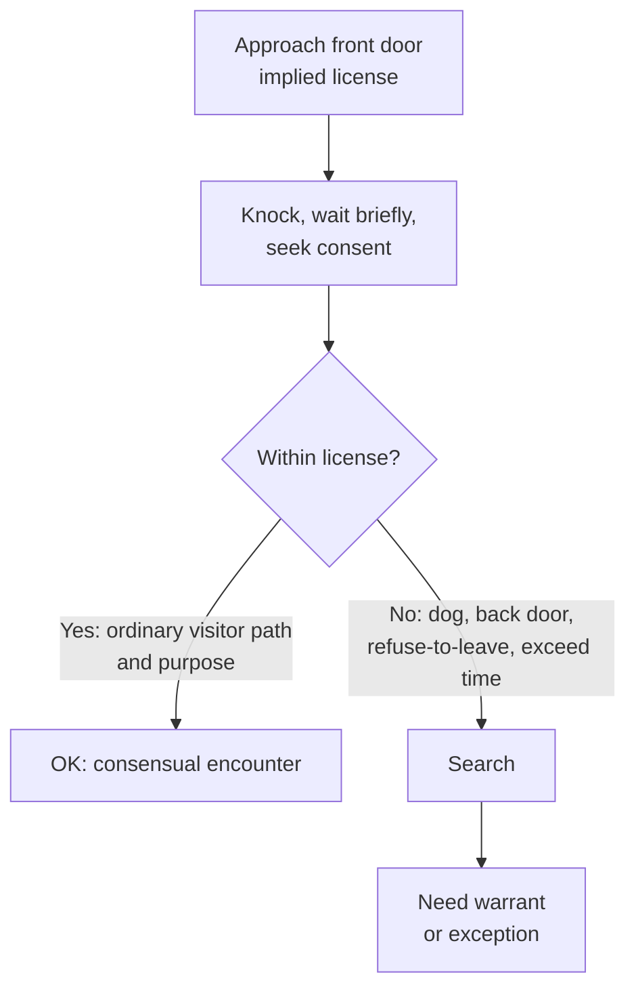

# Knock and Talk

## Rule

The "knock and talk" is not a standalone warrant exception — it rests on the same **implied license** that lets any visitor approach a home's front door, knock, wait briefly, and (absent a refusal) leave. Officers may use that license to seek a consensual conversation or to ask for consent to search; what they obtain is governed by ordinary [[Consent Searches]] law. The moment officers exceed the implied license in **scope, time, or manner** — straying off the normal route, lingering after being told to go, or bringing investigative tools onto the [[Curtilage]] — the approach becomes a Fourth Amendment search requiring a warrant or another exception (*Florida v. Jardines*).

## Key cases

| Case | Holding (one line) | Weight | CourtListener |
| --- | --- | --- | --- |
| *Florida v. Jardines*, 569 U.S. 1, 6-8 (2013) | Walking a drug dog onto the front porch to investigate exceeded the implied license to approach and knock — a trespassory search. | SCOTUS — binding | [opinion](https://www.courtlistener.com/opinion/856347/florida-v-jardines/) |
| *Kentucky v. King*, 563 U.S. 452 (2011) | Police may lawfully knock and announce their presence; a police-created exigency is unusable only when officers create it by engaging or threatening to engage in conduct that itself violates the Fourth Amendment. | SCOTUS — binding | [opinion](https://www.courtlistener.com/opinion/216733/kentucky-v-king/) |
| *Florida v. Bostick*, 501 U.S. 429, 435-36 (1991) | An encounter stays consensual where a reasonable person would feel free to decline the officers' requests or terminate the encounter. | SCOTUS — binding | [opinion](https://www.courtlistener.com/opinion/112631/florida-v-bostick/) |
| *United States v. Drayton*, 536 U.S. 194, 203-07 (2002) | Consent can be voluntary even though officers never advised the person of the right to refuse; there is no per se warning requirement. | SCOTUS — binding | [opinion](https://www.courtlistener.com/opinion/121153/united-states-v-drayton/) |
| *French v. Merrill*, 15 F.4th 116 (1st Cir. 2021) | The knock-and-talk is bounded by the implied license's physical-area and purpose limits; intrusive, repeated pre-dawn conduct exceeded it and violated the Fourth Amendment. | Circuit (1st) — persuasive | [opinion](https://www.courtlistener.com/opinion/5273192/french-v-merrill/) |

## Nuances & limits

- **It is consent, not an exception.** A knock and talk authorizes no search by itself. Any entry or search still needs valid consent ([[Consent Searches]]) or an independent exception; treat the doctrine as a lawful *approach*, not a lawful *search*.
- **The implied license sets the boundary.** Under *Jardines*, the license is limited in both **physical area** (the customary path to the front door) and **purpose** (a brief, ordinary visitor's errand). A drug dog deployed on the porch exceeds it; so does deviating to a back door or yard within the [[Curtilage]].
- **Staying consensual.** Whether the encounter remains a mere knock and talk turns on the *Bostick/Drayton* test — would a reasonable person feel **free to decline** the requests or **terminate** the encounter. Officers need not advise the resident of the right to refuse (*Drayton*).
- **You may knock; you may not manufacture exigency.** *King* permits knocking and announcing. But if officers create the exigency by engaging or threatening to engage in conduct that itself violates the Fourth Amendment, the resulting emergency cannot justify a warrantless entry — overlapping with [[Arrest in the Home]] and [[Community Caretaking and Emergency Aid]]; the manufactured-exigency limit is developed on [[Exigent Circumstances and Hot Pursuit]].
- **Circuit marker on how far it can go (not nationwide).** Lower courts vary on repeated knocks, back-door approaches, and pre-dawn visits. The **First Circuit** in *French v. Merrill* is the leading persuasive marker: officers who made repeated pre-dawn visits, knocked on a bedroom window, and peered in with a flashlight "plainly exceeded the scope of the implied license to enter the curtilage." Persuasive only — label it First Circuit, not a national rule.

## Common pitfalls

- **Treating "knock and talk" as its own warrant exception.** It is not. Without consent or another exception, nothing inside the home is fair game.
- **Ignoring curtilage / implied-license limits.** The license covers the front-door path for a brief errand. Cutting to a back door, lingering in the yard, or bringing a dog onto the porch breaks it (*Jardines*; see [[Curtilage]] and [[Two Definitions of Search]]).
- **Using the knock to manufacture exigency.** Banging while shouting threats to break in, or otherwise threatening a Fourth Amendment violation, taints any "emergency" that follows (*King*).
- **Overstaying a refusal.** Once a resident declines or asks officers to leave, continued or repeated intrusion converts the encounter into a search, as the First Circuit illustrated in *French*.

## Visual

## Flashcards

- Is the "knock and talk" an independent exception to the warrant requirement?::No. It rests on the implied license any visitor has to approach and knock; any search still requires consent or another exception.
- In *Florida v. Jardines*, why did bringing a drug dog onto the front porch violate the Fourth Amendment?::It exceeded the implied license to approach and knock — a trespassory search of the curtilage.
- Under *Kentucky v. King*, when is a police-created exigency unusable?::Only when police create it by engaging or threatening to engage in conduct that itself violates the Fourth Amendment; merely knocking and announcing is fine.
- What test (from *Bostick/Drayton*) decides whether a knock-and-talk stays consensual?::Whether a reasonable person would feel free to decline the officers' requests or terminate the encounter — with no requirement to advise of the right to refuse.
- What is the persuasive First Circuit marker on exceeding the knock-and-talk license?::*French v. Merrill* (1st Cir. 2021) — repeated pre-dawn visits, window-knocking, and flashlight-peering exceeded the implied license to enter the curtilage.

## Sources

- [Florida v. Jardines, 569 U.S. 1 (2013)](https://www.courtlistener.com/opinion/856347/florida-v-jardines/)
- [Kentucky v. King, 563 U.S. 452 (2011)](https://www.courtlistener.com/opinion/216733/kentucky-v-king/)
- [Florida v. Bostick, 501 U.S. 429 (1991)](https://www.courtlistener.com/opinion/112631/florida-v-bostick/)
- [United States v. Drayton, 536 U.S. 194 (2002)](https://www.courtlistener.com/opinion/121153/united-states-v-drayton/)
- [French v. Merrill, 15 F.4th 116 (1st Cir. 2021)](https://www.courtlistener.com/opinion/5273192/french-v-merrill/)
