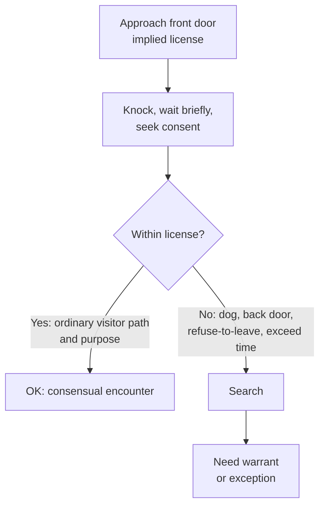

# Knock and Talk

## Rule

The "knock and talk" is not a standalone warrant exception — it rests on the same **implied license** that lets any visitor approach a home's front door, knock, wait briefly, and (absent a refusal) leave. Officers may use that license to seek a consensual conversation or to ask for consent to search; what they obtain is governed by ordinary [[Consent Searches]] law. The moment officers exceed the implied license in **scope, time, or manner** — straying off the normal route, lingering after being told to go, or bringing investigative tools onto the [[Curtilage]] — the approach becomes a Fourth Amendment search requiring a warrant or another exception (*Florida v. Jardines*).

## Key cases

| Case | Holding (one line) | Weight | CourtListener |
| --- | --- | --- | --- |
| *Florida v. Jardines*, 569 U.S. 1, 6-8 (2013) | Walking a drug dog onto the front porch to investigate exceeded the implied license to approach and knock — a trespassory search. | SCOTUS — binding | [opinion](https://www.courtlistener.com/opinion/856347/florida-v-jardines/) |
| *Kentucky v. King*, 563 U.S. 452 (2011) | Police may lawfully knock and announce their presence; a police-created exigency is unusable only when officers create it by engaging or threatening to engage in conduct that itself violates the Fourth Amendment. | SCOTUS — binding | [opinion](https://www.courtlistener.com/opinion/216733/kentucky-v-king/) |
| *Florida v. Bostick*, 501 U.S. 429, 435-36 (1991) | An encounter stays consensual where a reasonable person would feel free to decline the officers' requests or terminate the encounter. | SCOTUS — binding | [opinion](https://www.courtlistener.com/opinion/112631/florida-v-bostick/) |
| *United States v. Drayton*, 536 U.S. 194, 203-07 (2002) | Consent can be voluntary even though officers never advised the person of the right to refuse; there is no per se warning requirement. | SCOTUS — binding | [opinion](https://www.courtlistener.com/opinion/121153/united-states-v-drayton/) |
| *French v. Merrill*, 15 F.4th 116 (1st Cir. 2021) | The knock-and-talk is bounded by the implied license's physical-area and purpose limits; intrusive, repeated pre-dawn conduct exceeded it and violated the Fourth Amendment. | Circuit (1st) — persuasive | [opinion](https://www.courtlistener.com/opinion/5273192/french-v-merrill/) |

## Related cases across doctrines

These cases are treated in full elsewhere but bear on the knock-and-talk doctrine, framed here for it.

| Case | Relevance to knock and talk | Primary treatment | CourtListener |
| --- | --- | --- | --- |
| *United States v. Santana*, 427 U.S. 38 (1976) | A resident standing in her own doorway/threshold is in a "public" place — marking where the implied license to approach ends and a doorway encounter (and arrest) becomes lawful without entering the home. | [[Arrest in the Home]] · [[Exigent Circumstances and Hot Pursuit]] | [opinion](https://www.courtlistener.com/opinion/109504/united-states-v-santana/) |
| *Payton v. New York*, 445 U.S. 573 (1980) | The knock-and-talk's hard backstop: officers may approach and knock, but warrantless, nonconsensual crossing of the threshold to arrest inside the home is presumptively unreasonable — the line a lawful approach must not cross. | [[Arrest in the Home]] · [[Securing the Scene]] | [opinion](https://www.courtlistener.com/opinion/110235/payton-v-new-york/) |
| *Schneckloth v. Bustamonte*, 412 U.S. 218 (1973) | Whatever consent the officers obtain at the door is judged by the totality of the circumstances; the knock-and-talk authorizes no search by itself, so doorstep consent must be voluntary to validate any entry or search. | [[Consent Searches]] | [opinion](https://www.courtlistener.com/opinion/108800/schneckloth-v-bustamonte/) |
| *Georgia v. Randolph*, 547 U.S. 103 (2006) | If a knock-and-talk produces a physically present co-occupant who expressly refuses, that refusal defeats another occupant's consent — the encounter cannot be converted into a consent search over the objector. | [[Consent Searches]] | [opinion](https://www.courtlistener.com/opinion/145669/georgia-v-randolph/) |
| *Illinois v. Rodriguez*, 497 U.S. 177 (1990) | Consent obtained at the door from a third party validates entry if officers reasonably (even if mistakenly) believed that person had authority — the apparent-authority overlay on knock-and-talk consent. | [[Consent Searches]] | [opinion](https://www.courtlistener.com/opinion/112475/illinois-v-rodriguez/) |
| *United States v. Conner*, 127 F.3d 663 (8th Cir. 1997) | The knock-and-talk gone coercive: where officers under color of authority demand that occupants open the door, the resulting "consent" is invalid — the encounter became a seizure, not a consensual approach. | [[Securing the Scene]] | [opinion](https://www.courtlistener.com/opinion/747208/united-states-v-larry-duane-conner-united-states-of-america-v-john/) |
| *Caniglia v. Strom*, 593 U.S. 194 (2021) | There is no freestanding community-caretaking exception for the home — officers who knock cannot bootstrap a warrantless entry on caretaking grounds; they need consent or a recognized exception. | [[Community Caretaking and Emergency Aid]] | [opinion](https://www.courtlistener.com/opinion/4883694/caniglia-v-strom/) |
| *Florida v. Harris*, 568 U.S. 237, 244-48 (2013) | The dog-alert counterpart to *Jardines*: a reliable dog's alert can furnish probable cause, but *Jardines* bars deploying that dog on the porch during a knock-and-talk to generate it in the first place. | [[Probable Cause and Reasonable Suspicion]] | [opinion](https://www.courtlistener.com/opinion/820744/florida-v-harris/) |
| *Collins v. Virginia*, 584 U.S. 586 (2018) | Reinforces the curtilage limit underlying the knock-and-talk: officers may walk the customary front path, but may not stray into curtilage (here, to search a vehicle) without a warrant or exception. | [[Automobile Exception]] | [opinion](https://www.courtlistener.com/opinion/4501697/collins-v-virginia/) |

## Nuances & limits

- **It is consent, not an exception.** A knock and talk authorizes no search by itself. Any entry or search still needs valid consent ([[Consent Searches]]) or an independent exception; treat the doctrine as a lawful *approach*, not a lawful *search*.
- **The implied license sets the boundary.** Under *Jardines*, the license is limited in both **physical area** (the customary path to the front door) and **purpose** (a brief, ordinary visitor's errand). A drug dog deployed on the porch exceeds it; so does deviating to a back door or yard within the [[Curtilage]].
- **Staying consensual.** Whether the encounter remains a mere knock and talk turns on the *Bostick/Drayton* test — would a reasonable person feel **free to decline** the requests or **terminate** the encounter. Officers need not advise the resident of the right to refuse (*Drayton*).
- **You may knock; you may not manufacture exigency.** *King* permits knocking and announcing. But if officers create the exigency by engaging or threatening to engage in conduct that itself violates the Fourth Amendment, the resulting emergency cannot justify a warrantless entry — overlapping with [[Arrest in the Home]] and [[Community Caretaking and Emergency Aid]]; the manufactured-exigency limit is developed on [[Exigent Circumstances and Hot Pursuit]].
- **Circuit marker on how far it can go (not nationwide).** Lower courts vary on repeated knocks, back-door approaches, and pre-dawn visits. The **First Circuit** in *French v. Merrill* is the leading persuasive marker: officers who made repeated pre-dawn visits, knocked on a bedroom window, and peered in with a flashlight "plainly exceeded the scope of the implied license to enter the curtilage." *French v. Merrill*, 15 F.4th 116, 130 (1st Cir. 2021). Persuasive only — label it First Circuit, not a national rule.
- **Burden of proof.** When the government relies on consent obtained at the door, **the government bears the burden of proving the consent was freely and voluntarily given**, judged by the totality of the circumstances — and that burden "cannot be discharged by showing no more than acquiescence to a claim of lawful authority." *Bumper v. North Carolina*, 391 U.S. 543, 548-49 (1968); *Schneckloth v. Bustamonte*, 412 U.S. 218, 222 (1973). (Most courts apply a preponderance standard.)

## Common pitfalls

- **Treating "knock and talk" as its own warrant exception.** It is not. Without consent or another exception, nothing inside the home is fair game.
- **Ignoring curtilage / implied-license limits.** The license covers the front-door path for a brief errand. Cutting to a back door, lingering in the yard, or bringing a dog onto the porch breaks it (*Jardines*; see [[Curtilage]] and [[Two Definitions of Search]]).
- **Using the knock to manufacture exigency.** Banging while shouting threats to break in, or otherwise threatening a Fourth Amendment violation, taints any "emergency" that follows (*King*).
- **Overstaying a refusal.** Once a resident declines or asks officers to leave, continued or repeated intrusion converts the encounter into a search, as the First Circuit illustrated in *French*.

## Recent developments & subsequent treatment

Since *Jardines* and *King*, the circuits have done most of the work of mapping the implied license — when an approach stays consensual, when it becomes a trespassory search, and when a knock-and-talk may (or may not) feed an exigency. These applications are persuasive only; the circuits divide on how far the approach reaches, and no Supreme Court case is currently pending on the question. Treat each as the law of its circuit, not nationwide.

- **United States v. Banks (7th Cir. 2023)** — Applies *Jardines* to bar an investigatory/arrest-purpose porch entry: officers who saw a Snapchat of a felon (Banks) with a gun on his porch had probable cause but skipped the warrant, walked onto the porch, and arrested him inside. Held the front porch is curtilage receiving full home-level protection, and a knock-and-talk cannot launder a warrantless curtilage arrest; suppression reversal. **Seventh Circuit — persuasive, not binding.** "Consent is a well-accepted exception to the warrant requirement, but reasonable suspicion is not." *United States v. Banks*, 61 F.4th 523, 526 (7th Cir. 2023). [opinion](https://www.courtlistener.com/opinion/9378369/united-states-v-jeremy-banks/).
- **United States v. Meyer, 19 F.4th 1028, 1033 (8th Cir. 2021)** — Applies *Kentucky v. King* in the knock-and-talk setting: when a suspect's evasive conduct during a consensual knock-and-talk (excuses, "need to clean up," "check my email") created a risk of evidence destruction, officers did not impermissibly manufacture the exigency — "asking tough questions and closely scrutinizing the answers" does not create the exigency. Warrantless entry/seizure of devices upheld. **Eighth Circuit — persuasive, not binding.** [opinion](https://www.courtlistener.com/opinion/5302394/united-states-v-william-meyer/).
- **United States v. Carloss (10th Cir. 2016)** — The permissive side of the split: multiple "No Trespassing" signs (including one on the front door) did not revoke the implied license for officers to approach and knock seeking a consensual conversation. Treats *Jardines* as leaving ordinary knock-and-talks undisturbed and resists letting signage or arrest-purpose curtail the approach. **Tenth Circuit — persuasive, not binding.** ⚖ Circuit split. "under the circumstances presented here, those 'No Trespassing' signs would not have conveyed to an objective officer that he could not approach the house and knock on the front door seeking to have a consensual conversation with the occupants." (818 F.3d at 991). [opinion](https://www.courtlistener.com/opinion/3184928/united-states-v-carloss/).
- **United States v. Lundin (9th Cir. 2016)** — Applied *Jardines* to hold a 4 a.m. knock-and-talk exceeded the implied license to approach the curtilage — both because of the unusual hour and because the officers' purpose was to arrest, not to ask questions; suppressed the resulting statements/evidence. **Ninth Circuit — persuasive, not binding.** ⚖ Circuit split. "the officers knocked on Lundin's door around 4:00 a.m. without evidence that Lundin generally accepted visitors at that hour, and without a reason for knocking that a resident would ordinarily accept as sufficiently weighty to justify the disturbance." (817 F.3d at 1159). [opinion](https://www.courtlistener.com/opinion/3187682/united-states-v-eric-lundin/).

## Visual

## Sources

- [Florida v. Jardines, 569 U.S. 1 (2013)](https://www.courtlistener.com/opinion/856347/florida-v-jardines/)
- [Kentucky v. King, 563 U.S. 452 (2011)](https://www.courtlistener.com/opinion/216733/kentucky-v-king/)
- [Florida v. Bostick, 501 U.S. 429 (1991)](https://www.courtlistener.com/opinion/112631/florida-v-bostick/)
- [United States v. Drayton, 536 U.S. 194 (2002)](https://www.courtlistener.com/opinion/121153/united-states-v-drayton/)
- [French v. Merrill, 15 F.4th 116 (1st Cir. 2021)](https://www.courtlistener.com/opinion/5273192/french-v-merrill/)
