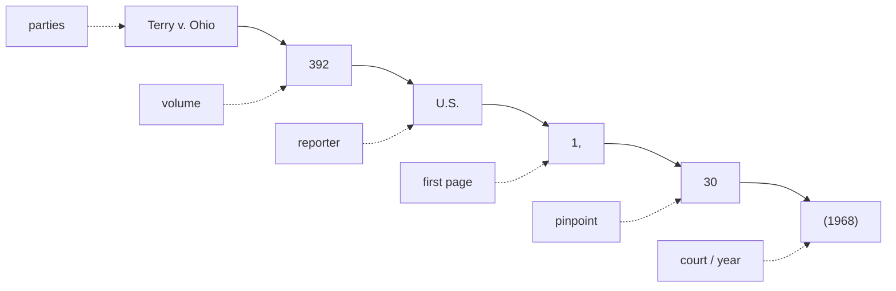

A working instructor has to *read* a citation cold and *find* the opinion fast. This page covers both: how to decode a Bluebook cite, and how to research federal case law for free. This wiki's house style is **Bluebook**, and every case it asserts is verified on CourtListener before it goes on a page.

## Part 1 — Reading a case citation

### Anatomy of a cite

Take a neutral example:

> *Terry v. Ohio*, 392 U.S. 1, 30 (1968).

Read left to right, every standard cite has the same parts:

- **Case name (the parties)** — *Terry v. Ohio*. Italicized; the *v.* separates the two sides. By convention the first-named party is the appellant/petitioner on review, so the same dispute can flip names on appeal. Cite by the short name everyone uses (*Terry*).
- **Volume number** — `392`. Which physical volume of the reporter the case sits in.
- **Reporter abbreviation** — `U.S.` Tells you *which set of books* (and therefore which court). See the reporter table below.
- **First page** — `1`. The page where the opinion *starts*.
- **Pinpoint (pin cite)** — `30`. The *specific* page the quoted or relied-on language is on. `392 U.S. 1, 30` means "the opinion starts at page 1; the point I'm making is on page 30." **Always pin when you quote or attribute a specific holding** — a cite without a pin is hard to check and weak in a courtroom.
- **Court & year parenthetical** — `(1968)`. The year decided. For lower courts the parenthetical also names the **court**, e.g. `(9th Cir. 2021)` or `(S.D.N.Y. 2020)`. For the Supreme Court the reporter `U.S.` already identifies the court, so the parenthetical is year only.

### Which reporter = which court

The reporter abbreviation is the fastest way to tell a case's level — and therefore its precedential weight (see [[The Federal Court System]]).

| Reporter | Court | Example |
| --- | --- | --- |
| `U.S.` | U.S. Supreme Court (official) | 392 U.S. 1 |
| `S. Ct.` | U.S. Supreme Court (West) — parallel | 88 S. Ct. 1868 |
| `L. Ed. 2d` | U.S. Supreme Court (Lawyers' Ed.) — parallel | 20 L. Ed. 2d 889 |
| `F.4th` / `F.3d` / `F.2d` / `F.` | U.S. Courts of Appeals (circuits) | 5 F.4th 100 (9th Cir. 2021) |
| `F. Supp. 3d` / `F. Supp. 2d` / `F. Supp.` | U.S. District Courts | 500 F. Supp. 3d 1 (D. Mass. 2020) |
| `F. App'x` | unpublished circuit dispositions (Federal Appendix) | 700 F. App'x 1 |

- The numbered series (`F.`, `F.2d`, `F.3d`, `F.4th`) are just *editions* of the same Federal Reporter as the volumes filled up over the decades — `F.4th` is simply the current one.
- For a circuit case the parenthetical's circuit tells you *whose* persuasive authority it is — `(5th Cir.)` binds the Fifth Circuit but is only persuasive elsewhere. Never anchor a multi-jurisdiction point to one circuit.

### Parallel citations

The *same* SCOTUS opinion appears in three reporters at once, so you'll see all three strung together:

> *Terry v. Ohio*, 392 U.S. 1, 88 S. Ct. 1868, 20 L. Ed. 2d 889 (1968).

These are **parallel citations** — same case, three sets of books. For federal work, citing the official `U.S.` reporter alone is standard; the parallels matter mainly for older cases or some state-court practice. Don't mistake parallels for three different cases.

### Signals, short forms, and the back-references

- **Introductory signals** tell the reader *how* the cite supports the point:
  - *(no signal)* — the source directly states the proposition.
  - **See** — the source supports it by clear inference (the workhorse signal).
  - **See also** — additional support, secondary to what you already cited.
  - **Cf.** — supports an *analogous* point; worth a parenthetical explaining why.
  - **E.g.** — one example among many that say the same thing.
  - **But see** / **Contra** — authority that cuts the *other* way (cite these honestly).
- **Short forms** — after a case is cited in full once, refer to it by the short name (*Terry*) or a short cite (`392 U.S. at 30`).
- **`Id.`** — "the immediately preceding authority." `Id. at 30` = same source, new page. Use only when the cite right before it is the same source.
- **`Supra`** — points back to a source cited earlier but *not* immediately above (used mainly for books, articles, and the like — generally **not** for cases under Bluebook).

### Published vs. unpublished opinions

This distinction drives **how much weight** an opinion carries — tie it to [[The Federal Court System]].

- **Published** opinions are designated for the bound reporters (`F.4th`, `F. Supp. 3d`) and are **precedential** — binding on that court and the courts below it within the jurisdiction.
- **Unpublished** dispositions (often in `F. App'x`, the Federal Appendix, or marked "not for publication") are typically **non-precedential** — persuasive at best. Circuits vary on whether and how they may be cited; Federal Rule of Appellate Procedure 32.1 permits *citing* federal unpublished opinions issued on or after Jan. 1, 2007, but permission to cite is not the same as binding force.
- **Per curiam** ("by the court") opinions are issued in the name of the whole court rather than a single authoring judge. They can be fully precedential (many SCOTUS per curiams are) or summary and non-precedential — judge the weight by the court and whether it's published, not by the "per curiam" label alone.
- **Bottom line for instructors:** before you lean on a case, confirm it is *published* (or otherwise binding in your jurisdiction). An unpublished circuit case is a teaching illustration, not a rule you can hang a search on.

## Part 2 — Researching case law for free

You do not need Westlaw or Lexis to do this course's research. The free federal ecosystem is strong. *(Tool details below confirmed current via web search, June 2026.)*

### The free toolkit

- **CourtListener** (Free Law Project) — the backbone. 8M+ precedential opinions, federal and state, with full-text search, an integrated **citator** ("Cited By" / "Authorities"), and stable permalinks. **This wiki verifies every cite here.** Its **RECAP Archive** is the largest open collection of federal **docket** filings (briefs, motions, orders) pulled from PACER; the **RECAP browser extension** captures PACER documents you pull and shares them free, so check RECAP before paying PACER.
- **Google Scholar (case law mode)** — fastest start for full-text searching. Switch to "Case law," filter by court. Its **"How cited"** panel shows later cases that cite the opinion and how they treated it — a free, lightweight citator.
- **Justia** — clean, browsable directory of opinions organized by court and jurisdiction; a strong free SCOTUS collection (1791–present) with summaries.
- **Official court / SCOTUS sites** — the *authoritative* source for a slip opinion the day it drops. **supremecourt.gov** posts SCOTUS opinions and bound U.S. Reports volumes; individual circuit and district court sites post their own opinions.
- **Caselaw Access Project (CAP)** — Harvard's digitization of official book-published U.S. case law **through 2020**, all courts. CAP's own search was retired in 2024; search the CAP corpus through **CourtListener's Advanced Case Law Search**.
- **govinfo** (GPO) — official government documents, including historic bound **U.S. Reports** volumes (roughly 1790–1991).
- **OpenJurist** — free full-text public-domain federal case law (SCOTUS back to 1790, Federal Reporter back to 1880). *(This is the resource the class notes meant by "opencase" — older and clunkier than CourtListener; use it as a fallback.)*

> Avoid asserting a "tool" you can't confirm exists. The list above is verified current; if a name doesn't resolve to a real, live resource, leave it out.

### Search by what you have

How you search depends on what you already know:

1. **By citation** — you have `392 U.S. 1`. Drop it straight into CourtListener's citation lookup or Google Scholar. Fastest path to the *exact* opinion.
2. **By party name** — you remember "*Terry v. Ohio*." Search the case name; watch for same-named but different cases (multiple *United States v. Jones*).
3. **By proposition / full text** — you only know the *idea* ("frisk for weapons reasonable suspicion"). Full-text search the phrase, then read down to the controlling case. This is where CourtListener and Google Scholar shine.

### Verify it's good law (citator awareness)

Finding a case is not the end — finding out whether it **still stands** is.

- Free tools don't give you a Shepard's/KeyCite red-flag system, so you must do it by hand: check **CourtListener's "Cited By"/"Authorities"** and **Google Scholar's "How cited."**
- Scan whether later courts **followed, criticized, distinguished, or overruled** it. A case that's been narrowed or reversed is a trap, not a holding.
- **Read the actual opinion — never cite from a headnote or summary.** Headnotes are editorial; they are not the court's words and can mislead. Pull the text, find the language, and **pin** to its page.

### Confirm jurisdiction and weight

Before you teach from a case, confirm:

- **Which court** decided it (SCOTUS = binding everywhere; a circuit binds only that circuit; a district court binds no one) — see [[The Federal Court System]].
- Whether it is **published / precedential** (Part 1 above).
- Whether it's still **current** federal law — and if circuits **split**, flag the split rather than picking a side.

### Save and organize your findings

Record each case the way **this wiki itself** does, so it can be re-found and re-verified instantly:

- **Consistent Bluebook cite** — e.g., *Terry v. Ohio*, 392 U.S. 1 (1968).
- **CourtListener permalink** — the stable opinion URL, so anyone can open the exact text you read.
- **Pinpoint** — the page your point lives on, captured *when* you read it (`392 U.S. at 30`).
- A one-line note on the **holding** and its **weight** (binding / persuasive / illustrative).

That triple — **cite + CourtListener link + pin** — is the unit of trustworthy legal research, and it's exactly what every page in this wiki carries in its Key cases table and Sources.

## Flashcards

- In *Terry v. Ohio*, 392 U.S. 1, 30 (1968), what is the `30`?::The pinpoint (pin cite) — the specific page the relied-on language is on; `1` is where the opinion starts.
- What does the reporter abbreviation `U.S.` tell you?::The case is a U.S. Supreme Court opinion in the official United States Reports.
- Which reporters signal a U.S. Court of Appeals vs. a U.S. District Court case?::Courts of Appeals → `F.4th`/`F.3d`/`F.2d`/`F.` (with the circuit in the parenthetical); District Courts → `F. Supp. 3d`/`F. Supp. 2d`/`F. Supp.`
- What is a parallel citation?::The same opinion reported in more than one reporter at once — e.g., a SCOTUS case in `U.S.`, `S. Ct.`, and `L. Ed. 2d`. Same case, different books.
- What do the signals *see*, *cf.*, and *e.g.* mean?::*See* = supports by clear inference; *cf.* = supports an analogous point; *e.g.* = one of many sources stating the same thing.
- What does `id.` refer to?::The immediately preceding authority; `id. at 30` = same source, new page.
- Published vs. unpublished opinion — what's the practical difference?::Published opinions are precedential (binding within the jurisdiction); unpublished/per curiam dispositions may be non-precedential, persuasive-only — confirm the weight before relying on one.
- Name three free tools for federal case-law research.::CourtListener (+ RECAP), Google Scholar (case law mode), and Justia — plus official court/SCOTUS sites, Caselaw Access Project, govinfo, and OpenJurist.
- Why read the opinion instead of a headnote?::Headnotes are editorial summaries, not the court's words; they can mislead. Cite the court's actual language and pin to its page.
- How does this wiki save a verified case?::As a consistent Bluebook cite + a CourtListener permalink + a pinpoint (and a one-line holding/weight note) — so it can be re-found and re-verified.

## Sources

Free legal-research resources (general practice references, not case-law authority):

- [CourtListener — Free Law Project](https://www.courtlistener.com/)
- [Google Scholar — How to Find Free Case Law Online (Library of Congress)](https://guides.loc.gov/free-case-law/google-scholar)
- [CourtListener & Caselaw Access Project (Library of Congress)](https://guides.loc.gov/free-case-law/courtlistener)
- [Justia U.S. Supreme Court Center](https://supreme.justia.com/)
- [OpenJurist](https://openjurist.org/)
- [Free Sources of Case Law — Georgetown Law Library](https://guides.ll.georgetown.edu/freelowcost/free)
