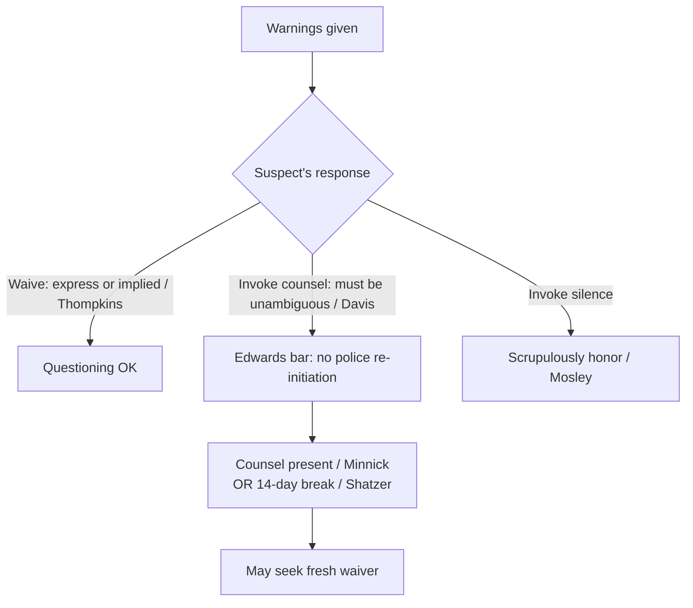

# Miranda: Waiver and Invocation

## Rule

This page picks up *after* the warnings are given — whether warnings were required in the first place is governed by [[Miranda and Custodial Interrogation]]. Once warned, a suspect may **waive** his rights (the waiver must be knowing, intelligent, and voluntary, and it may be express or inferred from conduct) or **invoke** them. Invocation runs on two distinct tracks: an invocation of **counsel** must be unambiguous and triggers the *Edwards* bright-line bar on police-initiated re-questioning, while an invocation of **silence** need only be "scrupulously honored." Miranda-statement fruits (a warned second statement, physical evidence, the deliberate two-step) are governed here; note that Fourth Amendment fruit-of-the-poisonous-tree analysis lives on [[The Exclusionary Rule]].

## Key cases

| Case | Holding (one line) | Weight | CourtListener |
|------|--------------------|--------|---------------|
| *North Carolina v. Butler*, 441 U.S. 369 (1979) | Waiver need not be express; it may be inferred from words and conduct, but silence alone is never enough and the burden stays on the government. | SCOTUS — binding | [opinion](https://www.courtlistener.com/opinion/110065/north-carolina-v-butler/) |
| *Edwards v. Arizona*, 451 U.S. 477 (1981) | Once counsel is invoked, police may not re-initiate interrogation until counsel is made available, unless the accused himself initiates. | SCOTUS — binding | [opinion](https://www.courtlistener.com/opinion/110475/edwards-v-arizona/) |
| *Michigan v. Mosley*, 423 U.S. 96 (1975) | After an invocation of silence, later statements are admissible if the invocation was "scrupulously honored." | SCOTUS — binding | [opinion](https://www.courtlistener.com/opinion/109336/michigan-v-mosley/) |
| *Berghuis v. Thompkins*, 560 U.S. 370 (2010) | Silence alone does not invoke; the right to silence must be invoked unambiguously, and a suspect who answers after a long silence has impliedly waived. | SCOTUS — binding | [opinion](https://www.courtlistener.com/opinion/147529/berghuis-v-thompkins/) |
| *Arizona v. Roberson*, 486 U.S. 675 (1988) | The Edwards bar is not offense-specific — invocation blocks questioning on any offense, and a second officer's ignorance is no excuse. | SCOTUS — binding | [opinion](https://www.courtlistener.com/opinion/112100/arizona-v-roberson/) |
| *Minnick v. Mississippi*, 498 U.S. 146 (1990) | Edwards is not satisfied merely because the suspect already consulted a lawyer; counsel must be present for police-initiated re-questioning. | SCOTUS — binding | [opinion](https://www.courtlistener.com/opinion/112513/minnick-v-mississippi/) |
| *Oregon v. Elstad*, 470 U.S. 298 (1985) | An earlier un-warned but voluntary statement does not taint a later, properly warned and waived confession. | SCOTUS — binding | [opinion](https://www.courtlistener.com/opinion/111364/oregon-v-elstad/) |
| *United States v. Patane*, 542 U.S. 630 (2004) | Physical fruits of an un-warned but voluntary statement are admissible. | SCOTUS — binding | [opinion](https://www.courtlistener.com/opinion/137003/united-states-v-patane/) |
| *Davis v. United States*, 512 U.S. 452 (1994) | Invocation of counsel must be unambiguous; an equivocal reference ("maybe I should talk to a lawyer") does not require police to stop or even to ask clarifying questions. | SCOTUS — binding | [opinion](https://www.courtlistener.com/opinion/117863/davis-v-united-states/) |
| *Maryland v. Shatzer*, 559 U.S. 98 (2010) | A 14-day break in Miranda custody ends Edwards protection; release into the general prison population counts as a break. | SCOTUS — binding | [opinion](https://www.courtlistener.com/opinion/1734/maryland-v-shatzer/) |
| *Missouri v. Seibert*, 542 U.S. 600 (2004) | A deliberate "question-first, warn-later" two-step interrogation is invalid. | SCOTUS — binding | [opinion](https://www.courtlistener.com/opinion/137002/missouri-v-seibert/) |
| *Moran v. Burbine*, 475 U.S. 412 (1986) | Waiver is valid even though police did not tell the suspect an attorney was trying to reach him; events outside his knowledge do not bear on his waiver. | SCOTUS — binding | [opinion](https://www.courtlistener.com/opinion/111614/moran-v-burbine/) |

## Nuances & limits

- **Waiver can be implied.** *Butler* holds an express written or oral waiver is not required — it may be inferred from the suspect's words and conduct — but **silence alone is never a waiver**, and the burden of proving waiver stays on the government. *Thompkins* applies this in practice: a suspect who stays largely silent and then answers a question after a long interrogation has impliedly waived.
- **Two invocation tracks, two different rules.** Invoking *counsel* triggers *Edwards*' bright-line bar on police-initiated re-questioning; invoking *silence* only requires that police "scrupulously honor" the invocation. Under *Mosley*, that honor was satisfied where questioning ceased, time passed, fresh warnings were given, and the second interrogation concerned a *different* crime.
- **The Edwards bar is strong and broad.** Once counsel is invoked, *Edwards* bars further interrogation until counsel is made available or the accused himself re-initiates. *Roberson* makes the bar **not offense-specific** — it covers questioning on *any* offense, even an unrelated one, and a second, unaware officer cannot bypass it. (Contrast the offense-specific Sixth Amendment right to counsel, treated on [[Sixth Amendment Right to Counsel]].) *Minnick* confirms the bar is not lifted merely because the suspect has consulted a lawyer; counsel must be **present** for police-initiated re-questioning.
- **The bar is not permanent.** *Shatzer* holds that a **14-day break in Miranda custody** ends Edwards protection, after which police may re-approach and seek a fresh waiver; release back into the general prison population is itself a break in custody.
- **Miranda fruits.** An earlier *un-warned but voluntary* statement does not automatically taint what follows: under *Elstad*, a later confession is admissible if the suspect is then properly Mirandized and waives. *Patane* holds that **physical fruits** of an un-warned voluntary statement are admissible. Both turn on the earlier statement being *voluntary* in the due-process sense — actual coercion is a separate problem treated on [[Due-Process Voluntariness of Confessions]]. But *Seibert* invalidates the **deliberate** "question-first, warn-later" two-step designed to circumvent Miranda — *Elstad*'s safe harbor does not cover bad-faith end-runs.
- **Waiver tests the suspect's knowledge, not the police's candor.** *Moran v. Burbine* holds a waiver valid even though officers withheld that an attorney was trying to reach the suspect; events outside the suspect's awareness do not undermine his own knowing, intelligent, and voluntary choice.

## Common pitfalls

- **Treating silence as an invocation.** Under *Thompkins*, merely staying quiet neither invokes the right to silence nor blocks waiver — to stop questioning, the suspect must invoke *unambiguously*.
- **Treating an ambiguous lawyer reference as an invocation.** *Davis* is clear: officers may keep questioning after an equivocal statement: "But if a suspect makes a reference to an attorney that is ambiguous or equivocal in that a reasonable officer in light of the circumstances would have understood only that the suspect might be invoking the right to counsel, our precedents do not require the cessation of questioning." (512 U.S. at 459.) Officers are not even *required* to ask clarifying questions, though doing so is good practice.
- **Confusing the two tracks.** Invoking *silence* (scrupulously-honor, re-questioning on a different crime can be permissible under *Mosley*) is not the same as invoking *counsel* (the rigid, offense-blind *Edwards* bar). Officers who treat them identically either over- or under-protect the suspect.

## Visual

## Flashcards

- Under *North Carolina v. Butler*, can a Miranda waiver be implied?::Yes — waiver need not be express and may be inferred from words and conduct, but silence alone is never a waiver and the government bears the burden.
- What does invoking the right to *counsel* trigger under *Edwards v. Arizona*?::A bright-line bar: police may not re-initiate interrogation until counsel is made available, unless the accused himself initiates further communication.
- Per *Davis v. United States*, must police stop questioning after an ambiguous reference to a lawyer?::No — invocation of counsel must be unambiguous; an equivocal reference ("maybe I should talk to a lawyer") does not require cessation, and officers need not even ask clarifying questions.
- How does *Arizona v. Roberson* differ from the Sixth Amendment right to counsel?::The Edwards/Fifth Amendment bar is NOT offense-specific — it blocks questioning on any offense; the Sixth Amendment right is offense-specific.
- What ends Edwards protection under *Maryland v. Shatzer*?::A 14-day break in Miranda custody; release back into the general prison population counts as a break, after which police may seek a fresh waiver.

## Sources

- [North Carolina v. Butler, 441 U.S. 369 (1979)](https://www.courtlistener.com/opinion/110065/north-carolina-v-butler/)
- [Edwards v. Arizona, 451 U.S. 477 (1981)](https://www.courtlistener.com/opinion/110475/edwards-v-arizona/)
- [Michigan v. Mosley, 423 U.S. 96 (1975)](https://www.courtlistener.com/opinion/109336/michigan-v-mosley/)
- [Berghuis v. Thompkins, 560 U.S. 370 (2010)](https://www.courtlistener.com/opinion/147529/berghuis-v-thompkins/)
- [Arizona v. Roberson, 486 U.S. 675 (1988)](https://www.courtlistener.com/opinion/112100/arizona-v-roberson/)
- [Minnick v. Mississippi, 498 U.S. 146 (1990)](https://www.courtlistener.com/opinion/112513/minnick-v-mississippi/)
- [Oregon v. Elstad, 470 U.S. 298 (1985)](https://www.courtlistener.com/opinion/111364/oregon-v-elstad/)
- [United States v. Patane, 542 U.S. 630 (2004)](https://www.courtlistener.com/opinion/137003/united-states-v-patane/)
- [Davis v. United States, 512 U.S. 452 (1994)](https://www.courtlistener.com/opinion/117863/davis-v-united-states/)
- [Maryland v. Shatzer, 559 U.S. 98 (2010)](https://www.courtlistener.com/opinion/1734/maryland-v-shatzer/)
- [Missouri v. Seibert, 542 U.S. 600 (2004)](https://www.courtlistener.com/opinion/137002/missouri-v-seibert/)
- [Moran v. Burbine, 475 U.S. 412 (1986)](https://www.courtlistener.com/opinion/111614/moran-v-burbine/)
