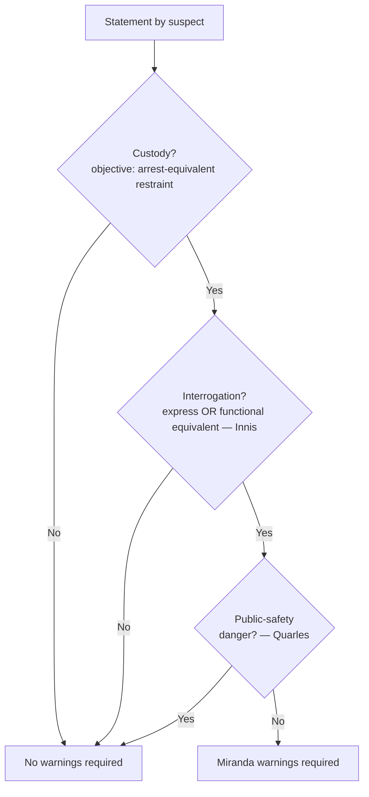

# Miranda and Custodial Interrogation

## Rule

Before *custodial interrogation*, police must warn a suspect of the Fifth Amendment privilege against self-incrimination; statements obtained without the warnings (or a valid waiver) are inadmissible in the prosecution's case-in-chief. The trigger has **two** elements — the instructor's "two C's": **Custody** (an objective test: a reasonable person's freedom of action is restrained to the degree associated with formal arrest) **and** **Interrogation** (express questioning *or* its functional equivalent under *Rhode Island v. Innis*). Both must be present; warnings are not required for non-custodial questioning, and volunteered statements are never the product of interrogation. *Miranda* is a constitutional rule that Congress cannot override by statute (*Dickerson*), subject to a narrow public-safety exception (*Quarles*).

> Scope note: this page covers whether warnings are **required** (the custody + interrogation gate) plus the public-safety exception. What happens *after* warnings — waiver, invocation, and the admissibility of statement-fruits — lives in [[Miranda Waiver and Invocation]]. Coercion claims independent of *Miranda* go to [[Due-Process Voluntariness of Confessions]]. The distinct, offense-specific Sixth Amendment right that attaches at formal charging is treated in [[Sixth Amendment Right to Counsel]].

## Key cases

| Case | Holding (one line) | Weight | CourtListener |
| --- | --- | --- | --- |
| *Miranda v. Arizona*, 384 U.S. 436, 444 (1966) | Custodial-interrogation statements are inadmissible absent the warnings and a knowing, voluntary waiver. | SCOTUS — binding | [opinion](https://www.courtlistener.com/opinion/107252/miranda-v-arizona/) |
| *Rhode Island v. Innis*, 446 U.S. 291 (1980) | "Interrogation" includes express questioning *and* its functional equivalent. | SCOTUS — binding | [opinion](https://www.courtlistener.com/opinion/110254/rhode-island-v-innis/) |
| *Dickerson v. United States*, 530 U.S. 428, 432, 444 (2000) | *Miranda* is a constitutional rule; 18 U.S.C. § 3501 cannot supersede it. | SCOTUS — binding | [opinion](https://www.courtlistener.com/opinion/118380/dickerson-v-united-states/) |
| *Berkemer v. McCarty*, 468 U.S. 420 (1984) | *Miranda* covers all offenses, but an ordinary traffic stop is not custody. | SCOTUS — binding | [opinion](https://www.courtlistener.com/opinion/111249/berkemer-v-mccarty/) |
| *Oregon v. Mathiason*, 429 U.S. 492 (1977) (per curiam) | A voluntary station-house interview, told free to leave, is not custody. | SCOTUS — binding | [opinion](https://www.courtlistener.com/opinion/109587/oregon-v-mathiason/) |
| *Orozco v. Texas*, 394 U.S. 324 (1969) | Custody can exist in the suspect's own bedroom; it is not limited to the stationhouse. | SCOTUS — binding | [opinion](https://www.courtlistener.com/opinion/107883/orozco-v-texas/) |
| *J.D.B. v. North Carolina*, 564 U.S. 261 (2011) | A child's age is part of the objective custody analysis when known/apparent to the officer. | SCOTUS — binding | [opinion](https://www.courtlistener.com/opinion/218925/j-d-b-v-north-carolina/) |
| *Howes v. Fields*, 565 U.S. 499 (2012) | Imprisonment alone is not *Miranda* custody; custody turns on the totality. | SCOTUS — binding | [opinion](https://www.courtlistener.com/opinion/623144/howes-v-fields/) |
| *Stansbury v. California*, 511 U.S. 318 (1994) (per curiam) | Custody is objective; an officer's undisclosed suspicion is irrelevant. | SCOTUS — binding | [opinion](https://www.courtlistener.com/opinion/117843/stansbury-v-california/) |
| *New York v. Quarles*, 467 U.S. 649 (1984) | Public-safety exception: unwarned questions to neutralize an immediate danger are allowed. | SCOTUS — binding | [opinion](https://www.courtlistener.com/opinion/111214/new-york-v-quarles/) |
| *Illinois v. Perkins*, 496 U.S. 292 (1990) | No warnings for an undercover/jailhouse agent — no police-dominated coercive atmosphere. | SCOTUS — binding | [opinion](https://www.courtlistener.com/opinion/112452/illinois-v-perkins/) |

## Nuances & limits

- **"Interrogation" is broader than questions.** Under *Innis*, the *Miranda* safeguards apply to "either express questioning or its functional equivalent" — defined as "any words or actions on the part of the police (other than those normally attendant to arrest and custody) that the police should know are reasonably likely to elicit an incriminating response from the suspect" (446 U.S. at 300-01). The test looks to the suspect's perceptions; on the facts, the officers' exchange about a missing shotgun near a school for handicapped children was *not* the functional equivalent of interrogation.
- **Custody is objective and arrest-equivalent.** It is measured by the objective circumstances, not by what the officer privately suspected — an officer's uncommunicated suspicion is irrelevant (*Stansbury*). The benchmark is restraint to the degree associated with formal arrest, which is why a temporary, public roadside detention is not custody (*Berkemer*) and why *J.D.B.* adds a known/apparent child's age to that objective calculus.
- **Setting is not dispositive — restraint is.** A voluntary station visit where the suspect is told he is free to leave is not custody (*Mathiason*), and even a prison inmate questioned about an outside offense is not automatically in custody (*Howes v. Fields*). Conversely, four officers questioning an arrested suspect in his own bedroom *was* custody (*Orozco*).
- **Offense severity does not matter.** *Berkemer* holds *Miranda* reaches all custodial interrogation regardless of whether the charge is a misdemeanor or felony — but separately holds the ordinary traffic stop is not custodial.
- **No coercive atmosphere, no *Miranda*.** *Perkins* removes undercover and jailhouse-informant questioning from *Miranda* entirely, because a suspect who does not know he is speaking to law enforcement faces no police-dominated pressure.
- **Public-safety exception is narrow.** *Quarles* permits un-Mirandized questions reasonably prompted by an immediate threat (the location of a hidden loaded gun); both the answer and the weapon are admissible. It is not a license for routine investigative questioning.
- **Statutory override rejected.** *Dickerson* confirms *Miranda* is constitutional and that 18 U.S.C. § 3501 cannot displace it in federal court; this remains current law.

## Common pitfalls

- **Treating *Miranda* as covering all police contact.** Warnings attach only when custody **and** interrogation coincide. On-scene, consensual, or non-custodial questioning needs no warnings.
- **Calling a *Terry* or traffic stop "custody."** A brief, public investigative detention is a [[Seizure of the Person]] for Fourth Amendment purposes but is *not* *Miranda* custody (*Berkemer*); see [[Traffic Stops]]. Custody requires arrest-equivalent restraint.
- **Suppressing volunteered statements.** Spontaneous, unsolicited statements are not the product of interrogation and need no warnings — even after arrest, words "normally attendant to arrest and custody" do not count (*Innis*).
- **Relying on the officer's own (unspoken) view of the suspect.** Whether someone is in custody turns on objective circumstances, not the officer's hidden belief that the person is a suspect (*Stansbury*).
- **Reading the public-safety exception too broadly.** *Quarles* is limited to questions neutralizing an immediate danger, not general fact-gathering.

## Visual

## Flashcards

- What two elements together trigger Miranda warnings?::Custody (objective, arrest-equivalent restraint) AND interrogation (express questioning or its functional equivalent).
- How did Rhode Island v. Innis define "interrogation"?::Express questioning plus its functional equivalent — words/actions police should know are reasonably likely to elicit an incriminating response (other than those normally attendant to arrest and custody).
- Is an ordinary traffic stop Miranda custody?::No. Berkemer v. McCarty holds a temporary, public traffic stop is not custody, though Miranda otherwise applies to all offenses.
- What is the Quarles exception?::A narrow public-safety exception allowing un-Mirandized questions reasonably prompted by an immediate danger; the answers and resulting evidence are admissible.
- Why does Dickerson v. United States matter?::It holds Miranda is a constitutional rule, so 18 U.S.C. § 3501 cannot supersede it.

## Sources

- [Miranda v. Arizona, 384 U.S. 436 (1966)](https://www.courtlistener.com/opinion/107252/miranda-v-arizona/)
- [Rhode Island v. Innis, 446 U.S. 291 (1980)](https://www.courtlistener.com/opinion/110254/rhode-island-v-innis/)
- [Dickerson v. United States, 530 U.S. 428 (2000)](https://www.courtlistener.com/opinion/118380/dickerson-v-united-states/)
- [Berkemer v. McCarty, 468 U.S. 420 (1984)](https://www.courtlistener.com/opinion/111249/berkemer-v-mccarty/)
- [Oregon v. Mathiason, 429 U.S. 492 (1977)](https://www.courtlistener.com/opinion/109587/oregon-v-mathiason/)
- [Orozco v. Texas, 394 U.S. 324 (1969)](https://www.courtlistener.com/opinion/107883/orozco-v-texas/)
- [J.D.B. v. North Carolina, 564 U.S. 261 (2011)](https://www.courtlistener.com/opinion/218925/j-d-b-v-north-carolina/)
- [Howes v. Fields, 565 U.S. 499 (2012)](https://www.courtlistener.com/opinion/623144/howes-v-fields/)
- [Stansbury v. California, 511 U.S. 318 (1994)](https://www.courtlistener.com/opinion/117843/stansbury-v-california/)
- [New York v. Quarles, 467 U.S. 649 (1984)](https://www.courtlistener.com/opinion/111214/new-york-v-quarles/)
- [Illinois v. Perkins, 496 U.S. 292 (1990)](https://www.courtlistener.com/opinion/112452/illinois-v-perkins/)
