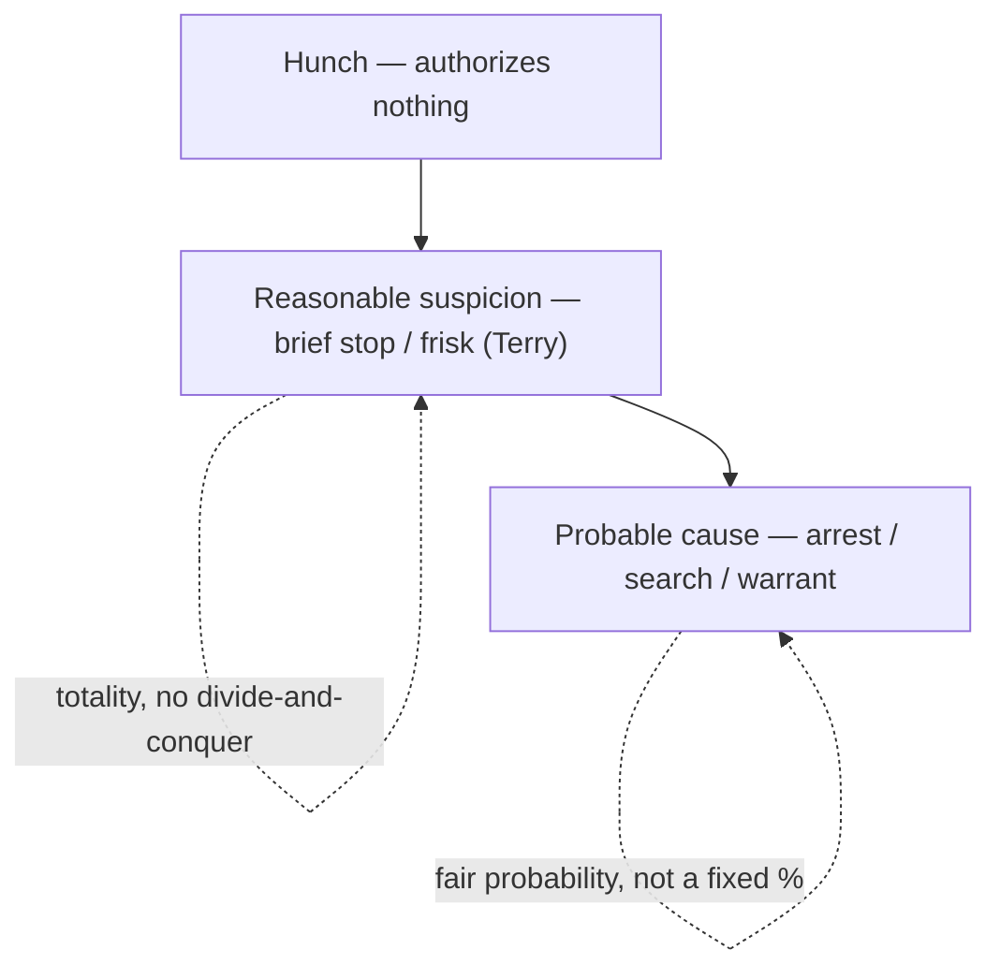

# Probable Cause and Reasonable Suspicion

## Rule
The Fourth Amendment runs on two standards of proof, neither of which is a fixed number. **Probable cause** — the quantum required for an arrest, a full search, or a warrant — exists when the known facts give a *fair probability* that a crime has occurred or that evidence will be found in a particular place. **Reasonable, articulable suspicion** is a less demanding standard that authorizes only a brief investigative stop and protective frisk: specific facts and rational inferences pointing to criminal activity, more than a hunch but well short of probable cause. Both are measured by the **totality of the circumstances** through the eyes of a reasonable, experienced officer, and both are reviewed de novo on appeal. This page owns the standards themselves and the [[Fourth Amendment Framework]] and [[Fourth Amendment Analysis Checklist]] point here for "how much proof"; [[Terry Stops and Reasonable Suspicion]] owns stop/frisk scope and duration, and [[The Warrant Requirement]] owns presenting probable cause to a magistrate.

## Key cases

| Case | Holding (one line) | Weight | CourtListener |
| --- | --- | --- | --- |
| *Brinegar v. United States*, 338 U.S. 160, 175 (1949) | Classic probable-cause standard: practical, non-technical probabilities on which reasonable people act. | SCOTUS — binding | [opinion](https://www.courtlistener.com/opinion/104716/brinegar-v-united-states/) |
| *Terry v. Ohio*, 392 U.S. 1 (1968) | A brief investigative stop and protective frisk require reasonable, articulable suspicion — not an inchoate hunch. | SCOTUS — binding | [opinion](https://www.courtlistener.com/opinion/107729/terry-v-ohio/) |
| *Illinois v. Gates*, 462 U.S. 213 (1983) | Probable cause is judged by the totality of the circumstances — a fair-probability inquiry, not rigid prongs. | SCOTUS — binding | [opinion](https://www.courtlistener.com/opinion/110959/illinois-v-gates/) |
| *Alabama v. White*, 496 U.S. 325, 332 (1990) | An anonymous tip can supply reasonable suspicion when police corroborate its prediction of future conduct. | SCOTUS — binding | [opinion](https://www.courtlistener.com/opinion/112454/alabama-v-white/) |
| *Ornelas v. United States*, 517 U.S. 690 (1996) | Reasonable-suspicion and probable-cause determinations are reviewed de novo on appeal. | SCOTUS — binding | [opinion](https://www.courtlistener.com/opinion/118030/ornelas-v-united-states/) |
| *Illinois v. Wardlow*, 528 U.S. 119, 124 (2000) | Unprovoked headlong flight in a high-crime area can furnish reasonable suspicion for a Terry stop. | SCOTUS — binding | [opinion](https://www.courtlistener.com/opinion/118326/illinois-v-wardlow/) |
| *Florida v. J.L.*, 529 U.S. 266, 272 (2000) | A bare anonymous tip that a person has a gun, without more, is not reasonable suspicion. | SCOTUS — binding | [opinion](https://www.courtlistener.com/opinion/118352/florida-v-jl/) |
| *United States v. Arvizu*, 534 U.S. 266, 274 (2002) | Reasonable suspicion is judged on the whole picture; no divide-and-conquer of individual factors. | SCOTUS — binding | [opinion](https://www.courtlistener.com/opinion/118474/united-states-v-arvizu/) |
| *Maryland v. Pringle*, 540 U.S. 366, 371-74 (2003) | Drugs/cash in a car with no owner gives probable cause to arrest all occupants on a common-enterprise inference. | SCOTUS — binding | [opinion](https://www.courtlistener.com/opinion/131150/maryland-v-pringle/) |
| *Devenpeck v. Alford*, 543 U.S. 146, 153-55 (2004) | Probable cause is objective; the offense need not be the one the officer named or closely related to it. | SCOTUS — binding | [opinion](https://www.courtlistener.com/opinion/137733/devenpeck-v-alford/) |
| *Florida v. Harris*, 568 U.S. 237, 244-48 (2013) | A trained dog's alert can supply probable cause under the totality — no rigid field-record checklist. | SCOTUS — binding | [opinion](https://www.courtlistener.com/opinion/820744/florida-v-harris/) |
| *Navarette v. California*, 572 U.S. 393, 398-99 (2014) | A reliable, contemporaneous 911 report of dangerous driving can supply reasonable suspicion. | SCOTUS — binding | [opinion](https://www.courtlistener.com/opinion/2670795/prado-navarette-v-california/) |
| *District of Columbia v. Wesby*, 583 U.S. 48, 63 (2018) | Probable cause is a totality inquiry; courts must not divide-and-conquer the facts. | SCOTUS — binding | [opinion](https://www.courtlistener.com/opinion/4238107/district-of-columbia-v-wesby/) |
| *Aguilar v. Texas*, 378 U.S. 108 (1964) | HISTORY — the rigid two-prong (basis of knowledge + veracity) test abandoned by Gates. | SCOTUS — binding (abrogated) | [opinion](https://www.courtlistener.com/opinion/106865/aguilar-v-texas/) |

## Nuances & limits
- **The ladder.** Three rungs: a bare *hunch* authorizes nothing; *reasonable suspicion* authorizes a brief stop and frisk ([[Terry Stops and Reasonable Suspicion]]); *probable cause* authorizes an arrest, a full search, or a warrant ([[The Warrant Requirement]]). The quantum climbs with the intrusion.
- **Probable cause defined.** *Brinegar* frames probable cause as practical probabilities, not technical certainty; *Gates* operationalizes it as a "fair probability" assessed on the totality. *Wesby* (2018) and *Arvizu* (2002) forbid the divide-and-conquer move of evaluating and discarding each fact in isolation — the magistrate and the court weigh the whole picture.
- **Totality, not prongs.** Under *Gates*, "[t]he task of the issuing magistrate is simply to make a practical, common-sense decision whether, given all the circumstances set forth in the affidavit before him, including the 'veracity' and 'basis of knowledge' of persons supplying hearsay information, there is a fair probability that contraband or evidence of a crime will be found in a particular place" (462 U.S. at 238). That discarded the rigid two-step *Aguilar-Spinelli* test for informants; veracity, reliability, and basis of knowledge remain relevant *factors* but are no longer independent hurdles that each must clear.
- **Sources and quantum of suspicion.** Anonymous tips occupy a spectrum: a bare tip that someone is armed is insufficient (*Florida v. J.L.*), but a tip corroborated by an accurate *prediction* of future conduct (*Alabama v. White*) or a reliable, contemporaneous, traceable 911 report of dangerous driving (*Navarette*) can supply reasonable suspicion. *Wardlow* adds that unprovoked headlong flight in a high-crime area counts toward suspicion. A trained drug dog's alert can supply *probable cause* (*Florida v. Harris*).
- **Particularized but not individual-by-individual.** Probable cause must be particularized to a place or person, yet *Pringle* allows an inference of common enterprise to reach every occupant of a car where contraband is found and no one claims it.
- **Objective test.** Under *Devenpeck*, probable cause is judged on the objective facts known to the officer; an arrest stands if those facts support *some* offense, even one the officer never mentioned and not closely related to the stated charge.
- **Standard of review.** Under *Ornelas*, "the ultimate questions of reasonable suspicion and probable cause to make a warrantless search should be reviewed de novo" (517 U.S. at 691) — historical facts are reviewed for clear error, but the legal sufficiency of the quantum is reviewed fresh on appeal.

## Common pitfalls
- **Treating reasonable suspicion and probable cause as the same.** They are different rungs. Reasonable suspicion buys a brief stop and frisk; it does not buy an arrest or a full search. Articulate which one the facts actually support.
- **"Possibilities, not probabilities."** Both standards turn on *probabilities*, not bare possibility (one of the [[CREW]] three-golden-rules maxims). A fact that merely makes crime *possible* is not enough; *Terry* requires "specific reasonable inferences," not an "inchoate and unparticularized suspicion or 'hunch'" (392 U.S. at 27).
- **Quantifying the standard as a fixed percentage.** Neither standard reduces to a number. *Brinegar* and *Gates* speak of practical, common-sense probabilities; an instructor who says "probable cause is 51%" is inventing a rule the Court has never adopted.

## Visual

## Flashcards
What standard of proof does *Illinois v. Gates* (1983) set for probable cause?::Totality of the circumstances — a practical, common-sense "fair probability" inquiry that abandoned the rigid *Aguilar-Spinelli* two-prong test.
How does *Terry v. Ohio* describe the minimum required for an investigative stop?::Reasonable, articulable suspicion — "specific reasonable inferences," not an "inchoate and unparticularized suspicion or 'hunch'" (392 U.S. at 27).
Per *Ornelas v. United States*, what is the appellate standard of review for RS and PC?::De novo — historical facts reviewed for clear error, but the ultimate RS/PC question reviewed fresh (517 U.S. at 691).
Why are anonymous tips treated differently in *Florida v. J.L.* versus *Alabama v. White*?::A bare tip that someone is armed is insufficient (*J.L.*); a tip corroborated by an accurate prediction of future conduct shows inside knowledge and can supply RS (*White*).
What does *Wesby* / *Arvizu* forbid courts from doing with the facts?::Divide-and-conquer — evaluating and discarding each factor in isolation instead of weighing the whole picture.

## Sources
- [Brinegar v. United States — opinion](https://www.courtlistener.com/opinion/104716/brinegar-v-united-states/)
- [Terry v. Ohio — opinion](https://www.courtlistener.com/opinion/107729/terry-v-ohio/)
- [Illinois v. Gates — opinion](https://www.courtlistener.com/opinion/110959/illinois-v-gates/)
- [Alabama v. White — opinion](https://www.courtlistener.com/opinion/112454/alabama-v-white/)
- [Ornelas v. United States — opinion](https://www.courtlistener.com/opinion/118030/ornelas-v-united-states/)
- [Illinois v. Wardlow — opinion](https://www.courtlistener.com/opinion/118326/illinois-v-wardlow/)
- [Florida v. J.L. — opinion](https://www.courtlistener.com/opinion/118352/florida-v-jl/)
- [United States v. Arvizu — opinion](https://www.courtlistener.com/opinion/118474/united-states-v-arvizu/)
- [Maryland v. Pringle — opinion](https://www.courtlistener.com/opinion/131150/maryland-v-pringle/)
- [Devenpeck v. Alford — opinion](https://www.courtlistener.com/opinion/137733/devenpeck-v-alford/)
- [Florida v. Harris — opinion](https://www.courtlistener.com/opinion/820744/florida-v-harris/)
- [Navarette v. California — opinion](https://www.courtlistener.com/opinion/2670795/prado-navarette-v-california/)
- [District of Columbia v. Wesby — opinion](https://www.courtlistener.com/opinion/4238107/district-of-columbia-v-wesby/)
- [Aguilar v. Texas — opinion](https://www.courtlistener.com/opinion/106865/aguilar-v-texas/)
