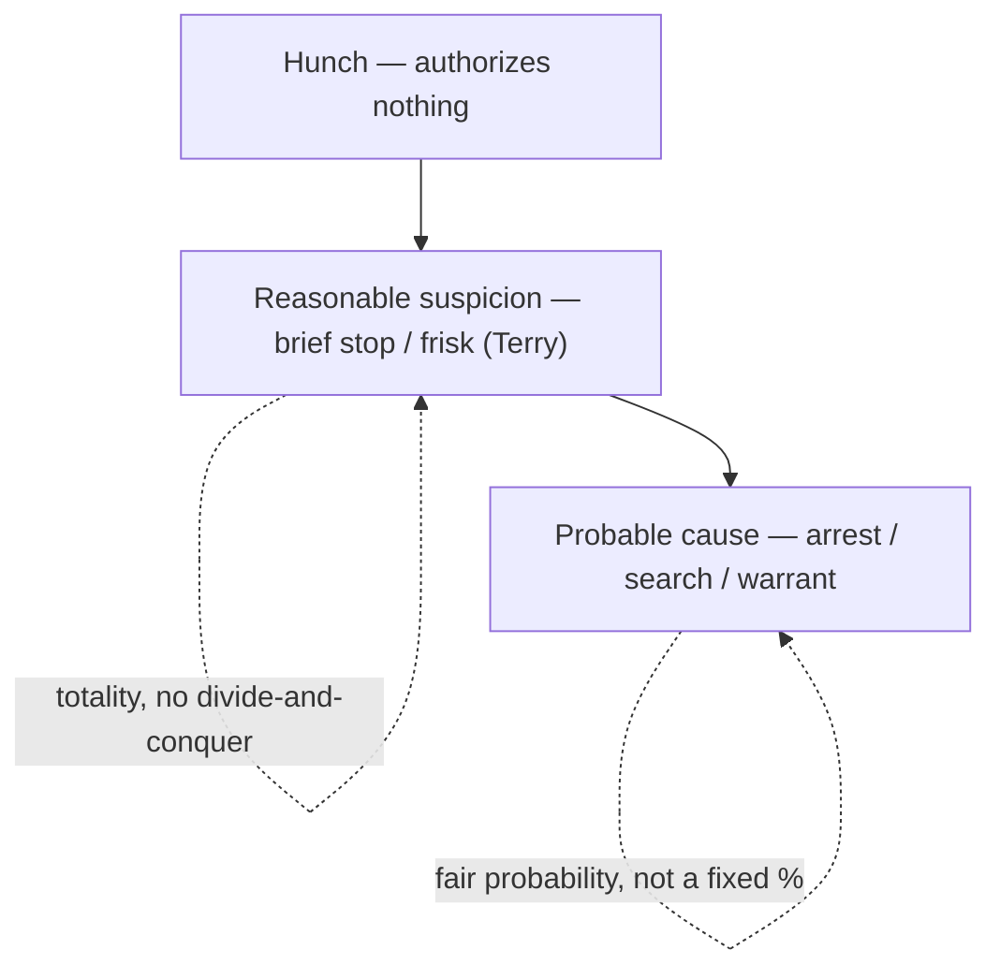

# Probable Cause and Reasonable Suspicion

## Rule
The Fourth Amendment runs on two standards of proof, neither of which is a fixed number. **Probable cause** — the quantum required for an arrest, a full search, or a warrant — exists when the known facts give a *fair probability* that a crime has occurred or that evidence will be found in a particular place. **Reasonable, articulable suspicion** is a less demanding standard that authorizes only a brief investigative stop and protective frisk: specific facts and rational inferences pointing to criminal activity, more than a hunch but well short of probable cause. Both are measured by the **totality of the circumstances** through the eyes of a reasonable, experienced officer, and both are reviewed de novo on appeal (with underlying historical facts reviewed only for clear error). This page owns the standards themselves and the [[Fourth Amendment Framework]] and [[Fourth Amendment Analysis Checklist]] point here for "how much proof"; [[Terry Stops and Reasonable Suspicion]] owns stop/frisk scope and duration, and [[The Warrant Requirement]] owns presenting probable cause to a magistrate.

**Burden of proof.** Burdens track the warrant line. For a *warrantless* search, seizure, or arrest, the government bears the burden of justifying it under a recognized exception — "the burden is on those seeking the exemption to show the need for it." *Coolidge v. New Hampshire*, 403 U.S. 443, 455 (1971). By contrast, a search or arrest made under a *warrant* enjoys a presumption of validity, and the defendant bears the burden of overcoming it — e.g., to obtain a *Franks* hearing the defendant must make a substantial preliminary showing of a knowing or reckless falsehood material to probable cause. *Franks v. Delaware*, 438 U.S. 154, 155-56 (1978).

## Key cases

| Case | Holding (one line) | Weight | CourtListener |
| --- | --- | --- | --- |
| *Brinegar v. United States*, 338 U.S. 160, 175 (1949) | Classic probable-cause standard: practical, non-technical probabilities on which reasonable people act. | SCOTUS — binding | [opinion](https://www.courtlistener.com/opinion/104716/brinegar-v-united-states/) |
| *Terry v. Ohio*, 392 U.S. 1 (1968) | A brief investigative stop and protective frisk require reasonable, articulable suspicion — not an inchoate hunch. | SCOTUS — binding | [opinion](https://www.courtlistener.com/opinion/107729/terry-v-ohio/) |
| *Illinois v. Gates*, 462 U.S. 213 (1983) | Probable cause is judged by the totality of the circumstances — a fair-probability inquiry, not rigid prongs. | SCOTUS — binding | [opinion](https://www.courtlistener.com/opinion/110959/illinois-v-gates/) |
| *Alabama v. White*, 496 U.S. 325, 332 (1990) | An anonymous tip can supply reasonable suspicion when police corroborate its prediction of future conduct. | SCOTUS — binding | [opinion](https://www.courtlistener.com/opinion/112454/alabama-v-white/) |
| *Ornelas v. United States*, 517 U.S. 690 (1996) | Reasonable-suspicion and probable-cause determinations are reviewed de novo on appeal. | SCOTUS — binding | [opinion](https://www.courtlistener.com/opinion/118030/ornelas-v-united-states/) |
| *Illinois v. Wardlow*, 528 U.S. 119, 124 (2000) | Unprovoked headlong flight in a high-crime area can furnish reasonable suspicion for a Terry stop. | SCOTUS — binding | [opinion](https://www.courtlistener.com/opinion/118326/illinois-v-wardlow/) |
| *Florida v. J.L.*, 529 U.S. 266, 272 (2000) | A bare anonymous tip that a person has a gun, without more, is not reasonable suspicion. | SCOTUS — binding | [opinion](https://www.courtlistener.com/opinion/118352/florida-v-jl/) |
| *United States v. Arvizu*, 534 U.S. 266, 274 (2002) | Reasonable suspicion is judged on the whole picture; no divide-and-conquer of individual factors. | SCOTUS — binding | [opinion](https://www.courtlistener.com/opinion/118474/united-states-v-arvizu/) |
| *Maryland v. Pringle*, 540 U.S. 366, 371-74 (2003) | Drugs/cash in a car with no owner gives probable cause to arrest all occupants on a common-enterprise inference. | SCOTUS — binding | [opinion](https://www.courtlistener.com/opinion/131150/maryland-v-pringle/) |
| *Devenpeck v. Alford*, 543 U.S. 146, 153-55 (2004) | Probable cause is objective; the offense need not be the one the officer named or closely related to it. | SCOTUS — binding | [opinion](https://www.courtlistener.com/opinion/137733/devenpeck-v-alford/) |
| *Florida v. Harris*, 568 U.S. 237, 244-48 (2013) | A trained dog's alert can supply probable cause under the totality — no rigid field-record checklist. | SCOTUS — binding | [opinion](https://www.courtlistener.com/opinion/820744/florida-v-harris/) |
| *Navarette v. California*, 572 U.S. 393, 398-99 (2014) | A reliable, contemporaneous 911 report of dangerous driving can supply reasonable suspicion. | SCOTUS — binding | [opinion](https://www.courtlistener.com/opinion/2670795/prado-navarette-v-california/) |
| *District of Columbia v. Wesby*, 583 U.S. 48, 63 (2018) | Probable cause is a totality inquiry; courts must not divide-and-conquer the facts. | SCOTUS — binding | [opinion](https://www.courtlistener.com/opinion/4460854/district-of-columbia-v-wesby/) |
| *Aguilar v. Texas*, 378 U.S. 108 (1964) | HISTORY — the rigid two-prong (basis of knowledge + veracity) test abandoned by Gates. | SCOTUS — abrogated by Gates (history only) | [opinion](https://www.courtlistener.com/opinion/106865/aguilar-v-texas/) |

## Related cases across doctrines
These cases are treated in full on other doctrine pages but bear directly on the probable-cause / reasonable-suspicion standards, framed here for that quantum-of-proof inquiry.

| Case | Relevance to probable cause / reasonable suspicion | Primary treatment | CourtListener |
| --- | --- | --- | --- |
| *Whiteley v. Warden*, 401 U.S. 560 (1971) | An officer may make a stop/arrest on the strength of a bulletin and assume the issuing officer had probable cause — but if the issuer in fact lacked PC, the stop is invalid: the quantum of suspicion is measured at the source. | [[Collective Knowledge and the Fellow-Officer Rule]] | [opinion](https://www.courtlistener.com/opinion/108297/whiteley-v-warden-wyoming-state-penitentiary/) |
| *United States v. Hensley*, 469 U.S. 221 (1985) | Reasonable suspicion may be supplied by a wanted flyer/bulletin from another department: the stopping officer need not personally possess the articulable facts so long as the issuing agency had them — RS is assessed on the collective knowledge. | [[Collective Knowledge and the Fellow-Officer Rule]] | [opinion](https://www.courtlistener.com/opinion/111294/united-states-v-hensley/) |
| *Heien v. North Carolina*, 574 U.S. 54 (2014) | The facts supporting reasonable suspicion (or probable cause) may rest on an officer's objectively reasonable mistake of law as well as fact — reasonableness, not perfect legal accuracy, is the touchstone of the quantum inquiry. | [[Traffic Stops]] | [opinion](https://www.courtlistener.com/opinion/2760668/heien-v-north-carolina/) |
| *Delaware v. Prouse*, 440 U.S. 648 (1979) | A discretionary stop requires at least reasonable, articulable suspicion of wrongdoing; random suspicionless stops fail the standard — the floor for any investigative seizure is articulable suspicion, not an officer's unparticularized discretion. | [[Traffic Stops]] | [opinion](https://www.courtlistener.com/opinion/110045/delaware-v-prouse/) |
| *Michigan v. Long*, 463 U.S. 1032 (1983) | A protective vehicle frisk requires reasonable suspicion — specific and articulable facts giving the officer a reasonable belief the suspect is dangerous and may gain access to weapons; same RS quantum as a Terry frisk, extended to the passenger compartment. | [[Traffic Stops]] | [opinion](https://www.courtlistener.com/opinion/111020/michigan-v-long/) |
| *United States v. Brignoni-Ponce*, 422 U.S. 873 (1975) | A roving border-area stop requires reasonable suspicion built on specific articulable facts; the Court catalogs RS factors and warns that apparent ancestry alone cannot supply it — an early gloss on the content of the RS standard. | [[Border Searches]] | [opinion](https://www.courtlistener.com/opinion/109311/united-states-v-brignoni-ponce/) |
| *Franks v. Delaware*, 438 U.S. 154 (1978) | A defendant may attack the probable-cause showing itself: on a substantial preliminary showing that the affidavit contained a knowing/reckless material falsehood, the false statement is set aside and PC re-evaluated on what remains. | [[The Exclusionary Rule]] / [[The Warrant Requirement]] | [opinion](https://www.courtlistener.com/opinion/109925/franks-v-delaware/) |
| *Maryland v. Buie*, 494 U.S. 325 (1990) | A protective sweep beyond the spaces immediately adjoining the arrest requires reasonable, articulable suspicion that the area harbors a dangerous person — importing the Terry RS quantum into the in-home arrest setting. | [[Securing the Scene]] | [opinion](https://www.courtlistener.com/opinion/112384/maryland-v-buie/) |

## Nuances & limits
- **The ladder.** Three rungs: a bare *hunch* authorizes nothing; *reasonable suspicion* authorizes a brief stop and frisk ([[Terry Stops and Reasonable Suspicion]]); *probable cause* authorizes an arrest, a full search, or a warrant ([[The Warrant Requirement]]). The quantum climbs with the intrusion.
- **Probable cause defined.** *Brinegar* frames probable cause as practical probabilities, not technical certainty; *Gates* operationalizes it as a "fair probability" assessed on the totality. *Wesby* (2018) and *Arvizu* (2002) forbid the divide-and-conquer move of evaluating and discarding each fact in isolation — the magistrate and the court weigh the whole picture.
- **Totality, not prongs.** Under *Gates*, "[t]he task of the issuing magistrate is simply to make a practical, common-sense decision whether, given all the circumstances set forth in the affidavit before him, including the 'veracity' and 'basis of knowledge' of persons supplying hearsay information, there is a fair probability that contraband or evidence of a crime will be found in a particular place" (462 U.S. at 238). That discarded the rigid two-step *Aguilar-Spinelli* test for informants; veracity, reliability, and basis of knowledge remain relevant *factors* but are no longer independent hurdles that each must clear.
- **Sources and quantum of suspicion.** Anonymous tips occupy a spectrum: a bare tip that someone is armed is insufficient (*Florida v. J.L.*), but a tip corroborated by an accurate *prediction* of future conduct (*Alabama v. White*) or a reliable, contemporaneous, traceable 911 report of dangerous driving (*Navarette*) can supply reasonable suspicion. *Wardlow* adds that unprovoked headlong flight in a high-crime area counts toward suspicion. A trained drug dog's alert can supply *probable cause* (*Florida v. Harris*).
- **Particularized but not individual-by-individual.** Probable cause must be particularized to a place or person, yet *Pringle* allows an inference of common enterprise to reach every occupant of a car where contraband is found and no one claims it.
- **Objective test.** Under *Devenpeck*, probable cause is judged on the objective facts known to the officer; an arrest stands if those facts support *some* offense, even one the officer never mentioned and not closely related to the stated charge.
- **Standard of review.** Under *Ornelas*, "the ultimate questions of reasonable suspicion and probable cause to make a warrantless search should be reviewed de novo" (517 U.S. at 691) — historical facts are reviewed for clear error, but the legal sufficiency of the quantum is reviewed fresh on appeal.

## Common pitfalls
- **Treating reasonable suspicion and probable cause as the same.** They are different rungs. Reasonable suspicion buys a brief stop and frisk; it does not buy an arrest or a full search. Articulate which one the facts actually support.
- **"Possibilities, not probabilities."** Both standards turn on *probabilities*, not bare possibility (one of the [[CREW]] three-golden-rules maxims). A fact that merely makes crime *possible* is not enough; *Terry* requires "specific reasonable inferences," not an "inchoate and unparticularized suspicion or 'hunch'" (392 U.S. at 27).
- **Quantifying the standard as a fixed percentage.** Neither standard reduces to a number. *Brinegar* and *Gates* speak of practical, common-sense probabilities; an instructor who says "probable cause is 51%" is inventing a rule the Court has never adopted.

## Visual

## Recent developments & subsequent treatment
The core probable-cause and reasonable-suspicion standards remain stable, but recent decisions sharpen their boundaries: the Supreme Court has reaffirmed that *probable cause* is the criminal-investigative quantum and is not transplanted into non-investigative Fourth Amendment contexts, and the circuits continue to police the reasonable-suspicion floor against vague, uncorroborated tips. Circuit decisions below are **persuasive, not binding** outside their own circuits.

- **Case v. Montana (SCOTUS 2026)** — Warrantless home entry to render emergency aid requires only *Brigham City*'s "objectively reasonable basis" to believe an occupant needs emergency assistance, not probable cause; probable cause is rooted in the criminal-investigative context and is not transplanted to the emergency-aid context. Resolves a circuit split (CA2/CA11/CADC had required probable cause; CA1/CA8 had not), holding *Brigham City*'s reasonableness standard applies "with no further gloss" — a clean recent gloss confirming PC is the investigative quantum while non-investigative (caretaking/emergency-aid) contexts use their own reasonableness measure. ⚖ Circuit split. "The probable-cause requirement is rooted in, and derives its meaning from, the criminal context, and we decline to transplant it to this different one. *Brigham City*'s reasonableness standard means just what it says, with no further gloss." (slip op., at 1). [opinion](https://www.courtlistener.com/opinion/10774335/case-v-montana/).
- **United States v. Daniels (10th Cir. 2024)** — *Persuasive, not binding* (Tenth Circuit). Affirms suppression: a near-anonymous 911 tip (three Black men in dark hoodies near an idling SUV, reporting no actual illegality at issue) plus the suspect's presence did not amount to reasonable suspicion on de novo totality-of-the-circumstances review; overly generic tips give police excessive discretion and fall below the reasonable-suspicion floor. Tightens the *Florida v. J.L.* / *Navarette* line by stressing that vague, uncorroborated tips reporting lawful-sounding conduct fall below the RS floor. [opinion](https://www.courtlistener.com/opinion/9500360/united-states-v-daniels/).

## Sources
- [Brinegar v. United States — opinion](https://www.courtlistener.com/opinion/104716/brinegar-v-united-states/)
- [Terry v. Ohio — opinion](https://www.courtlistener.com/opinion/107729/terry-v-ohio/)
- [Illinois v. Gates — opinion](https://www.courtlistener.com/opinion/110959/illinois-v-gates/)
- [Alabama v. White — opinion](https://www.courtlistener.com/opinion/112454/alabama-v-white/)
- [Ornelas v. United States — opinion](https://www.courtlistener.com/opinion/118030/ornelas-v-united-states/)
- [Illinois v. Wardlow — opinion](https://www.courtlistener.com/opinion/118326/illinois-v-wardlow/)
- [Florida v. J.L. — opinion](https://www.courtlistener.com/opinion/118352/florida-v-jl/)
- [United States v. Arvizu — opinion](https://www.courtlistener.com/opinion/118474/united-states-v-arvizu/)
- [Maryland v. Pringle — opinion](https://www.courtlistener.com/opinion/131150/maryland-v-pringle/)
- [Devenpeck v. Alford — opinion](https://www.courtlistener.com/opinion/137733/devenpeck-v-alford/)
- [Florida v. Harris — opinion](https://www.courtlistener.com/opinion/820744/florida-v-harris/)
- [Navarette v. California — opinion](https://www.courtlistener.com/opinion/2670795/prado-navarette-v-california/)
- [District of Columbia v. Wesby — opinion](https://www.courtlistener.com/opinion/4460854/district-of-columbia-v-wesby/)
- [Aguilar v. Texas — opinion](https://www.courtlistener.com/opinion/106865/aguilar-v-texas/)
