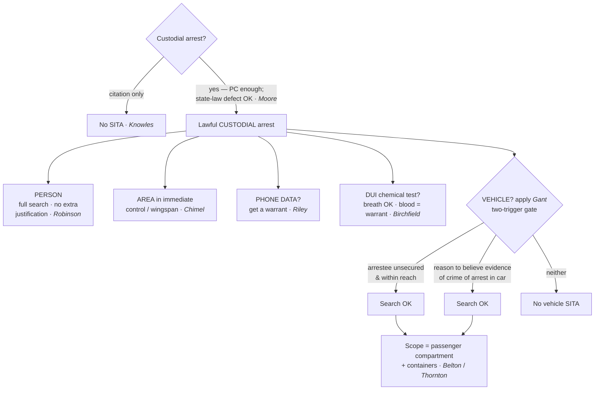

## Rule
A lawful **custodial arrest** authorizes, without a warrant, a **contemporaneous** search of (1) the **arrestee's person** — a *full* search, requiring no case-by-case justification (*United States v. Robinson*, 414 U.S. 218, 235 (1973)) — and (2) the **area within the arrestee's immediate control**, the "wingspan" from which he might grab a weapon or destroy evidence (*Chimel v. California*, 395 U.S. 752, 763 (1969)). The two engines are **officer safety** and **evidence preservation**. The predicate is a **custodial** arrest: a mere citation in lieu of custody does **not** trigger SITA (*Knowles v. Iowa*, 525 U.S. 113 (1998)) — but an arrest that breaks a *state* arrest statute yet rests on **probable cause** still satisfies the Fourth Amendment, and the SITA is valid (*Virginia v. Moore*, 553 U.S. 164 (2008)). The bright-line rule does **not** reach the **digital contents** of a cell phone — for that data, "get a warrant." *Riley v. California*, 573 U.S. 373, 403 (2014). In the **vehicle** context (see [[Automobile Exception]]), *New York v. Belton*, 453 U.S. 454, 460 (1981), fixes the **scope** (passenger compartment + containers) and reaches "recent occupants" (*Thornton v. United States*, 541 U.S. 615 (2004)), but *Arizona v. Gant*, 556 U.S. 332, 343 (2009), fixes the **trigger**: a vehicle search incident to arrest is lawful **only** when (a) the arrestee is **unsecured and within reaching distance** of the compartment, **or** (b) it is reasonable to believe **evidence of the crime of arrest** is in the vehicle.

## Key cases
| Case (Bluebook) | Holding in one line | Weight | CourtListener |
|---|---|---|---|
| *Chimel v. California*, 395 U.S. 752 (1969) | SITA scope = the arrestee's person **plus** the area within his immediate control ("wingspan"); rationales are officer safety and evidence preservation. | SCOTUS — binding | [link](https://www.courtlistener.com/opinion/107979/chimel-v-california/) |
| *United States v. Robinson*, 414 U.S. 218 (1973) | A lawful custodial arrest categorically permits a **full search of the person** — no separate showing that weapons or evidence are present. | SCOTUS — binding | [link](https://www.courtlistener.com/opinion/108893/united-states-v-robinson/) |
| *Knowles v. Iowa*, 525 U.S. 113 (1998) | No "search incident to **citation**": where the officer writes a ticket instead of making a custodial arrest, SITA does not apply. | SCOTUS — binding | [link](https://www.courtlistener.com/opinion/118250/knowles-v-iowa/) |
| *Virginia v. Moore*, 553 U.S. 164 (2008) | An arrest that violates **state law** but rests on probable cause does **not** violate the 4A; the SITA is still valid (state law ≠ 4A standard). | SCOTUS — binding | [link](https://www.courtlistener.com/opinion/9435233/virginia-v-moore/) |
| *Riley v. California*, 573 U.S. 373 (2014) | The bright-line rule does **not** extend to the **digital data** on a cell phone — generally, get a warrant. | SCOTUS — binding | [link](https://www.courtlistener.com/opinion/2680439/riley-v-california/) |
| *New York v. Belton*, 453 U.S. 454 (1981) | Vehicle SITA **scope (the *where*)** = the passenger compartment and any containers in it. | SCOTUS — binding | [link](https://www.courtlistener.com/opinion/110559/new-york-v-belton/) |
| *Thornton v. United States*, 541 U.S. 615 (2004) | *Belton* reaches **"recent occupants,"** not just those inside the car; Scalia's concurrence floats the evidence-of-the-offense rationale *Gant* later adopts. | SCOTUS — binding | [link](https://www.courtlistener.com/opinion/9434613/thornton-v-united-states/) |
| *Arizona v. Gant*, 556 U.S. 332 (2009) | Vehicle SITA **trigger (the *when*)**: arrestee unsecured & within reach, **or** reason to believe evidence of the offense of arrest is in the car. | SCOTUS — binding | [link](https://www.courtlistener.com/opinion/145887/arizona-v-gant/) |
| *Birchfield v. North Dakota*, 579 U.S. 438 (2016) | SITA-DUI: a warrantless **breath** test is permissible incident to arrest; a warrantless **blood** test is **not** (needs a warrant/other exception). | SCOTUS — binding | [link](https://www.courtlistener.com/opinion/3216391/birchfield-v-n-dakota-william-robert-bernard/) |
| *United States v. Davis*, 997 F.3d 191 (4th Cir. 2021) | *Gant*'s reachability prong extends to **non-vehicular containers** — a secured arrestee's backpack out of reach cannot be searched as SITA. | Circuit (4th) — persuasive | [link](https://www.courtlistener.com/opinion/4881258/united-states-v-howard-davis/) |
| *Illinois v. Lafayette*, 462 U.S. 640 (1983) | A **booking/stationhouse inventory** of an arrestee's effects per established procedures is reasonable — *administratively distinct* from SITA. | SCOTUS — binding | [link](https://www.courtlistener.com/opinion/110976/illinois-v-lafayette/) |
| *Maryland v. King*, 569 U.S. 435 (2013) | A **booking DNA cheek swab** of an arrestee held for a serious offense is a reasonable booking procedure (booking — *not* SITA-of-the-person). | SCOTUS — binding | [link](https://www.courtlistener.com/opinion/873669/maryland-v-king/) |
| *South Dakota v. Opperman*, 428 U.S. 364 (1976) | A vehicle **inventory** under standard procedures, not a pretext for investigation, is reasonable. | SCOTUS — binding | [link](https://www.courtlistener.com/opinion/109537/south-dakota-v-opperman/) |
| *Colorado v. Bertine*, 479 U.S. 367 (1987) | Inventory discretion is permissible only if exercised by **standardized criteria**, not by suspicion of evidence. | SCOTUS — binding | [link](https://www.courtlistener.com/opinion/111788/colorado-v-bertine/) |
| *Florida v. Wells*, 495 U.S. 1 (1990) | An inventory must **not be a ruse** for general rummaging; the policy must be designed to produce an inventory. | SCOTUS — binding | [link](https://www.courtlistener.com/opinion/112412/florida-v-wells/) |
| *United States v. Evans*, 937 F.2d 1534 (10th Cir. 1991) | **Valid** inventory: officer followed policy, no PC, no ruse — the textbook good example. | Circuit (10th) — persuasive | [link](https://www.courtlistener.com/opinion/564407/united-states-v-daryl-lee-evans/) |
| *United States v. Braxton*, 61 F.4th 830 (10th Cir. 2023) | **Suppression**: no valid impoundment → no valid inventory; policy compliance alone is not enough — the cautionary case. | Circuit (10th) — persuasive | [link](https://www.courtlistener.com/opinion/9381854/united-states-v-braxton/) |

## Nuances & limits
- **Wingspan is the engine (*Chimel*).** The arrest justifies "a search of the arrestee's person and the area 'within his immediate control' — construing that phrase to mean the area from within which he might gain possession of a weapon or destructible evidence." *Chimel*, 395 U.S. at 763. Officer safety and evidence preservation are the twin rationales — and they are what *Gant* and *Davis* later use to cabin the doctrine. (*Chimel* itself was a home arrest; cf. [[Arrest in the Home]] for how wingspan plays out indoors.)
- **The person is searched in full — no extra showing (*Robinson*).** "It is the fact of the lawful arrest which establishes the authority to search, and we hold that in the case of a lawful custodial arrest a full search of the person is not only an exception to the warrant requirement of the Fourth Amendment, but is also a 'reasonable' search under that Amendment." *Robinson*, 414 U.S. at 235. Unlike a *Terry* frisk, the search of the person on a custodial arrest needs **no** case-by-case justification that weapons or evidence are present — the arrest alone is enough. The predicate, though, is a **custodial** arrest; a citation in lieu of custody does not trigger it.
- **The custodial predicate has teeth — citation ≠ arrest (*Knowles*).** Iowa's "search incident to citation" failed: "In *Robinson*, we held that the authority to conduct a full field search as incident to an arrest was a 'bright-line rule,' which was based on the concern for officer safety and destruction or loss of evidence, but which did not depend in every case upon the existence of either concern. Here we are asked to extend that 'bright-line rule' to a situation where the concern for officer safety is not present to the same extent and the concern for destruction or loss of evidence is not present at all. We decline to do so." *Knowles*, 525 U.S. at 118–119. Once a driver is "stopped for speeding and issued a citation, all the evidence necessary to prosecute that offense had been obtained." *Id.* at 118. No custody, no SITA. (See [[Traffic Stops]].)
- **State-law arrest defects don't shrink the 4A (*Moore* — never blur federal/state).** An arrest that broke a state statute (state law called for a summons, not custody) but was backed by probable cause is still constitutionally reasonable, and the SITA stands: "the arrest rules that the officers violated were those of state law alone, and as we have just concluded, it is not the province of the Fourth Amendment to enforce state law. That Amendment does not require the exclusion of evidence obtained from a constitutionally permissible arrest." *Moore*, 553 U.S. at 178. "When officers have probable cause to believe that a person has committed a crime in their presence, the Fourth Amendment permits them to make an arrest, and to search the suspect in order to safeguard evidence and ensure their own safety." *Id.* **State law does not define Fourth Amendment reasonableness** — the federal standard governs.
- **Digital is different — get a warrant (*Riley*).** "Our answer to the question of what police must do before searching a cell phone seized incident to an arrest is accordingly simple — get a warrant." *Riley*, 573 U.S. at 403. The *Chimel* rationales do not transfer: "Digital data stored on a cell phone cannot itself be used as a weapon to harm an arresting officer or to effectuate the arrestee's escape." *Id.* at 387. Officers may still **seize** the phone and inspect the **physical** device (e.g., for a razor blade hidden in the case); they may not browse its **data** without a warrant. (Cross-reference the digital-search treatment under [[Plain View Doctrine]].)
- **Belton sets the *where* (the room) and reaches recent occupants (*Belton* → *Thornton*).** "[W]hen a policeman has made a lawful custodial arrest of the occupant of an automobile, he may, as a contemporaneous incident of that arrest, search the passenger compartment of that automobile," and "may also examine the contents of any containers found within the passenger compartment." *Belton*, 453 U.S. at 460. *Thornton* then expanded that reach beyond people seized inside the car: "So long as an arrestee is the sort of 'recent occupant' of a vehicle such as petitioner was here, officers may search that vehicle incident to the arrest." *Thornton*, 541 U.S. at 623–624. Crucially, **Scalia's concurrence** in *Thornton* proposed the rule *Gant* would adopt: "I would therefore limit *Belton* searches to cases where it is reasonable to believe evidence relevant to the crime of arrest might be found in the vehicle." *Id.* at 632 (Scalia, J., concurring in the judgment). The arc is **Belton (scope/occupants) → Thornton (recent occupants + the evidentiary idea) → Gant (the two-prong gate)**. *Belton* describes scope; it does not, after *Gant*, authorize the search by itself.
- **Gant sets the *when* (the gate).** *Gant* re-tethered *Belton* to *Chimel*. Prong 1: "the *Chimel* rationale authorizes police to search a vehicle incident to a recent occupant's arrest **only when the arrestee is unsecured and within reaching distance of the passenger compartment at the time of the search**." *Gant*, 556 U.S. at 343. Prong 2: "circumstances unique to the vehicle context justify a search incident to a lawful arrest when it is 'reasonable to believe evidence relevant to the crime of arrest might be found in the vehicle.'" *Id.* at 343–44 (quoting *Thornton*, 541 U.S. at 632 (Scalia, J., concurring in the judgment)). Read together: **Gant is the gate, Belton is the room** — if neither prong is met, you never reach Belton's scope.
- **DUI testing — breath yes, blood no (*Birchfield*).** Applying SITA to chemical testing on a DUI arrest, the Court split the two methods: "Because breath tests are significantly less intrusive than blood tests and in most cases amply serve law enforcement interests, we conclude that a breath test, but not a blood test, may be administered as a search incident to a lawful arrest for drunk driving." *Birchfield*, 579 U.S. at 474. A warrantless **blood** draw is not SITA: "Having concluded that the search incident to arrest doctrine does not justify the warrantless taking of a blood sample," the Court turned to other theories. *Id.* at 476. Bottom line: breath test on the arrest alone is fine; for blood, **get a warrant** (or rely on another exception — exigency/implied consent live under the warrant-exception pages; see [[Traffic Stops]]).
- **Gant prong 1 reaches beyond cars (*Davis* — persuasive, 4th Cir.).** The Fourth Circuit held that "the first *Gant* holding applies to searches of non-vehicular containers" and that officers may search such a container incident to arrest "'only when the arrestee is unsecured and within reaching distance of the [container] at the time of the search.'" *Davis*, 997 F.3d at 199 (quoting *Gant*, 556 U.S. at 343). Applied: because "Davis was secure and not within reaching distance of his backpack when [the officer] searched it … there is no factual basis for finding that this was a proper search incident to arrest under the first *Gant* holding." *Id.* at 202. **Use narrowly** — this is persuasive circuit authority, not a SCOTUS rule. The Third (*Shakir*), Ninth (*Cook*), and Tenth (*Knapp*) Circuits agree and no circuit holds otherwise, but the Fifth (*Curtis*) and Eighth (*Perdoma*) expressly **declined to reach** the question — treat "does *Gant* prong 1 apply outside vehicles?" as **open but leaning uniform**, not a clean split.

## Common pitfalls
- **Conducting a "search incident to citation."** *Knowles* forbids a *Robinson* full search when the officer writes a ticket instead of making a custodial arrest — no custody, no SITA. If you let the suspect go with a citation, the search-incident authority never attaches.
- **Assuming a state-law arrest defect bars the SITA.** Per *Moore*, an arrest valid for 4A purposes (probable-cause-backed) supports the SITA even if it broke a state arrest statute — do **not** argue suppression on a state-law violation alone; state law does not define Fourth Amendment reasonableness.
- **Treating *Belton* as automatic.** After *Gant* there is **no per se vehicle search on arrest**. You must satisfy one of *Gant*'s two prongs; the routine act of cuffing and securing the arrestee usually **kills prong 1**, leaving only the "evidence of the offense of arrest" prong (which an arrest for, e.g., driving on a suspended license rarely supplies).
- **Taking a warrantless blood draw as SITA on a DUI arrest.** *Birchfield*: a breath test is SITA-OK, but a blood test is **not** — get a warrant (or rely on exigency/consent) before drawing blood.
- **Searching the phone "incident to arrest."** *Riley* forbids browsing phone **data** on the arrest alone — seize it, then get a warrant. Inspecting the physical handset for a weapon is still fine.
- **Forgetting the search must be contemporaneous and the arrest custodial.** SITA rides on a *custodial* arrest and a *contemporaneous* search tied to its rationales — not a delayed, remote rummage and not a mere citation.
- **Over-reading *Davis*.** It is persuasive Fourth Circuit authority extending *Gant* prong 1 to containers — frame it that way, and pair it with the binding *Chimel/Gant* anchors.
- **Conflating SITA with inventory.** They are **different exceptions** (see below): SITA is justified by the arrest; inventory is **administrative**. Do not let a failed SITA be rescued by an inventory theory unless the **predicate impoundment** is itself valid (the *Braxton* trap).

## Visual

### Booking & Inventory Searches
**This is a different exception from SITA — keep them separate.** An inventory is **administrative caretaking**, not evidence-gathering: it secures an arrestee's property, protects the agency against claims of lost or stolen items, and guards against dangerous instrumentalities. It is justified by a **standardized procedure**, not by the arrest itself, and it collapses the moment it becomes investigatory.

- **Booking inventory (*Lafayette*).** As "part of the routine procedure incident to incarcerating an arrested person," police may "search any container or article in his possession, in accordance with established inventory procedures." *Lafayette*, 462 U.S. at 648.
- **Booking DNA (*King*) — a booking procedure, not SITA-of-the-person.** A buccal (cheek) swab taken at booking is upheld on a general booking-reasonableness rationale, *not* as a search incident to arrest of the person: "When officers make an arrest supported by probable cause to hold for a serious offense and they bring the suspect to the station to be detained in custody, taking and analyzing a cheek swab of the arrestee's DNA is, like fingerprinting and photographing, a legitimate police booking procedure that is reasonable under the Fourth Amendment." *King*, 569 U.S. at 465–466. **Label it carefully**: it sits beside *Lafayette* in the booking track — do not cite it for the wingspan search of the person at the scene.
- **Standardized criteria, not a ruse — the trilogy guardrail.**
  - *Opperman*: valid because the police acted "in following standard police procedures," with "no suggestion whatever that this standard procedure … was a pretext concealing an investigatory police motive." *Opperman*, 428 U.S. at 376.
  - *Bertine*: discretion is tolerable "so long as that discretion is exercised according to standard criteria and on the basis of something other than suspicion of evidence of criminal activity," because "inventories [must] be conducted according to standardized criteria." *Bertine*, 479 U.S. at 375–76 & 374 n.6.
  - *Wells*: "an inventory search must not be a ruse for a general rummaging in order to discover incriminating evidence. The policy or practice governing inventory searches should be designed to produce an inventory." *Wells*, 495 U.S. at 4. The officer "must not be allowed so much latitude that inventory searches are turned into 'a purposeful and general means of discovering evidence of crime.'" *Id.* (quoting *Bertine*, 479 U.S. at 376).
- **The good example (*Evans* — persuasive, 10th Cir.).** An inventory of a carry-on bag was upheld where the officer "adhered to these procedures, and there is no evidence in the record that he anticipated or intended the search to serve any purpose other than that of an inventory of the contents of the bag." *Evans*, 937 F.2d at 1539. Both prongs satisfied — standard policy followed, no ruse.
- **The cautionary case (*Braxton* — persuasive, 10th Cir.).** Reversed; evidence **suppressed**. The Government conceded the backpack search was not a valid SITA and fell back on **inevitable discovery** — it would have impounded the bag and inventoried it per policy. The court rejected the workaround because the **impoundment itself** was not shown to be reasonable: a companion had arrived at Braxton's request and repeatedly asked to take the backpack, a reasonable **alternative to impoundment**. The caretaking interest "is significantly undercut by the presence of an individual who arrived on the scene at Braxton's request and repeatedly asked to take possession of the backpack throughout the arrest process," 61 F.4th at 833, and "the existence of and compliance with such a policy does not by itself establish a reasonable community-caretaking rationale," *id.* at 838.
- **Bottom line.** An inventory is lawful only when (a) it follows **standardized criteria** (*Lafayette*, *Bertine*, *Opperman*) and (b) it is **not a ruse** for investigation (*Wells*) — **and** the predicate seizure/impoundment is itself reasonable, with **alternatives to impoundment** considered (*Braxton*). A written policy is **not a safe harbor**: compliance alone does not save an unjustified impoundment, and the "we'd have inventoried it anyway" backstop fails where the impoundment was never proper.

## Flashcards
- What two things may be searched on a lawful custodial arrest, and why?::The arrestee's **person** (full search, no extra justification — *Robinson*) and the **area within his immediate control / wingspan** (*Chimel*), justified by officer safety and evidence preservation.
- Can officers search a phone's data incident to arrest?::No — *Riley*: "get a warrant" (573 U.S. at 403). They may seize the phone and inspect the physical device, but not browse its digital contents without a warrant.
- State *Gant*'s two triggers for a vehicle search incident to arrest.::(1) The arrestee is **unsecured and within reaching distance** of the passenger compartment, **or** (2) it is **reasonable to believe evidence of the crime of arrest** is in the vehicle (556 U.S. at 343).
- *Belton* vs. *Gant* — what does each decide?::*Belton* fixes the **scope/where** (passenger compartment + containers); *Gant* fixes the **trigger/when** (the two-prong gate). Gant is the gate, Belton is the room.
- How is an inventory search different from SITA, and what is its key limit?::Inventory is **administrative caretaking**, not arrest-based; it is lawful only under **standardized criteria** and **not as a ruse** for investigation (*Lafayette*, *Bertine*, *Wells*) — and the impoundment itself must be reasonable (*Braxton*).
- Does writing a traffic citation authorize a full search of the driver?::No — *Knowles v. Iowa*: no custodial arrest, no SITA. A citation does not trigger *Robinson*'s full-search authority because neither officer-safety nor evidence-preservation rationale supports it.
- An arrest violates a state arrest statute but is backed by probable cause — is the SITA good?::Yes — *Virginia v. Moore*: a state-law arrest violation does not violate the Fourth Amendment; the SITA is valid. State law does not define 4A reasonableness.
- On a DUI arrest, may police take a warrantless breath test? A warrantless blood test?::Breath yes (SITA-OK); blood no — *Birchfield v. North Dakota*: a blood draw needs a warrant (or another exception). Breath is far less intrusive.

## Sources
- *Chimel v. California*, 395 U.S. 752 (1969) — https://www.courtlistener.com/opinion/107979/chimel-v-california/
- *United States v. Robinson*, 414 U.S. 218 (1973) — https://www.courtlistener.com/opinion/108893/united-states-v-robinson/
- *Knowles v. Iowa*, 525 U.S. 113 (1998) — https://www.courtlistener.com/opinion/118250/knowles-v-iowa/
- *Virginia v. Moore*, 553 U.S. 164 (2008) — https://www.courtlistener.com/opinion/9435233/virginia-v-moore/
- *Riley v. California*, 573 U.S. 373 (2014) — https://www.courtlistener.com/opinion/2680439/riley-v-california/
- *New York v. Belton*, 453 U.S. 454 (1981) — https://www.courtlistener.com/opinion/110559/new-york-v-belton/
- *Thornton v. United States*, 541 U.S. 615 (2004) — https://www.courtlistener.com/opinion/9434613/thornton-v-united-states/
- *Arizona v. Gant*, 556 U.S. 332 (2009) — https://www.courtlistener.com/opinion/145887/arizona-v-gant/
- *Birchfield v. North Dakota*, 579 U.S. 438 (2016) — https://www.courtlistener.com/opinion/3216391/birchfield-v-n-dakota-william-robert-bernard/
- *United States v. Davis*, 997 F.3d 191 (4th Cir. 2021) — https://www.courtlistener.com/opinion/4881258/united-states-v-howard-davis/ *(persuasive; Gant prong-1 extended to non-vehicular containers)*
- *Illinois v. Lafayette*, 462 U.S. 640 (1983) — https://www.courtlistener.com/opinion/110976/illinois-v-lafayette/
- *Maryland v. King*, 569 U.S. 435 (2013) — https://www.courtlistener.com/opinion/873669/maryland-v-king/ *(booking procedure — DNA cheek swab, not SITA-of-the-person)*
- *South Dakota v. Opperman*, 428 U.S. 364 (1976) — https://www.courtlistener.com/opinion/109537/south-dakota-v-opperman/
- *Colorado v. Bertine*, 479 U.S. 367 (1987) — https://www.courtlistener.com/opinion/111788/colorado-v-bertine/
- *Florida v. Wells*, 495 U.S. 1 (1990) — https://www.courtlistener.com/opinion/112412/florida-v-wells/
- *United States v. Evans*, 937 F.2d 1534 (10th Cir. 1991) — https://www.courtlistener.com/opinion/564407/united-states-v-daryl-lee-evans/ *(persuasive; the valid-inventory example)*
- *United States v. Braxton*, 61 F.4th 830 (10th Cir. 2023) — https://www.courtlistener.com/opinion/9381854/united-states-v-braxton/ *(persuasive; suppression — the cautionary inventory case)*
