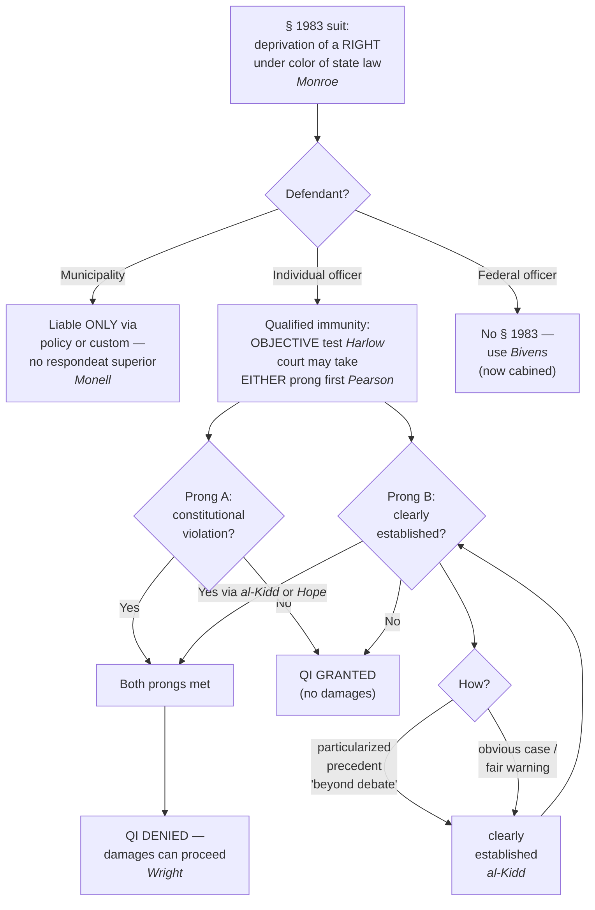

## Rule
**42 U.S.C. § 1983** is the engine of civil accountability: any person who, **under color of** state law, deprives someone of a federal constitutional **right** is liable in a civil action for damages or injunctive relief. *Monroe v. Pape*, 365 U.S. 167 (1961), made it operative — "under color of" reaches an officer's **misuse** of state-conferred authority, even conduct state law forbids. Reaching the **agency** is harder: under *Monell* a municipality is liable only when an official **policy or custom** causes the injury — there is **no respondeat superior**. *Monell v. Dep't of Soc. Servs.*, 436 U.S. 658, 691 (1978). The principal defense for an individual officer is **qualified immunity**, which shields officials from damages unless they violated **"clearly established"** law — an **objective** test that ignores the officer's subjective good faith. *Harlow v. Fitzgerald*, 457 U.S. 800, 818 (1982). The QI analysis is a two-step — (1) constitutional violation? and (2) was the right clearly established? — that courts may take in **either order**. *Saucier v. Katz*, 533 U.S. 194 (2001); *Pearson v. Callahan*, 555 U.S. 223 (2009).

## Key statutes
- **42 U.S.C. § 1983** — Civil action for deprivation of **rights, privileges, or immunities** secured by the Constitution and federal law, by anyone acting **under color of** state law. The instructor's emphasis is correct: § 1983 protects **rights**, not mere injuries. It is the primary vehicle for damages and injunctive relief against state and local officers for Fourth Amendment violations.
- **42 U.S.C. § 1988(b)** — In its discretion, the court may award **reasonable attorney's fees to the prevailing party**. The practical sting: a successful civil-rights plaintiff's fees against a government defendant come out of the **public fisc** — taxpayer-funded.
- **18 U.S.C. § 242** — The **criminal** analog: it is a federal crime to **willfully** deprive a person of constitutional rights under color of law. The **willfulness** (specific-intent) burden is steep, which is why § 242 indictments are **reserved in practice for the most egregious violations**. (See *Screws v. United States*, 325 U.S. 91 (1945), construing "willfully.") Keep this distinct from § 1983: civil damages vs. criminal prosecution.

## Key cases
| Case (Bluebook) | Holding in one line | Weight | CourtListener |
|---|---|---|---|
| *Monroe v. Pape*, 365 U.S. 167 (1961) | "Under color of" law reaches an officer's **misuse** of state-conferred authority, even when it violates state law; no exhaustion of state remedies required. (Municipality holding later overruled by *Monell*.) | SCOTUS — binding | [link](https://www.courtlistener.com/opinion/106170/monroe-v-pape/) |
| *Monell v. Dep't of Soc. Servs.*, 436 U.S. 658 (1978) | Municipalities are "persons" under § 1983, but liable **only** for injuries caused by an official **policy or custom** — **no respondeat superior**. | SCOTUS — binding | [link](https://www.courtlistener.com/opinion/109881/monell-v-new-york-city-dept-of-social-servs/) |
| *Harlow v. Fitzgerald*, 457 U.S. 800 (1982) | Reformulated qualified immunity as a purely **objective** test — shielded unless conduct violated **clearly established** law a reasonable person would have known; abandoned the subjective good-faith prong. | SCOTUS — binding | [link](https://www.courtlistener.com/opinion/110763/harlow-v-fitzgerald/) |
| *Saucier v. Katz*, 533 U.S. 194 (2001) | Set the (then-mandatory) QI **two-step**: (1) constitutional violation on the alleged facts? (2) was the right clearly established, judged at a **specific** level? | SCOTUS — binding | [link](https://www.courtlistener.com/opinion/118449/saucier-v-katz/) |
| *Pearson v. Callahan*, 555 U.S. 223 (2009) | The *Saucier* sequence "**should no longer be regarded as mandatory**" — courts may decide either prong first. | SCOTUS — binding | [link](https://www.courtlistener.com/opinion/145918/pearson-v-callahan/) |
| *Graham v. Connor*, 490 U.S. 386 (1989) | Force/seizure § 1983 claims are judged by Fourth Amendment **objective reasonableness**; subjective "malice" and "sadism" are irrelevant. | SCOTUS — binding | [link](https://www.courtlistener.com/opinion/112257/graham-v-connor/) |
| **"Clearly established" specificity line:** *Ashcroft v. al-Kidd*, 563 U.S. 731 (2011); *Mullenix v. Luna*, 577 U.S. 7 (2015) (per curiam); *District of Columbia v. Wesby*, 583 U.S. 48 (2018); *Rivas-Villegas v. Cortesluna*, 595 U.S. 1 (2021) (per curiam); *City of Tahlequah v. Bond*, 595 U.S. 9 (2021) (per curiam) | Precedent must place the question **"beyond debate"** and be **particularized to the specific context** — courts must **not** define the right at a high level of generality; QI protects "**all but the plainly incompetent or those who knowingly violate the law.**" | SCOTUS — binding | [al-Kidd](https://www.courtlistener.com/opinion/7262676/ashcroft-v-al-kidd/) · [Mullenix](https://www.courtlistener.com/opinion/9820073/mullenix-v-luna/) · [Wesby](https://www.courtlistener.com/opinion/4238107/district-of-columbia-v-wesby/) · [Rivas-Villegas](https://www.courtlistener.com/opinion/5118993/rivas-villegas-v-cortesluna/) · [Tahlequah](https://www.courtlistener.com/opinion/5120580/city-of-tahlequah-v-bond/) |
| *Hope v. Pelzer*, 536 U.S. 730 (2002) | Counterweight: a right can be clearly established **without a factually identical case** — in an "obvious case," officials have **fair warning** even in novel circumstances. | SCOTUS — binding | [link](https://www.courtlistener.com/opinion/9434318/hope-v-pelzer/) |
| *Wright v. City of Euclid*, 962 F.3d 852 (6th Cir. 2020) | QI **reversed** on excessive force, false arrest, extended detention, and malicious prosecution; "clearly established" must not be defined at a high level of generality. | 6th Cir. — persuasive (illustrative) | [link](https://www.courtlistener.com/opinion/4762133/lamar-wright-v-city-of-euclid/) |

## Related cases across doctrines
These cases are treated in full elsewhere but bear on **§ 1983 liability and qualified immunity** — framed here for that doctrine.

| Case | Relevance to § 1983 / qualified immunity | Primary treatment | CourtListener |
|---|---|---|---|
| *Devenpeck v. Alford*, 543 U.S. 146 (2004) | Defeats a § 1983 false-arrest claim: an arrest is lawful if the known facts give probable cause for SOME offense, even if not the one invoked — so the officer's stated charge being wrong does not create civil liability. | [[Probable Cause and Reasonable Suspicion]] | [opinion](https://www.courtlistener.com/opinion/137733/devenpeck-v-alford/) |
| *Heien v. North Carolina*, 574 U.S. 54 (2014) | The same objective-reasonableness logic QI runs on: an officer's objectively reasonable mistake of law (or fact) does not violate the Fourth Amendment — a merits analog to the "reasonable officer" baseline that also blunts § 1983 exposure for good-faith legal errors. | [[Traffic Stops]] | [opinion](https://www.courtlistener.com/opinion/2760668/heien-v-north-carolina/) |

## Nuances & limits
- **Qualified immunity is objective, not subjective — this is the instructor's core point.** Officials "are shielded from liability for civil damages insofar as their conduct does not violate clearly established statutory or constitutional rights of which a reasonable person would have known." *Harlow*, 457 U.S. at 818. The test is "the objective reasonableness of an official's conduct, as measured by reference to clearly established law." *Id.* The Court dropped the subjective good-faith/malice prong precisely because it was incompatible with disposing of insubstantial claims on summary judgment. The question is **not** whether the officer meant well; it is whether the **law was clearly established at the time**. Hence the maxim: there is **no "good-faith exception" to a warrantless search** — the merits turn on **objective reasonableness**.
- **"Under color of" = misuse of authority.** "Misuse of power, possessed by virtue of state law and made possible only because the wrongdoer is clothed with the authority of state law, is action taken 'under color of' state law." *Monroe*, 365 U.S. at 184 (adopting *United States v. Classic*). An officer who acts **illegally** can still be acting under color of law — the badge is what makes the deprivation actionable.
- **No municipal vicarious liability.** "[A] municipality cannot be held liable under § 1983 on a respondeat superior theory." *Monell*, 436 U.S. at 691. Liability attaches only when "execution of a government's policy or custom … inflicts the injury." *Id.* at 694. Operationally: to reach the agency, the plaintiff must identify a **policy, custom, or final-policymaker decision** — not merely a single bad-acting employee.
- **Failure-to-train is the hardest *Monell* route.** "A pattern of similar constitutional violations by untrained employees is 'ordinarily necessary' to demonstrate deliberate indifference for purposes of failure to train." *Connick v. Thompson*, 563 U.S. 51, 62 (2011). A **single** violation — there, a *Brady* nondisclosure — generally will **not** support municipal liability. The city is even harder to reach than the bare "policy or custom" line suggests. (Cross-reference [[Brady and Giglio]].)
- **The two-step — and its order is now discretionary.** *Saucier* framed the "threshold question: Taken in the light most favorable to the party asserting the injury, do the facts alleged show the officer's conduct violated a constitutional right? This must be the initial inquiry." 533 U.S. at 201. *Pearson* relaxed the sequencing: "while the sequence set forth there is often appropriate, it should no longer be regarded as mandatory." 555 U.S. at 236. A court may now grant QI on "not clearly established" **without ever deciding** whether a right was violated — which can leave the underlying constitutional question unresolved.
- **The specificity requirement — the heart of modern QI.** A right is clearly established only where "existing precedent must have placed the statutory or constitutional question beyond debate." *al-Kidd*, 563 U.S. at 741. The inquiry is particularized: "The dispositive question is 'whether the violative nature of particular conduct is clearly established.'" *Mullenix*, 577 U.S. at 12. The plaintiff "must identify a case that put [the officer] on notice that his specific conduct was unlawful," *Rivas-Villegas*, 595 U.S. at 6, undertaken "in light of the specific context of the case, not as a broad general proposition," *id.* at 5. The Court has "repeatedly told courts not to define clearly established law at too high a level of generality," and QI protects "'all but the plainly incompetent or those who knowingly violate the law.'" *Tahlequah*, 595 U.S. at 12, 11–12; *accord Wesby*, 583 U.S. at 63 (the rule must be "settled law" placing the question "beyond debate"). *Wright* (6th Cir.) merely **illustrates** this binding SCOTUS spine.
- **But specificity is not absolute — the "obvious case."** A right can be clearly established **without** a case on all fours: "officials can still be on notice that their conduct violates established law even in novel factual circumstances." *Hope v. Pelzer*, 536 U.S. 730, 741 (2002). Egregious, plainly unlawful conduct carries its own **fair warning**. Read *al-Kidd* and *Hope* together: particularized precedent **or** an obvious case will defeat QI.
- **Same objective theme on the merits.** Excessive-force claims are "properly analyzed under the Fourth Amendment's 'objective reasonableness' standard," and "subjective concepts like 'malice' and 'sadism' have no proper place in that inquiry." *Graham*, 490 U.S. at 388, 399. The QI side (*Harlow*) and the merits side (*Graham*) march in lockstep: **objective reasonableness governs both.** (Cross-reference [[Use of Force]].)
- **Illustrative QI denial.** *Wright* shows what defeats QI — concrete, well-articulated facts: "It was clearly established as of November 4, 2016 that drawing a weapon on a suspect who was not fleeing or posing a safety risk and tasering a suspect who was not actively resisting arrest constituted excessive force. Therefore, we REVERSE the district court's grant of summary judgment on qualified immunity grounds." *Wright*, 962 F.3d at 868. *Wright* is **persuasive** (one circuit) and illustrative only — the binding spine is *Harlow*/*Saucier*/*Pearson* plus the *al-Kidd* specificity line.
- **Federal officers fall outside § 1983 — that is *Bivens* territory.** § 1983 reaches only action "under color of **state** law." The analog for a **federal** agent (DEA, FBI, CBP) is *Bivens v. Six Unknown Named Agents*, 403 U.S. 388, 397 (1971), which recognized an implied damages remedy for Fourth Amendment violations. *Bivens* is now **sharply cabined**: "If there is even a single 'reason to pause before applying *Bivens* in a new context,' a court may not recognize a *Bivens* remedy." *Egbert v. Boule*, 596 U.S. 482, 491–92 (2022). Outside its original search-and-seizure context it is nearly a dead letter.
- **The *Heck* bar — civil suit vs. outstanding conviction.** A § 1983 damages action that "would necessarily imply the invalidity of [an outstanding] conviction or sentence" is **not cognizable** unless that conviction has already been overturned. *Heck v. Humphrey*, 512 U.S. 477 (1994): the plaintiff "must prove that the conviction or sentence has been reversed on direct appeal, expunged by executive order, declared invalid by a state tribunal … or called into question by a federal court's issuance of a writ of habeas corpus." *Id.* at 486–87. A defendant convicted on challenged evidence generally cannot pursue a parallel § 1983 suit attacking the same search/seizure **while the conviction stands**.
- **Accountability is layered.** Civil exposure under § 1983 (and § 1988 fees) is only one accountability track. Officer credibility and disclosure obligations run on a parallel track that can independently sink a case and follow an officer for the rest of a career — see [[Brady and Giglio]]. Both tracks reward the same habit: objectively reasonable, well-articulated conduct.

## Common pitfalls
- **Conflating qualified immunity with the *Leon* good-faith exception.** QI is a **civil** defense to § 1983 **damages**. The good-faith exception to the **exclusionary rule** (*United States v. Leon*) is a separate **criminal-side** doctrine about whether evidence is suppressed. The instructor's "no good-faith exception to warrantless searches — it's objective reasonableness" refers to *Harlow*'s objective QI standard; do **not** merge it with *Leon*.
- **Thinking QI affects suppression.** It does not. QI never determines whether evidence comes in or out of a criminal trial — it only limits **civil damages**.
- **Treating § 1983 and § 242 as interchangeable.** Civil (§ 1983: damages, preponderance, no willfulness element) vs. criminal (§ 242: prosecution, beyond a reasonable doubt, requires a **willful** deprivation). Willfulness is the reason § 242 charges are rare.
- **Confusing § 1983 with *Bivens*.** § 1983 reaches **state/local** actors only. To sue a **federal** officer you need *Bivens* — now nearly foreclosed outside its original Fourth Amendment context (*Egbert*).
- **Suing the city as if respondeat superior applies.** *Monell* forecloses that — you need a **policy or custom**, not just a bad employee.
- **Treating a single bad incident as *Monell* failure-to-train.** *Connick* requires a **pattern** of similar violations to show deliberate indifference; one incident almost never suffices.
- **Relying on subjective good intentions.** Post-*Harlow*/*Graham*, a pure good-faith motive does not save objectively unreasonable conduct, and a bad motive does not defeat objectively reasonable conduct.
- **Defining the right too generally.** Vague rights ("the right to be free from excessive force") rarely overcome QI; precedent must be **particularized** and place the question "**beyond debate**" (*al-Kidd*; *Mullenix*; *Rivas-Villegas*; *Tahlequah*).
- **Assuming *any* precedent suffices — or that *only* an identical case does.** Both extremes are wrong: precedent must be particularized "beyond debate," **but** an "obvious case" can be clearly established without a case on point (*Hope v. Pelzer*).
- **Filing a § 1983 4A-damages suit while the conviction stands.** *Heck* bars it if success would necessarily imply the conviction's invalidity.

## Recent developments & subsequent treatment
The modern QI rules — especially the *al-Kidd*/*Mullenix* "high degree of specificity" requirement and the *Hope v. Pelzer* "obvious case" escape hatch — keep getting reapplied and tested. The Supreme Court continues to police circuits that frame "clearly established" law too generally, while it has also revived the rare no-case-on-point denial. Recent decisions also reshape the underlying merits step that § 1983 force claims turn on, and one persuasive circuit decision shows the wrong-house-raid QI battleground. Circuit decisions below are **persuasive, not binding**; SCOTUS decisions are controlling.

- **Zorn v. Linton (SCOTUS 2026)** — Summarily reverses the Second Circuit and grants qualified immunity to an officer who used a rear-wristlock/pain-compliance technique to lift a passively resisting sit-in protester after warnings; the Second Circuit's 2004 *Amnesty America* precedent did not clearly establish, at the required "high degree of specificity," that Zorn's specific conduct violated the Fourth Amendment. Decided as a per curiam reversal over a Sotomayor, J., dissent (CL does not confirm a precise 6-3 line-up). The per curiam cites *Barnes v. Felix*, 605 U.S. 73 (2025), for the relevance of warnings. "The Second Circuit held that Zorn was not entitled to qualified immunity. We reverse... *Amnesty America* did not clearly establish that Zorn's specific conduct violated the Fourth Amendment." slip op., at 2-3. [opinion](https://www.courtlistener.com/opinion/10813527/zorn-v-linton/).
- **Barnes v. Felix (SCOTUS 2025)** — Rejects the Fifth Circuit's "moment of threat" rule: the reasonableness of force used to effect a seizure is judged on the totality of the circumstances, an inquiry that "has no time limit" and may consider the events leading up to the use of force, not just the isolated instant of danger. Unanimously vacated; governs the reasonableness step that § 1983 force claims run through. ⚖ Circuit split. "Most notable here, the 'totality of the circumstances' inquiry into a use of force has no time limit." 605 U.S. at 80. [opinion](https://www.courtlistener.com/opinion/10584846/barnes-v-felix/).
- **Martin v. United States (SCOTUS 2025)** — In an FTCA wrong-house-raid suit, the § 2680(h) law-enforcement proviso overrides only the intentional-tort exception (not the discretionary-function exception), and the Supremacy Clause affords the United States no defense in FTCA suits; vacated and remanded to the Eleventh Circuit (which must reassess the discretionary-function exception on remand). "The Supremacy Clause does not afford the United States a defense in FTCA suits. The FTCA is the 'supreme' federal law governing the United States' tort liability and serves as the exclusive remedy." 605 U.S. at 397 (syllabus). [opinion](https://www.courtlistener.com/opinion/10776839/martin-v-united-states/).
- **Jimerson v. Lewis (5th Cir. 2024)** — *Persuasive, not binding* (Fifth Circuit). A divided panel granted qualified immunity to an officer who raided the wrong house, holding that *Maryland v. Garrison* announced only a "general principle" (officers must make "reasonable effort[s] to ascertain and identify the place intended to be searched") that did not clearly establish, with the requisite specificity, the duty to verify the address; the dissent argued *Garrison* plus *Hartsfield* clearly established the duty. ⚖ Circuit split. Cert. denied. [opinion](https://www.courtlistener.com/opinion/9471275/jimerson-v-lewis/).
- **Taylor v. Riojas (SCOTUS 2020)** — Summarily reversed the Fifth Circuit's grant of qualified immunity without a case on point: no reasonable officer could think it constitutional to confine an inmate for six days in shockingly unsanitary cells. The first modern SCOTUS decision to deny QI purely on the *Hope v. Pelzer* "obvious case" / fair-warning route. "for six full days in September 2013, correctional officers confined him in a pair of shockingly unsanitary cells." 592 U.S. at 7 (141 S. Ct. at 53). [opinion](https://www.courtlistener.com/opinion/4802501/taylor-v-riojas/).

## Visual

## Sources
- *Monroe v. Pape*, 365 U.S. 167 (1961) — https://www.courtlistener.com/opinion/106170/monroe-v-pape/
- *Monell v. Department of Social Services*, 436 U.S. 658 (1978) — https://www.courtlistener.com/opinion/109881/monell-v-new-york-city-dept-of-social-servs/
- *Harlow v. Fitzgerald*, 457 U.S. 800 (1982) — https://www.courtlistener.com/opinion/110763/harlow-v-fitzgerald/
- *Saucier v. Katz*, 533 U.S. 194 (2001) — https://www.courtlistener.com/opinion/118449/saucier-v-katz/
- *Pearson v. Callahan*, 555 U.S. 223 (2009) — https://www.courtlistener.com/opinion/145918/pearson-v-callahan/
- *Graham v. Connor*, 490 U.S. 386 (1989) — https://www.courtlistener.com/opinion/112257/graham-v-connor/ *(objective-reasonableness merits; cross-reference [[Use of Force]])*
- *Ashcroft v. al-Kidd*, 563 U.S. 731 (2011) — https://www.courtlistener.com/opinion/7262676/ashcroft-v-al-kidd/ *("beyond debate"; not a high level of generality)*
- *Mullenix v. Luna*, 577 U.S. 7 (2015) (per curiam) — https://www.courtlistener.com/opinion/9820073/mullenix-v-luna/ *(particularized to the specific context)*
- *District of Columbia v. Wesby*, 583 U.S. 48 (2018) — https://www.courtlistener.com/opinion/4238107/district-of-columbia-v-wesby/ *(cited only for the clearly-established / "settled law" standard)*
- *Rivas-Villegas v. Cortesluna*, 595 U.S. 1 (2021) (per curiam) — https://www.courtlistener.com/opinion/5118993/rivas-villegas-v-cortesluna/ *(must identify a case on point to the specific conduct)*
- *City of Tahlequah v. Bond*, 595 U.S. 9 (2021) (per curiam) — https://www.courtlistener.com/opinion/5120580/city-of-tahlequah-v-bond/ *("all but the plainly incompetent"; not too high a level of generality)*
- *Hope v. Pelzer*, 536 U.S. 730 (2002) — https://www.courtlistener.com/opinion/9434318/hope-v-pelzer/ *(obvious case / fair warning — clearly established without a case on point)*
- *Connick v. Thompson*, 563 U.S. 51 (2011) — https://www.courtlistener.com/opinion/7261027/connick-v-thompson/ *(Monell failure-to-train needs a pattern; cross-reference [[Brady and Giglio]])*
- *Bivens v. Six Unknown Named Agents*, 403 U.S. 388 (1971) — https://www.courtlistener.com/opinion/9883113/bivens-v-six-unknown-named-agents-of-federal-bureau-of-narcotics/ *(federal-officer analog to § 1983)*
- *Egbert v. Boule*, 596 U.S. 482 (2022) — https://www.courtlistener.com/opinion/6347905/egbert-v-boule/ *(Bivens sharply cabined)*
- *Heck v. Humphrey*, 512 U.S. 477 (1994) — https://www.courtlistener.com/opinion/9433019/heck-v-humphrey/ *(favorable-termination bar)*
- *Wright v. City of Euclid*, 962 F.3d 852 (6th Cir. 2020) — https://www.courtlistener.com/opinion/4762133/lamar-wright-v-city-of-euclid/ *(persuasive; illustrative QI denial)*
