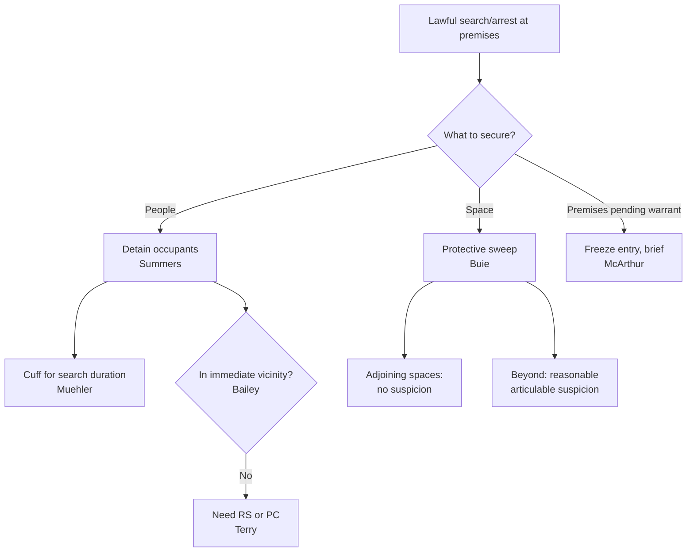

# Securing the Scene: Detention, Protective Sweeps and Freezes

## Rule
A judicially authorized search of premises carries the implicit, limited authority to **detain the occupants** during execution (*Summers*), and that detention may include handcuffing for the search's duration where officer-safety interests justify it (*Muehler*). Incident to an in-home arrest, officers may conduct a **protective sweep**: a suspicionless look into immediately adjoining spaces, and — on reasonable, articulable suspicion — a broader sweep of areas that may harbor a dangerous person (*Buie*). With probable cause, police may also impose a brief **freeze** on a residence to prevent destruction of evidence while a warrant is obtained (*McArthur*). These authorities are bounded: detention reaches only the **immediate vicinity** of the premises (*Bailey*), and gaining access by ordering a door opened "under color of authority" is a warrantless **constructive entry**, not a consensual encounter (*Conner*, 8th Cir.).

## Key cases

| Case | Holding (one line) | Weight | CourtListener |
| --- | --- | --- | --- |
| *Michigan v. Summers*, 452 U.S. 692 (1981) | A premises search warrant implicitly carries limited authority to detain occupants while the search is conducted. | SCOTUS — binding | [opinion](https://www.courtlistener.com/opinion/110534/michigan-v-summers/) |
| *Maryland v. Buie*, 494 U.S. 325 (1990) | Suspicionless sweep of immediately adjoining spaces; broader sweep only on articulable suspicion of danger. | SCOTUS — binding | [opinion](https://www.courtlistener.com/opinion/112384/maryland-v-buie/) |
| *Illinois v. McArthur*, 531 U.S. 326 (2001) | Police with probable cause may briefly bar a resident from re-entering his home while they obtain a warrant. | SCOTUS — binding | [opinion](https://www.courtlistener.com/opinion/118405/illinois-v-mcarthur/) |
| *Muehler v. Mena*, 544 U.S. 93 (2005) | Occupants may be handcuffed/detained for the search's duration; collateral questioning is not a separate seizure. | SCOTUS — binding | [opinion](https://www.courtlistener.com/opinion/142878/muehler-v-mena/) |
| *Segura v. United States*, 468 U.S. 796 (1984) | Evidence later seized under a warrant built on wholly independent information is admissible despite a prior illegal entry. | SCOTUS — binding | [opinion](https://www.courtlistener.com/opinion/111259/segura-v-united-states/) |
| *Bailey v. United States*, 568 U.S. 186 (2013) | *Summers* detention is confined to the immediate vicinity; cannot detain a former occupant stopped a mile away. | SCOTUS — binding | [opinion](https://www.courtlistener.com/opinion/820749/bailey-v-united-states/) |
| *Steagald v. United States*, 451 U.S. 204 (1981) | Entering a third party's home for an arrest-warrant subject requires a search warrant absent exigency or consent. | SCOTUS — binding | [opinion](https://www.courtlistener.com/opinion/110464/steagald-v-united-states/) |
| *United States v. Conner*, 127 F.3d 663 (8th Cir. 1997) | Forcing a door open under color of authority is a constructive entry/search, not a consensual encounter. | Circuit (8th) — persuasive | [opinion](https://www.courtlistener.com/opinion/747208/united-states-v-larry-duane-conner-united-states-of-america-v-john/) |

## Nuances & limits
- **Detention authority (*Summers*).** A premises search warrant "implicitly carries with it the limited authority to detain the occupants of the premises while a proper search is conducted" (452 U.S. at 705). The detention is categorical — no individualized suspicion of the occupant is needed; it rides on the warrant itself.
- **How far the detention can go (*Muehler*).** Handcuffing occupants for the full length of a search is reasonable where the safety interest is high. The Court "conclude[d] that the detention of Mena in handcuffs during the search was reasonable" given a search of a gang house for weapons by two officers (544 U.S. at 100). Separately, because the immigration questioning "did not constitute an independent Fourth Amendment seizure ... no additional Fourth Amendment justification for inquiring about Mena's immigration status was required" (544 U.S. at 101) — questioning during a lawful detention that does not prolong it is not a fresh seizure. See [[Seizure of the Person]].
- **The spatial leash (*Bailey*).** Detention authority "is limited to the immediate vicinity of the premises to be searched" and "does not apply ... where Bailey was detained at a point beyond any reasonable understanding of the immediate vicinity" (568 U.S. at 186). The Court fixed "[a] spatial constraint defined by the immediate vicinity of the premises to be searched" for detentions incident to warrant execution (568 U.S. at 201). Once an occupant has left and is stopped at a distance, *Summers* is gone — any stop must rest on [[Terry Stops and Reasonable Suspicion|reasonable suspicion]] or probable cause.
- **Protective sweep — two prongs (*Buie*).** Quoting the test verbatim: officers may "as a precautionary matter and without probable cause or reasonable suspicion, look in closets and other spaces immediately adjoining the place of arrest from which an attack could be immediately launched. Beyond that, however, ... there must be articulable facts which, taken together with the rational inferences from those facts, would warrant a reasonably prudent officer in believing that the area to be swept harbors an individual posing [a danger to those on the arrest scene]" (494 U.S. at 334). A sweep is a cursory visual inspection of places a person could hide — not a search for evidence. See [[Search Incident to Arrest]] and [[Plain View Doctrine]] for what may be seized in plain view during a lawful sweep.
- **Freeze pending a warrant (*McArthur*).** With probable cause to believe a home holds contraband, police "prevented that man from entering the home for about two hours while they obtained a search warrant ... We conclude that the officers acted reasonably" (531 U.S. at 328-29). The freeze is a limited, temporary restraint, not a search. *Segura v. United States*, 468 U.S. 796 (1984), is the companion principle from the other direction: securing premises while a warrant issues does not poison evidence later seized under a warrant grounded on wholly independent information.
- **Constructive entry — circuit-developed (*Conner*, 8th Cir.).** **CONNER-FRAMING:** This is a **constructive-entry / unlawful-search** doctrine under [[The Warrant Requirement]] — *not* a seizure-of-the-person rule. The Eighth Circuit held that "an unconstitutional search occurs when officers gain visual or physical access to a motel room after an occupant opens the door not voluntarily, but in response to a demand under color of authority" (127 F.3d at 667), and that "the officers' entry into the motel room and arrest of the occupants violated [defendants'] Fourth Amendment rights" (127 F.3d at 666). This is **Eighth Circuit precedent — persuasive only**, not a nationwide rule. Frame the surround-and-call-out (SACO) problem as a *Payton/Steagald* entry question: authority to enter and exclude flows from the warrant analysis in [[Arrest in the Home]] (*Payton* — arrest warrant + reason to believe the suspect is home; *Steagald* — a third party's home needs a search warrant).

## Common pitfalls
- **Detaining people who already left.** *Summers* does not reach a former occupant stopped down the block or a mile away (*Bailey*). Past the immediate vicinity, officers need independent [[Terry Stops and Reasonable Suspicion|reasonable suspicion]] or probable cause — the warrant alone will not carry the stop.
- **Treating a protective sweep as a full search.** A *Buie* sweep is a quick look for *people* in spaces where a person could hide, justified by danger — not a rummage for evidence. The adjoining-spaces look is suspicionless; anything beyond it demands articulable facts of danger. Opening drawers or "sweeping" for contraband converts it into an unlawful search.
- **Mislabeling a forced-door entry as a consensual encounter.** Where officers command occupants to open up under color of authority and the door opens in response, that is a **constructive entry** (*Conner*, 8th Cir. persuasive), not a knock-and-talk consent. The lawfulness turns on the entry rules in [[Arrest in the Home]] (*Payton*/*Steagald*), not on consent doctrine.

## Visual

## Flashcards
- What detention does a premises search warrant implicitly authorize? :: Under *Michigan v. Summers* (1981), limited authority to detain the occupants of the premises while a proper search is conducted — no individualized suspicion required.
- What spatial limit does *Bailey v. United States* place on *Summers* detention? :: It reaches only the immediate vicinity of the premises; a former occupant stopped beyond that (e.g., a mile away) cannot be held under *Summers* and needs independent reasonable suspicion or probable cause.
- State the two prongs of a *Maryland v. Buie* protective sweep. :: (1) Suspicionless look into spaces immediately adjoining the place of arrest from which an attack could be launched; (2) a broader sweep only on articulable facts warranting a reasonably prudent officer to believe the area harbors a dangerous person.
- What does *Illinois v. McArthur* permit while a warrant is sought? :: With probable cause that a home holds contraband, police may impose a brief, reasonable freeze — barring a resident from re-entering unaccompanied (about two hours) — to prevent destruction of evidence.
- Under *United States v. Conner* (8th Cir., persuasive), what is ordering a door opened "under color of authority"? :: A warrantless constructive entry/search — not a consensual encounter — analyzed under the *Payton/Steagald* entry rules, valid only with consent or exigency.

## Sources
- [*Michigan v. Summers*, 452 U.S. 692 (1981)](https://www.courtlistener.com/opinion/110534/michigan-v-summers/)
- [*Maryland v. Buie*, 494 U.S. 325 (1990)](https://www.courtlistener.com/opinion/112384/maryland-v-buie/)
- [*Illinois v. McArthur*, 531 U.S. 326 (2001)](https://www.courtlistener.com/opinion/118405/illinois-v-mcarthur/)
- [*Muehler v. Mena*, 544 U.S. 93 (2005)](https://www.courtlistener.com/opinion/142878/muehler-v-mena/)
- [*Segura v. United States*, 468 U.S. 796 (1984)](https://www.courtlistener.com/opinion/111259/segura-v-united-states/)
- [*Bailey v. United States*, 568 U.S. 186 (2013)](https://www.courtlistener.com/opinion/820749/bailey-v-united-states/)
- [*Steagald v. United States*, 451 U.S. 204 (1981)](https://www.courtlistener.com/opinion/110464/steagald-v-united-states/)
- [*United States v. Conner*, 127 F.3d 663 (8th Cir. 1997)](https://www.courtlistener.com/opinion/747208/united-states-v-larry-duane-conner-united-states-of-america-v-john/)
