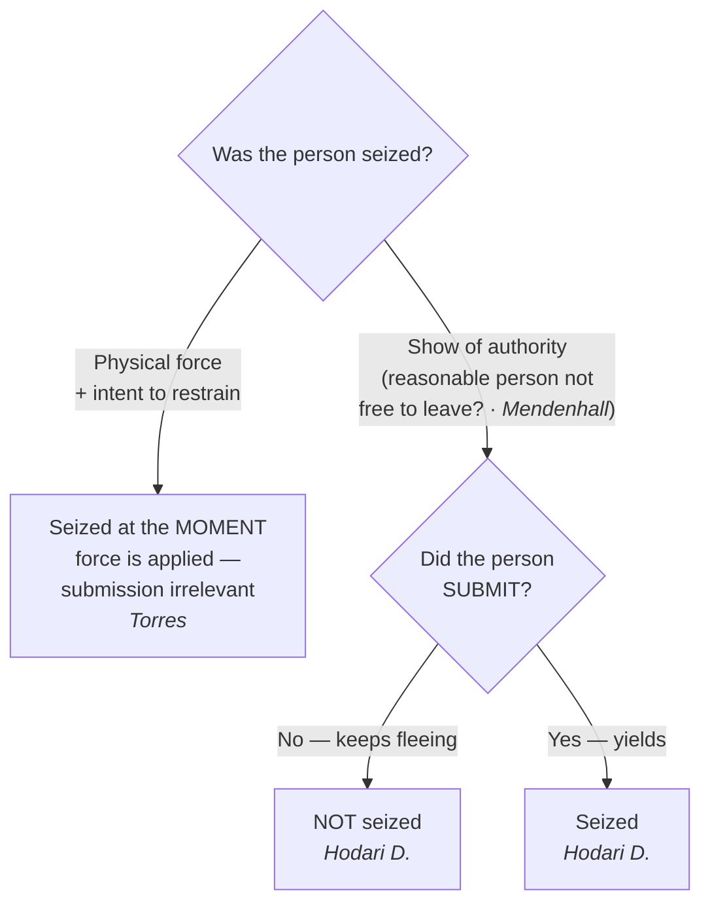

## Rule
A person is "seized" under the Fourth Amendment in one of **two ways**: (1) the **application of physical force** to the body with intent to restrain, or (2) a **show of authority to which the person submits**. *California v. Hodari D.*, 499 U.S. 621, 626 (1991); *Torres v. Madrid*, 592 U.S. 306 (2021). For the **show-of-authority** branch, the objective *Mendenhall* test sets the predicate — there is a show of authority only where, "in view of all of the circumstances surrounding the incident, a reasonable person would have believed that he was not free to leave" — **and** the person must then actually **submit**; a suspect who flees an uncomplied-with command is not yet seized. *United States v. Mendenhall*, 446 U.S. 544, 554 (1980); *Hodari D.*, 499 U.S. at 626. For the **physical-force** branch, the seizure occurs at the **moment force is applied with intent to restrain**, even if the person never submits and escapes. *Torres*, 592 U.S. 306. Whether a seizure is *reasonable* is a separate question taken up later; this page fixes only *when* a seizure has occurred.

## Key cases
| Case (Bluebook) | Holding in one line | Weight | CourtListener |
|---|---|---|---|
| *United States v. Mendenhall*, 446 U.S. 544 (1980) | The "free to leave" benchmark: a person is seized only if, under all the circumstances, a reasonable person would not have believed himself **free to leave**. | SCOTUS — binding | [link](https://www.courtlistener.com/opinion/110264/united-states-v-mendenhall/) |
| *California v. Hodari D.*, 499 U.S. 621 (1991) | A **show-of-authority** seizure is not complete until the suspect **submits**; contraband discarded while still fleeing is not the fruit of a seizure. | SCOTUS — binding | [link](https://www.courtlistener.com/opinion/112579/california-v-hodari-d/) |
| *Torres v. Madrid*, 592 U.S. 306 (2021) | **Physical force** with intent to restrain is a seizure **at the moment of application**, even if the person does not submit and is not subdued (officers shot Torres; she drove off — still seized). | SCOTUS — binding | [link](https://www.courtlistener.com/opinion/4867542/torres-v-madrid/) |

## Related cases across doctrines
These cases are treated in full on other pages but bear directly on *when* a seizure of the person occurs, framed here for this doctrine.

| Case | Relevance to seizure of the person | Primary treatment | CourtListener |
|---|---|---|---|
| *Brendlin v. California*, 551 U.S. 249 (2007) | When a car is stopped, the passenger is seized too — a show-of-authority seizure reaches everyone in the vehicle, not just the driver, because no reasonable passenger would feel free to leave. | [[Standing to Challenge a Search]] | [opinion](https://www.courtlistener.com/opinion/145712/brendlin-v-california/) |
| *Florida v. Bostick*, 501 U.S. 429 (1991) | Where the person is already confined (a bus seat) so "free to leave" is meaningless, the *Mendenhall* seizure test is reframed: a seizure occurs only if a reasonable person would not feel free to decline the officers' requests or otherwise terminate the encounter. | [[Knock and Talk]] | [opinion](https://www.courtlistener.com/opinion/112631/florida-v-bostick/) |
| *United States v. Drayton*, 536 U.S. 194 (2002) | A bus sweep with consent-to-search requests is not a seizure — no show of authority where officers do not block exits, brandish weapons, or use a commanding tone; the failure to advise of the right to refuse does not convert a consensual encounter into a seizure. | [[Knock and Talk]] | [opinion](https://www.courtlistener.com/opinion/121153/united-states-v-drayton/) |
| *Michigan v. Summers*, 452 U.S. 692 (1981) | A warrant to search premises for contraband carries categorical authority to seize (detain) the occupants for the duration of the search — a Fourth Amendment seizure of the person justified without individualized suspicion. | [[Securing the Scene]] | [opinion](https://www.courtlistener.com/opinion/110534/michigan-v-summers/) |
| *Bailey v. United States*, 568 U.S. 186 (2013) | The *Summers* detention authority — a categorical seizure of occupants during a search — is spatially limited to the immediate vicinity of the premises; once the occupant has left, his detention must be justified on ordinary seizure grounds (*Terry*/PC). | [[Securing the Scene]] | [opinion](https://www.courtlistener.com/opinion/820749/bailey-v-united-states/) |
| *Muehler v. Mena*, 544 U.S. 93 (2005) | The manner of a *Summers* detention may include handcuffing occupants for the entire search of a dangerous premises — the seizure remains reasonable; mere questioning during a lawful detention is not itself a separate seizure. | [[Securing the Scene]] | [opinion](https://www.courtlistener.com/opinion/142878/muehler-v-mena/) |
| *Illinois v. McArthur*, 531 U.S. 326 (2001) | A temporary restraint preventing a resident from re-entering his home while police get a warrant is a limited seizure of the person, reasonable on probable cause plus exigency — illustrates that seizure of the person spans more than arrest. | [[Securing the Scene]] | [opinion](https://www.courtlistener.com/opinion/118405/illinois-v-mcarthur/) |
| *Graham v. Connor*, 490 U.S. 386 (1989) | Once a seizure by force has occurred, its reasonableness is judged by the Fourth Amendment's objective-reasonableness standard from the officer's on-scene perspective — the seizure (this page) is the trigger; *Graham* supplies the next-step reasonableness test. | [[Section 1983 Liability and Qualified Immunity]] | [opinion](https://www.courtlistener.com/opinion/112257/graham-v-connor/) |

## Nuances & limits
- **Two roads to a seizure — keep them separate.** "An arrest requires *either* physical force (as described above) *or,* where that is absent, *submission* to the assertion of authority." *Hodari D.*, 499 U.S. at 626. The force branch and the show-of-authority branch are analyzed differently; do not import the submission requirement into a force case, or the force requirement into a show-of-authority case.
- **The *Mendenhall* standard (show-of-authority branch).** The test is objective and totality-based, and it asks whether a show of authority existed in the first place:
  > "[A] person has been 'seized' within the meaning of the Fourth Amendment only if, in view of all of the circumstances surrounding the incident, a reasonable person would have believed that he was not free to leave." — *Mendenhall*, 446 U.S. at 554.

  The Court listed circumstances that **might** indicate a seizure even if the person did not try to leave: "the threatening presence of several officers, the display of a weapon by an officer, some physical touching of the person of the citizen, or the use of language or tone of voice indicating that compliance with the officer's request might be compelled." *Id.*
- **"Free to leave" is necessary but not sufficient (the *Hodari D.* gloss).** For a show of authority, *Mendenhall* sets the threshold, but the suspect must also **yield**. *Hodari D.* frames "[t]he narrow question … whether, with respect to a show of authority …, a seizure occurs even though the subject does not yield. We hold that it does not." 499 U.S. at 626. A police command — "Stop, in the name of the law!" — to a fleeing suspect "is no seizure" until he submits. *Id.* Practical upshot: contraband a fleeing suspect tosses before submitting was **not** abandoned during a seizure, so it is not suppressible as fruit. (Cross-reference [[Abandonment]].)
- **Force needs no submission (the *Torres* gap-filler).** Where officers apply physical force to restrain, the seizure is complete at the instant of application even if it fails to subdue: "the application of physical force to the body of a person with intent to restrain is a seizure even if the person does not submit and is not subdued." *Torres*, 592 U.S. 306. Torres was seized the moment the bullets struck her, though she then drove away.
- **Force seizures are momentary unless submission follows.** "[A] seizure by force — absent submission — lasts only as long as the application of force"; there is no "continuing arrest during the period of fugitivity." *Torres*, 592 U.S. 306 (2021) (quoting *Hodari D.*, 499 U.S. at 625). A suspect grazed by an officer's grasp who breaks free is seized for that instant only.
- **Intent to restrain, judged objectively.** Only force *applied to restrain* counts — "[a] seizure requires the use of force with intent to restrain," not "force applied by accident or for some other purpose," and "the appropriate inquiry is whether the challenged conduct objectively manifests an intent to restrain." *Torres*, 592 U.S. 306. A tap on the shoulder to get someone's attention rarely shows that intent. *Id.*
- **Force–reasonableness link.** The same touching that effects a seizure also triggers the use-of-force inquiry: once a seizure by force has occurred, its *reasonableness* is judged under the objective standard of *Graham v. Connor*, 490 U.S. 386 (1989). Seizure (this page) is the trigger; reasonableness is the next question. (Cross-reference [[Use of Force]].)
- **A hunch grants no authority to seize — use a consensual encounter.** A mere hunch justifies no seizure of any kind. The lawful tool when an officer has only a hunch is a **consensual encounter**: the person remains free to leave, so no seizure occurs and no justification is needed. The investigative value of a hunch is that, properly **articulated** (identifying the specific facts the hunch rests on), it may rise to reasonable, articulable suspicion — the predicate for an investigative detention under *Terry v. Ohio*, 392 U.S. 1 (1968) (see [[Terry Stops and Reasonable Suspicion]]). (Cross-reference [[Consent Searches]].)

## Common pitfalls
- **Treating a fleeing suspect as already "seized" once an officer yells "stop."** Until the suspect submits (or is touched with intent to restrain), there is no show-of-authority seizure — anything discarded mid-flight is fair game. (*Hodari D.*)
- **Assuming a missed or failed use of force is no seizure.** A shot that hits but does not stop the suspect **is** a seizure at that instant. (*Torres*.) Conversely, a shot that *misses* applies no force to the body and is not a seizure.
- **Collapsing "free to leave" into the whole test.** For show-of-authority, *Mendenhall* is the threshold but submission is still required; for force, *Mendenhall* is beside the point — application of force controls.
- **Confusing "seized" with "lawfully seized."** Establishing a seizure does not make it reasonable. Whether reasonable suspicion, probable cause, or a recognized justification supported it is a separate analysis (covered later).
- **Reading "intent to restrain" as the officer's secret motive.** It is an **objective** inquiry into what the conduct manifests, not the officer's or suspect's subjective state of mind. (*Torres*.)
- **Treating a hunch as if it authorizes a detention or frisk.** Without articulable suspicion there is no authority to seize. Escalate via a consensual encounter and build the articulation — do not detain on a hunch.

## Recent developments & subsequent treatment
The two-roads seizure framework remains stable, but the post-seizure *reasonableness* inquiry and the *Hodari D.* submission requirement are being actively worked out. A unanimous 2025 SCOTUS decision rejected a circuit's narrowed view of when force is reasonable; circuit courts (persuasive, not binding) have applied the *Torres* force-seizure rule on remand and tightened what counts as "submission"; and a cert petition now presses whether race factors into the objective *Mendenhall* "free to leave" inquiry.

- **United States v. Carter** — *pending before the Supreme Court* (cert petition No. 25-885; below *Carter v. United States*, D.C. Court of Appeals, Aug. 28, 2025) (question: whether a suspect's race may be considered in the *Mendenhall* objective "free to leave" seizure inquiry). The decision below vacated on a seizure theory, holding under its *Dozier* precedent that courts must consider whether an objective reasonable person sharing the defendant's racial status and lived experiences would have felt free to terminate the encounter — finding a Black man here was seized. No SCOTUS holding yet; a developing frontier on the show-of-authority branch, not settled law. ⚖ Open question (cert pending) — not a settled circuit split. Note posture: the court below is the D.C. Court of Appeals (a local court), not the D.C. Circuit. [opinion](https://www.courtlistener.com/opinion/10662535/carter-v-united-states/).
- **Barnes v. Felix (SCOTUS 2025)** — Rejects the Fifth Circuit's "moment of threat" rule: the reasonableness of force used to effect a seizure is judged on the totality of the circumstances, an inquiry that "has no time limit" and may consider the events leading up to the use of force, not just the isolated instant of danger. Unanimously vacated the moment-of-threat doctrine; governs the reasonableness step that follows a *Torres* force-seizure. ⚖ Circuit split (resolved). "Most notable here, the 'totality of the circumstances' inquiry into a use of force has no time limit." 605 U.S. at 80. [opinion](https://www.courtlistener.com/opinion/10584846/barnes-v-felix/).
- **Torres v. Madrid (10th Cir. 2023, on remand)** — *Persuasive, not binding (Tenth Circuit).* On remand from SCOTUS, the Tenth Circuit reversed summary judgment for the officers: it rejected the *Heck v. Humphrey* bar and the alternative QI ground premised on Torres's escape, holding her successful eluding of seizure was irrelevant to QI because the officers' knowledge at the moment of firing controls. Because Torres was seized the instant the bullets struck her (even though she drove off), *Heck* did not bar her excessive-force claim and QI did not attach merely because she eluded capture. The most concrete circuit-level working-out of the *Torres* physical-force-seizure rule. [opinion](https://www.courtlistener.com/opinion/9376547/torres-v-madrid/).
- **United States v. Amos (3d Cir. 2023)** — *Persuasive, not binding (Third Circuit).* Applies the *Hodari D.* submission requirement to the modern "momentary pause" problem: a suspect's one-to-two-second pause and a halfway raise of the hands in response to an officer's command is NOT submission to a show of authority, so no seizure occurred until handcuffing — and his intervening flight supplied the reasonable suspicion. Distinguishes genuine compliance (sitting down, obeying for more than a moment) from fleeting hesitation. "[B]ecause submission 'would seem to require something more than a momentary pause,' Amos's brief pause and halfway hand raise was not a submission to the officers' show of authority." 88 F.4th at 455 (quoting *Waterman*, 569 F.3d at 146). [opinion](https://www.courtlistener.com/opinion/9452158/united-states-v-shiheem-amos/).

## Visual

## Sources
- *United States v. Mendenhall*, 446 U.S. 544 (1980) — https://www.courtlistener.com/opinion/110264/united-states-v-mendenhall/
- *California v. Hodari D.*, 499 U.S. 621 (1991) — https://www.courtlistener.com/opinion/112579/california-v-hodari-d/
- *Torres v. Madrid*, 592 U.S. 306 (2021) — https://www.courtlistener.com/opinion/4867542/torres-v-madrid/
- *Graham v. Connor*, 490 U.S. 386 (1989) — https://www.courtlistener.com/opinion/112257/graham-v-connor/ *(use-of-force reasonableness; cross-reference)*
- *Terry v. Ohio*, 392 U.S. 1 (1968) — https://www.courtlistener.com/opinion/107729/terry-v-ohio/ *(reasonable-suspicion predicate; see [[Terry Stops and Reasonable Suspicion]])*
