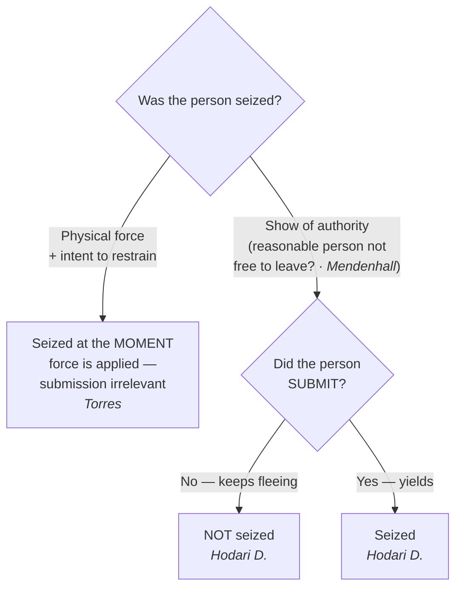

## Rule
A person is "seized" under the Fourth Amendment in one of **two ways**: (1) the **application of physical force** to the body with intent to restrain, or (2) a **show of authority to which the person submits**. *California v. Hodari D.*, 499 U.S. 621, 626 (1991); *Torres v. Madrid*, 592 U.S. 306 (2021). For the **show-of-authority** branch, the objective *Mendenhall* test sets the predicate — there is a show of authority only where, "in view of all of the circumstances surrounding the incident, a reasonable person would have believed that he was not free to leave" — **and** the person must then actually **submit**; a suspect who flees an uncomplied-with command is not yet seized. *United States v. Mendenhall*, 446 U.S. 544, 554 (1980); *Hodari D.*, 499 U.S. at 626. For the **physical-force** branch, the seizure occurs at the **moment force is applied with intent to restrain**, even if the person never submits and escapes. *Torres*, 592 U.S. 306. Whether a seizure is *reasonable* is a separate question taken up later; this page fixes only *when* a seizure has occurred.

## Key cases
| Case (Bluebook) | Holding in one line | Weight | CourtListener |
|---|---|---|---|
| *United States v. Mendenhall*, 446 U.S. 544 (1980) | The "free to leave" benchmark: a person is seized only if, under all the circumstances, a reasonable person would not have believed himself **free to leave**. | SCOTUS — binding | [link](https://www.courtlistener.com/opinion/110264/united-states-v-mendenhall/) |
| *California v. Hodari D.*, 499 U.S. 621 (1991) | A **show-of-authority** seizure is not complete until the suspect **submits**; contraband discarded while still fleeing is not the fruit of a seizure. | SCOTUS — binding | [link](https://www.courtlistener.com/opinion/112579/california-v-hodari-d/) |
| *Torres v. Madrid*, 592 U.S. 306 (2021) | **Physical force** with intent to restrain is a seizure **at the moment of application**, even if the person does not submit and is not subdued (officers shot Torres; she drove off — still seized). | SCOTUS — binding | [link](https://www.courtlistener.com/opinion/4867542/torres-v-madrid/) |

## Nuances & limits
- **Two roads to a seizure — keep them separate.** "An arrest requires *either* physical force (as described above) *or,* where that is absent, *submission* to the assertion of authority." *Hodari D.*, 499 U.S. at 626. The force branch and the show-of-authority branch are analyzed differently; do not import the submission requirement into a force case, or the force requirement into a show-of-authority case.
- **The *Mendenhall* standard (show-of-authority branch).** The test is objective and totality-based, and it asks whether a show of authority existed in the first place:
  > "[A] person has been 'seized' within the meaning of the Fourth Amendment only if, in view of all of the circumstances surrounding the incident, a reasonable person would have believed that he was not free to leave." — *Mendenhall*, 446 U.S. at 554.

  The Court listed circumstances that **might** indicate a seizure even if the person did not try to leave: "the threatening presence of several officers, the display of a weapon by an officer, some physical touching of the person of the citizen, or the use of language or tone of voice indicating that compliance with the officer's request might be compelled." *Id.*
- **"Free to leave" is necessary but not sufficient (the *Hodari D.* gloss).** For a show of authority, *Mendenhall* sets the threshold, but the suspect must also **yield**. *Hodari D.* frames "[t]he narrow question … whether, with respect to a show of authority …, a seizure occurs even though the subject does not yield. We hold that it does not." 499 U.S. at 626. A police command — "Stop, in the name of the law!" — to a fleeing suspect "is no seizure" until he submits. *Id.* Practical upshot: contraband a fleeing suspect tosses before submitting was **not** abandoned during a seizure, so it is not suppressible as fruit. (Cross-reference [[Abandonment]].)
- **Force needs no submission (the *Torres* gap-filler).** Where officers apply physical force to restrain, the seizure is complete at the instant of application even if it fails to subdue: "the application of physical force to the body of a person with intent to restrain is a seizure even if the person does not submit and is not subdued." *Torres*, 592 U.S. 306. Torres was seized the moment the bullets struck her, though she then drove away.
- **Force seizures are momentary unless submission follows.** "[A] seizure by force — absent submission — lasts only as long as the application of force"; there is no "continuing arrest during the period of fugitivity." *Torres*, 592 U.S. 306 (2021) (quoting *Hodari D.*, 499 U.S. at 625). A suspect grazed by an officer's grasp who breaks free is seized for that instant only.
- **Intent to restrain, judged objectively.** Only force *applied to restrain* counts — "[a] seizure requires the use of force with intent to restrain," not "force applied by accident or for some other purpose," and "the appropriate inquiry is whether the challenged conduct objectively manifests an intent to restrain." *Torres*, 592 U.S. 306. A tap on the shoulder to get someone's attention rarely shows that intent. *Id.*
- **Force–reasonableness link.** The same touching that effects a seizure also triggers the use-of-force inquiry: once a seizure by force has occurred, its *reasonableness* is judged under the objective standard of *Graham v. Connor*, 490 U.S. 386 (1989). Seizure (this page) is the trigger; reasonableness is the next question. (Cross-reference [[Use of Force]].)
- **A hunch grants no authority to seize — use a consensual encounter.** A mere hunch justifies no seizure of any kind. The lawful tool when an officer has only a hunch is a **consensual encounter**: the person remains free to leave, so no seizure occurs and no justification is needed. The investigative value of a hunch is that, properly **articulated** (identifying the specific facts the hunch rests on), it may rise to reasonable, articulable suspicion — the predicate for an investigative detention under *Terry v. Ohio*, 392 U.S. 1 (1968) (see [[Terry Stops and Reasonable Suspicion]]). (Cross-reference [[Consent Searches]].)

## Common pitfalls
- **Treating a fleeing suspect as already "seized" once an officer yells "stop."** Until the suspect submits (or is touched with intent to restrain), there is no show-of-authority seizure — anything discarded mid-flight is fair game. (*Hodari D.*)
- **Assuming a missed or failed use of force is no seizure.** A shot that hits but does not stop the suspect **is** a seizure at that instant. (*Torres*.) Conversely, a shot that *misses* applies no force to the body and is not a seizure.
- **Collapsing "free to leave" into the whole test.** For show-of-authority, *Mendenhall* is the threshold but submission is still required; for force, *Mendenhall* is beside the point — application of force controls.
- **Confusing "seized" with "lawfully seized."** Establishing a seizure does not make it reasonable. Whether reasonable suspicion, probable cause, or a recognized justification supported it is a separate analysis (covered later).
- **Reading "intent to restrain" as the officer's secret motive.** It is an **objective** inquiry into what the conduct manifests, not the officer's or suspect's subjective state of mind. (*Torres*.)
- **Treating a hunch as if it authorizes a detention or frisk.** Without articulable suspicion there is no authority to seize. Escalate via a consensual encounter and build the articulation — do not detain on a hunch.

## Visual

## Flashcards
- What are the two ways to seize a person under the 4A?::(1) Application of physical force with intent to restrain, or (2) a show of authority to which the person submits (*Hodari D.*, 499 U.S. at 626; *Torres*).
- State the *Mendenhall* "free to leave" test.::A person is seized only if, "in view of all of the circumstances surrounding the incident, a reasonable person would have believed that he was not free to leave" (446 U.S. at 554).
- When is a show-of-authority seizure complete?::Only when the suspect **submits**; a suspect who flees a command is not yet seized, so contraband he discards mid-flight is not the fruit of a seizure (*Hodari D.*).
- When is a force seizure complete, and for how long?::At the moment force is applied with intent to restrain, even without submission; absent submission it lasts only as long as the force is applied — no continuing arrest during flight (*Torres*, 592 U.S. 306 (2021)).
- Does a shot that hits but fails to stop a suspect seize her?::Yes — *Torres*: application of physical force with intent to restrain is a seizure even if the person is not subdued. A shot that misses is not.
- If an officer has only a hunch, what is the lawful option?::A consensual encounter — the person stays free to leave, so it is not a seizure; a hunch that can be articulated into specific facts may rise to reasonable suspicion (the *Terry* predicate, covered later).

## Sources
- *United States v. Mendenhall*, 446 U.S. 544 (1980) — https://www.courtlistener.com/opinion/110264/united-states-v-mendenhall/
- *California v. Hodari D.*, 499 U.S. 621 (1991) — https://www.courtlistener.com/opinion/112579/california-v-hodari-d/
- *Torres v. Madrid*, 592 U.S. 306 (2021) — https://www.courtlistener.com/opinion/4867542/torres-v-madrid/
- *Graham v. Connor*, 490 U.S. 386 (1989) — https://www.courtlistener.com/opinion/112257/graham-v-connor/ *(use-of-force reasonableness; cross-reference)*
- *Terry v. Ohio*, 392 U.S. 1 (1968) — https://www.courtlistener.com/opinion/107729/terry-v-ohio/ *(reasonable-suspicion predicate; see [[Terry Stops and Reasonable Suspicion]])*
