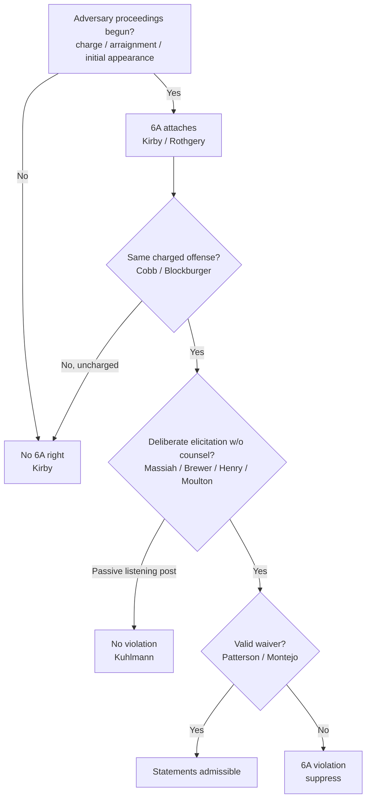

# Sixth Amendment Right to Counsel

## Rule
The Sixth Amendment right to counsel attaches only at or after the initiation of adversary judicial criminal proceedings — formal charge, preliminary hearing, indictment, information, or arraignment (Kirby), which in practice includes the initial appearance before a magistrate (Rothgery). The right is **offense-specific**: it covers only the charged offense, not other uncharged offenses, even factually related ones (Cobb). Once it has attached, the government may not **deliberately elicit** incriminating statements from the accused outside the presence of counsel — whether openly (Brewer) or covertly through informants (Massiah, Henry, Moulton) — unless the accused validly waives the right (Patterson, Montejo). This is a distinct guarantee from the Fifth Amendment [[Miranda and Custodial Interrogation|Miranda]]-counsel right, with different triggers and scope.

## Key cases

| Case | Holding (one line) | Weight | CourtListener |
| --- | --- | --- | --- |
| *Massiah v. United States*, 377 U.S. 201, 206 (1964) | Post-indictment deliberate elicitation of statements without counsel — even surreptitiously, outside custody — violates the 6A. | SCOTUS — binding | [opinion](https://www.courtlistener.com/opinion/106822/massiah-v-united-states/) |
| *Brewer v. Williams*, 430 U.S. 387, 392-93, 399-400 (1977) | The "Christian burial speech" deliberately elicited statements after attachment with no valid waiver — a Massiah violation. | SCOTUS — binding | [opinion](https://www.courtlistener.com/opinion/109624/brewer-v-williams/) |
| *Kirby v. Illinois*, 406 U.S. 682, 688-90 (1972) (plurality opinion) | The 6A right attaches only at/after initiation of adversary judicial proceedings; a pre-charge ID is not a critical stage. | SCOTUS — binding | [opinion](https://www.courtlistener.com/opinion/108554/kirby-v-illinois/) |
| *Rothgery v. Gillespie County*, 554 U.S. 191, 198, 213 (2008) | Attachment occurs at the initial appearance before a magistrate, even if no prosecutor is aware of or involved in it. | SCOTUS — binding | [opinion](https://www.courtlistener.com/opinion/145785/rothgery-v-gillespie-county/) |
| *United States v. Henry*, 447 U.S. 264, 270-74 (1980) | Government use of a paid informant to intentionally induce an indicted defendant's statements "deliberately elicited" them, violating the 6A. | SCOTUS — binding | [opinion](https://www.courtlistener.com/opinion/110300/united-states-v-henry/) |
| *Maine v. Moulton*, 474 U.S. 159 (1985) | Knowingly exploiting an opportunity to confront the charged accused without counsel violates the 6A — even if the defendant set up the meeting. | SCOTUS — binding | [opinion](https://www.courtlistener.com/opinion/111546/maine-v-moulton/) |
| *Patterson v. Illinois*, 487 U.S. 285 (1988) | An accused may knowingly and intelligently waive the 6A counsel right for post-indictment questioning via Miranda warnings. | SCOTUS — binding | [opinion](https://www.courtlistener.com/opinion/112127/patterson-v-illinois/) |
| *Montejo v. Louisiana*, 556 U.S. 778, 797 (2009) | A defendant may validly waive the 6A right during police-initiated interrogation even after counsel is appointed; overrules Michigan v. Jackson. | SCOTUS — binding | [opinion](https://www.courtlistener.com/opinion/145873/montejo-v-louisiana/) |
| *Texas v. Cobb*, 532 U.S. 162, 167-68, 173 (2001) | The 6A right is offense-specific; it does not extend to uncharged offenses, even factually related ones (Blockburger same-elements test). | SCOTUS — binding | [opinion](https://www.courtlistener.com/opinion/118417/texas-v-cobb/) |
| *Kuhlmann v. Wilson*, 477 U.S. 436, 459 (1986) | A passive "listening post" informant who merely reports statements does not violate the 6A; the accused must show deliberate elicitation. | SCOTUS — binding | [opinion](https://www.courtlistener.com/opinion/111726/kuhlmann-v-wilson/) |

## Nuances & limits
- **Attachment is at charging, not arrest.** The right turns on the initiation of adversary judicial proceedings — indictment, information, arraignment, preliminary hearing — and the Court in Rothgery held the initial appearance before a magistrate triggers it, even with no prosecutor aware or involved. Mere arrest or investigative detention does not attach the 6A right.
- **Offense-specificity (Cobb).** Attachment as to a charged offense does not bar questioning about *other* uncharged offenses, even closely related ones; the "offense" is defined by the *Blockburger* same-elements test. Officers may lawfully question a charged defendant about a separate, uncharged crime.
- **The trigger is "deliberate elicitation," not "interrogation."** Massiah is broader than Miranda: it reaches surreptitious, non-custodial efforts to draw out statements. Massiah quotes — the petitioner "was denied the basic protections of that guarantee when there was used against him at his trial evidence of his own incriminating words, which federal agents had deliberately elicited from him after he had been indicted and in the absence of his counsel." (377 U.S. at 206).
- **The informant line — Henry/Moulton vs. Kuhlmann.** Active inducement violates the right (Henry; Moulton — exploitation violates even when the defendant arranged the meeting). A purely **passive** informant who only listens and reports does not (Kuhlmann); the accused must show the informant took some action *beyond merely listening* designed to elicit the statements.
- **Waiver via Miranda (Patterson).** Standard Miranda warnings can supply a knowing and intelligent waiver of the post-attachment 6A right: "So long as the accused is made aware of the 'dangers and disadvantages of self-representation' during postindictment questioning, by use of the Miranda warnings, his waiver of his Sixth Amendment right to counsel at such questioning is 'knowing and intelligent.'" (487 U.S. at 300). Montejo extends this — a waiver during police-initiated interrogation is valid even after counsel has been appointed. See [[Miranda Waiver and Invocation]].
- **Michigan v. Jackson is no longer law.** Montejo expressly overruled it; the rule that a post-appointment, police-initiated waiver is presumptively invalid is *defunct* and should be presented only as history, never as current doctrine.
- **Critical-stage overlap.** A post-charge lineup is a critical stage requiring counsel; a pre-charge lineup is not (Kirby) — see [[Eyewitness Identification]] for the Wade counsel-at-lineup rule.

## Common pitfalls
- **Confusing the 5A Miranda-counsel right with the 6A counsel right.** They have different triggers (custodial interrogation vs. charging) and different scope. A Miranda invocation is not a 6A invocation, and vice versa. Keep [[Miranda and Custodial Interrogation]] and this doctrine separate.
- **Assuming the right attaches at arrest.** It does not — it attaches at charging/initial appearance (Kirby, Rothgery). Pre-charge investigation is governed by Miranda and [[Due-Process Voluntariness of Confessions]], not the 6A.
- **Forgetting offense-specificity (Cobb).** Officers wrongly assume that once a suspect is charged with one crime they cannot be questioned about anything. They can be questioned about *uncharged* offenses.
- **Treating a passive jailhouse informant as automatically unlawful.** Mere listening is not deliberate elicitation (Kuhlmann); the violation is in *inducing* the statements (Henry/Moulton).

## Visual

## Flashcards
When does the Sixth Amendment right to counsel attach?:: At or after the initiation of adversary judicial criminal proceedings — charge, preliminary hearing, indictment, information, or arraignment (Kirby); in practice at the initial appearance before a magistrate (Rothgery). Not at arrest.
What did Texas v. Cobb hold about the scope of the 6A right?:: The right is offense-specific — it attaches only to the charged offense (defined by the Blockburger same-elements test) and not to other uncharged offenses, even factually related ones.
What is the Massiah deliberate-elicitation rule?:: After attachment, the government may not deliberately elicit incriminating statements from the accused without counsel, even covertly and outside custody (Massiah, 377 U.S. at 206).
How does Kuhlmann v. Wilson limit the informant rule of Henry?:: A purely passive "listening post" informant who only reports statements does not violate the 6A; the accused must show the informant took action beyond merely listening, designed to elicit the statements.
Can Miranda warnings waive the 6A right, and what did Montejo add?:: Yes — Miranda warnings can supply a knowing and intelligent waiver for post-indictment questioning (Patterson, 487 U.S. at 300); Montejo held such a waiver is valid even after counsel is appointed, overruling Michigan v. Jackson.

## Sources
- [Massiah v. United States, 377 U.S. 201 (1964)](https://www.courtlistener.com/opinion/106822/massiah-v-united-states/)
- [Brewer v. Williams, 430 U.S. 387 (1977)](https://www.courtlistener.com/opinion/109624/brewer-v-williams/)
- [Kirby v. Illinois, 406 U.S. 682 (1972)](https://www.courtlistener.com/opinion/108554/kirby-v-illinois/)
- [Rothgery v. Gillespie County, 554 U.S. 191 (2008)](https://www.courtlistener.com/opinion/145785/rothgery-v-gillespie-county/)
- [United States v. Henry, 447 U.S. 264 (1980)](https://www.courtlistener.com/opinion/110300/united-states-v-henry/)
- [Maine v. Moulton, 474 U.S. 159 (1985)](https://www.courtlistener.com/opinion/111546/maine-v-moulton/)
- [Patterson v. Illinois, 487 U.S. 285 (1988)](https://www.courtlistener.com/opinion/112127/patterson-v-illinois/)
- [Montejo v. Louisiana, 556 U.S. 778 (2009)](https://www.courtlistener.com/opinion/145873/montejo-v-louisiana/)
- [Texas v. Cobb, 532 U.S. 162 (2001)](https://www.courtlistener.com/opinion/118417/texas-v-cobb/)
- [Kuhlmann v. Wilson, 477 U.S. 436 (1986)](https://www.courtlistener.com/opinion/111726/kuhlmann-v-wilson/)
