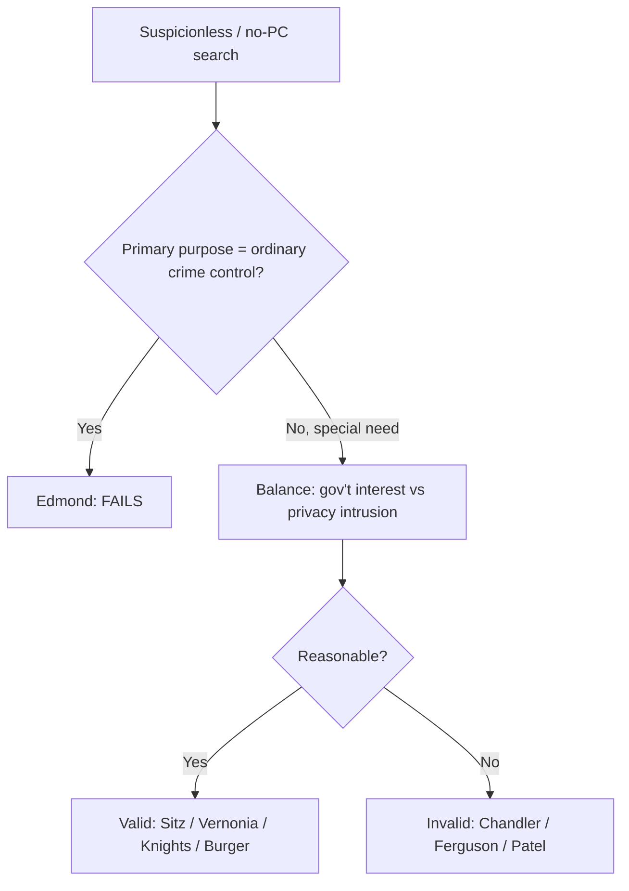

# Special Needs and Administrative Searches

## Rule
When a search or seizure serves a "special need" beyond the normal need for ordinary law enforcement, the Fourth Amendment is satisfied not by a warrant and probable cause but by a reasonableness balance: the government's special interest weighed against the individual's privacy intrusion. This balancing supports suspicionless or reduced-suspicion programs in defined contexts — sobriety checkpoints, schools, probation/parole, government employment, closely regulated industries, and administrative inspections. The threshold gate is purpose: under *City of Indianapolis v. Edmond*, a program whose **primary purpose is ordinary crime control fails**, no matter how it is balanced (for the seizure-of-the-driver angle at a checkpoint, see [[Traffic Stops]]). Unlike a true warrant exception under [[The Warrant Requirement]], special needs is a free-standing reasonableness inquiry — do not analyze it as if probable cause is required, and keep it distinct from voluntariness-based [[Consent Searches]] and from the sovereignty-based rules in [[Border Searches]].

## Key cases

| Case | Holding (one line) | Weight | CourtListener |
| --- | --- | --- | --- |
| *Michigan Dept. of State Police v. Sitz*, 496 U.S. 444 (1990) | Suspicionless DUI sobriety checkpoints are constitutional; state interest in combating drunk driving outweighs the brief, minimal intrusion. | SCOTUS — binding | [opinion](https://www.courtlistener.com/opinion/112459/michigan-department-of-state-police-v-sitz/) |
| *New Jersey v. T.L.O.*, 469 U.S. 325 (1985) | A public-school official may search a student on reasonableness alone — justified at inception and reasonable in scope — no warrant or PC. | SCOTUS — binding | [opinion](https://www.courtlistener.com/opinion/111301/new-jersey-v-t-l-o/) |
| *Griffin v. Wisconsin*, 483 U.S. 868 (1987) | A probationer's home may be searched without a warrant, on "reasonable grounds," pursuant to a valid regulation; probation is a special need. | SCOTUS — binding | [opinion](https://www.courtlistener.com/opinion/111959/griffin-v-wisconsin/) |
| *Camara v. Municipal Court*, 387 U.S. 523 (1967) | Administrative inspections generally need a warrant, but it may be an "area warrant" on reasonable legislative standards, not individualized PC. | SCOTUS — binding | [opinion](https://www.courtlistener.com/opinion/107473/camara-v-municipal-court-of-city-and-county-of-san-francisco/) |
| *New York v. Burger*, 482 U.S. 691 (1987) | Warrantless inspection of a closely regulated business is reasonable given substantial interest, necessity to the scheme, and a warrant substitute. | SCOTUS — binding | [opinion](https://www.courtlistener.com/opinion/111927/new-york-v-burger/) |
| *Illinois v. Lidster*, 540 U.S. 419 (2004) | An information-seeking checkpoint asking motorists about a crime committed by *someone else* is constitutional. | SCOTUS — binding | [opinion](https://www.courtlistener.com/opinion/131154/illinois-v-lidster/) |
| *Vernonia School District 47J v. Acton*, 515 U.S. 646 (1995) | Suspicionless random drug testing of public-school student athletes is reasonable under the special-needs doctrine. | SCOTUS — binding | [opinion](https://www.courtlistener.com/opinion/117964/vernonia-school-district-47j-v-acton/) |
| *Board of Education v. Earls*, 536 U.S. 822 (2002) | Extends *Vernonia*: suspicionless testing of all students in competitive extracurriculars is reasonable. | SCOTUS — binding | [opinion](https://www.courtlistener.com/opinion/121171/board-of-education-of-independent-school-district-no-92-of-pottawatomie/) |
| *United States v. Knights*, 534 U.S. 112 (2001) | A probation search on reasonable suspicion, authorized by a search condition, is reasonable even for a law-enforcement purpose. | SCOTUS — binding | [opinion](https://www.courtlistener.com/opinion/118468/united-states-v-knights/) |
| *Samson v. California*, 547 U.S. 843 (2006) | A *suspicionless* search of a parolee subject to a search condition is reasonable; parolees have severely diminished privacy expectations. | SCOTUS — binding | [opinion](https://www.courtlistener.com/opinion/145640/samson-v-california/) |
| *Skinner v. Railway Labor Executives' Ass'n*, 489 U.S. 602 (1989) | Suspicionless drug/alcohol testing of railway employees after accidents is reasonable under the special-needs doctrine. | SCOTUS — binding | [opinion](https://www.courtlistener.com/opinion/112219/skinner-v-railway-labor-executives-assn/) |
| *National Treasury Employees Union v. Von Raab*, 489 U.S. 656 (1989) | Suspicionless drug testing of Customs employees seeking interdiction or firearm-carrying posts is reasonable. | SCOTUS — binding | [opinion](https://www.courtlistener.com/opinion/112220/national-treasury-employees-union-v-von-raab/) |
| *Maryland v. King*, 569 U.S. 435 (2013) | A buccal DNA cheek-swab of a person arrested for a serious offense and held in custody is a reasonable booking procedure. | SCOTUS — binding | [opinion](https://www.courtlistener.com/opinion/873669/maryland-v-king/) |
| *South Dakota v. Opperman*, 428 U.S. 364 (1976) | A vehicle inventory under standard procedures, not a pretext for investigation, is reasonable. | SCOTUS — binding | [opinion](https://www.courtlistener.com/opinion/109537/south-dakota-v-opperman/) |
| *Colorado v. Bertine*, 479 U.S. 367 (1987) | Inventory (including closed containers) is valid where discretion follows standardized criteria, not suspicion of evidence. | SCOTUS — binding | [opinion](https://www.courtlistener.com/opinion/111788/colorado-v-bertine/) |
| *City of Indianapolis v. Edmond*, 531 U.S. 32 (2000) | A checkpoint whose primary purpose is ordinary crime control (drug interdiction) is unconstitutional. | SCOTUS — binding | [opinion](https://www.courtlistener.com/opinion/118391/city-of-indianapolis-v-edmond/) |
| *Ferguson v. City of Charleston*, 532 U.S. 67 (2001) | Covertly testing pregnant patients to generate evidence for police is NOT a special need. | SCOTUS — binding | [opinion](https://www.courtlistener.com/opinion/118414/ferguson-v-city-of-charleston/) |
| *Chandler v. Miller*, 520 U.S. 305 (1997) | Symbolic suspicionless drug testing of candidates for state office fails — no concrete special need. | SCOTUS — binding | [opinion](https://www.courtlistener.com/opinion/118100/chandler-v-miller/) |
| *Florida v. Wells*, 495 U.S. 1 (1990) | An inventory must follow standardized procedures; unbridled discretion to rummage for evidence is invalid. | SCOTUS — binding | [opinion](https://www.courtlistener.com/opinion/112412/florida-v-wells/) |
| *City of Los Angeles v. Patel*, 576 U.S. 409 (2015) | An admin-inspection regime is facially invalid absent an opportunity for pre-compliance review; hotels are not closely regulated. | SCOTUS — binding | [opinion](https://www.courtlistener.com/opinion/2810524/los-angeles-v-patel/) |

## Nuances & limits
- **The Edmond gate is purpose-based, and it comes first.** "Because the primary purpose of the Indianapolis narcotics checkpoint program is to uncover evidence of ordinary criminal wrongdoing, the program contravenes the Fourth Amendment." (531 U.S. at 41-42). A checkpoint is not valid because it is brief or orderly — it is valid only if its primary purpose is something *beyond* the general interest in crime control (DUI safety in *Sitz*; witness information in *Lidster*). *Ferguson* applies the same purpose test to drug testing: where the immediate objective is to generate evidence for law enforcement, the special-needs label fails.
- **Schools — the T.L.O. two-part test.** "Determining the reasonableness of any search involves a twofold inquiry: first, one must consider 'whether the . . . action was justified at its inception,' . . . second, one must determine whether the search as actually conducted 'was reasonably related in scope to the circumstances which justified the interference in the first place'." (469 U.S. at 341). Suspicionless student *drug testing* is a narrower line tied to reduced privacy — athletes (*Vernonia*) and extracurricular participants (*Earls*).
- **Probation vs. parole — different floors.** *Knights* upholds a probation search on **reasonable suspicion** even for an investigatory purpose: "the warrantless search of Knights, supported by reasonable suspicion and authorized by a condition of probation, was reasonable within the meaning of the Fourth Amendment." (534 U.S. at 122). *Samson* goes further for **parolees**, who may be searched with **no individualized suspicion** at all given their especially diminished privacy. Do not assume parole rules govern probationers, or vice versa.
- **Administrative inspections still favor a warrant.** *Camara* requires a warrant for routine code inspections, but on area-based standards rather than individualized PC. *Burger* recognizes a closely-regulated-industry exception (substantial interest + necessity + adequate warrant substitute), and modern *Patel* polices it: the regime must allow pre-compliance review, and ordinary businesses like hotels are not "closely regulated."
- **Inventory cluster (primary home: [[Search Incident to Arrest]]).** Inventories (*Opperman*, *Bertine*, *Wells*) are a caretaking, not investigatory, function. They turn on **standardized procedures**, not officer discretion. *Wells*: "an inventory search must not be a ruse for a general rummaging in order to discover incriminating evidence." (495 U.S. at 4). *Bertine* permits opening closed containers, but only where "discretion is exercised according to standard criteria and on the basis of something other than suspicion of evidence of criminal activity." (479 U.S. at 375-76).
- **King is a booking-process balancing case**, not a checkpoint or testing program — the DNA swab of a serious-offense arrestee is upheld as a reasonable booking procedure.

## Common pitfalls
- **Treating any checkpoint as automatically valid.** *Edmond* makes the program's primary purpose dispositive — a "drug checkpoint" or general crime-control roadblock is unconstitutional even if conducted exactly like a lawful *Sitz* sobriety checkpoint. Articulate the special purpose first.
- **Conflating special-needs reasonableness with probable cause.** Special needs is a balance; importing a PC requirement misstates the standard. Conversely, "reasonableness" is not a blank check — *Chandler* and *Ferguson* show the government must identify a *real, concrete* need that is not ordinary law enforcement.
- **Calling it a warrant exception in the usual sense.** It is a free-standing balancing test. Some special-needs contexts (administrative inspections under *Camara*) still require a warrant of a special kind; others (testing, parole searches) require none. Match the rule to the sub-area.
- **Using inventory authority as an investigative tool.** Deviating from the written, standardized inventory policy — or using it as a pretext to hunt for evidence — voids the inventory under *Wells* and *Bertine*.

## Visual

## Flashcards
What is the threshold "gate" for any suspicionless checkpoint under City of Indianapolis v. Edmond?::If the program's primary purpose is ordinary crime control, it is unconstitutional — regardless of how the reasonableness balance comes out.
What standard governs a public-school official's search of a student under New Jersey v. T.L.O.?::Reasonableness — justified at its inception and reasonably related in scope — not a warrant or probable cause.
How does United States v. Knights differ from Samson v. California on suspicion?::Knights upholds a probation search on reasonable suspicion (even for a law-enforcement purpose); Samson upholds a suspicionless search of a parolee.
What invalidates an inventory search under Florida v. Wells?::Departing from standardized procedures or using the inventory as a "ruse for a general rummaging" to discover incriminating evidence.
Why did drug testing fail in Ferguson v. City of Charleston and Chandler v. Miller?::Ferguson — the immediate objective was generating evidence for police (not a special need); Chandler — only a symbolic, not concrete, need existed.

## Sources
- [Michigan Dept. of State Police v. Sitz](https://www.courtlistener.com/opinion/112459/michigan-department-of-state-police-v-sitz/)
- [New Jersey v. T.L.O.](https://www.courtlistener.com/opinion/111301/new-jersey-v-t-l-o/)
- [Griffin v. Wisconsin](https://www.courtlistener.com/opinion/111959/griffin-v-wisconsin/)
- [Camara v. Municipal Court](https://www.courtlistener.com/opinion/107473/camara-v-municipal-court-of-city-and-county-of-san-francisco/)
- [New York v. Burger](https://www.courtlistener.com/opinion/111927/new-york-v-burger/)
- [Illinois v. Lidster](https://www.courtlistener.com/opinion/131154/illinois-v-lidster/)
- [Vernonia School District 47J v. Acton](https://www.courtlistener.com/opinion/117964/vernonia-school-district-47j-v-acton/)
- [Board of Education v. Earls](https://www.courtlistener.com/opinion/121171/board-of-education-of-independent-school-district-no-92-of-pottawatomie/)
- [United States v. Knights](https://www.courtlistener.com/opinion/118468/united-states-v-knights/)
- [Samson v. California](https://www.courtlistener.com/opinion/145640/samson-v-california/)
- [Skinner v. Railway Labor Executives' Ass'n](https://www.courtlistener.com/opinion/112219/skinner-v-railway-labor-executives-assn/)
- [National Treasury Employees Union v. Von Raab](https://www.courtlistener.com/opinion/112220/national-treasury-employees-union-v-von-raab/)
- [Maryland v. King](https://www.courtlistener.com/opinion/873669/maryland-v-king/)
- [South Dakota v. Opperman](https://www.courtlistener.com/opinion/109537/south-dakota-v-opperman/)
- [Colorado v. Bertine](https://www.courtlistener.com/opinion/111788/colorado-v-bertine/)
- [City of Indianapolis v. Edmond](https://www.courtlistener.com/opinion/118391/city-of-indianapolis-v-edmond/)
- [Ferguson v. City of Charleston](https://www.courtlistener.com/opinion/118414/ferguson-v-city-of-charleston/)
- [Chandler v. Miller](https://www.courtlistener.com/opinion/118100/chandler-v-miller/)
- [Florida v. Wells](https://www.courtlistener.com/opinion/112412/florida-v-wells/)
- [City of Los Angeles v. Patel](https://www.courtlistener.com/opinion/2810524/los-angeles-v-patel/)
