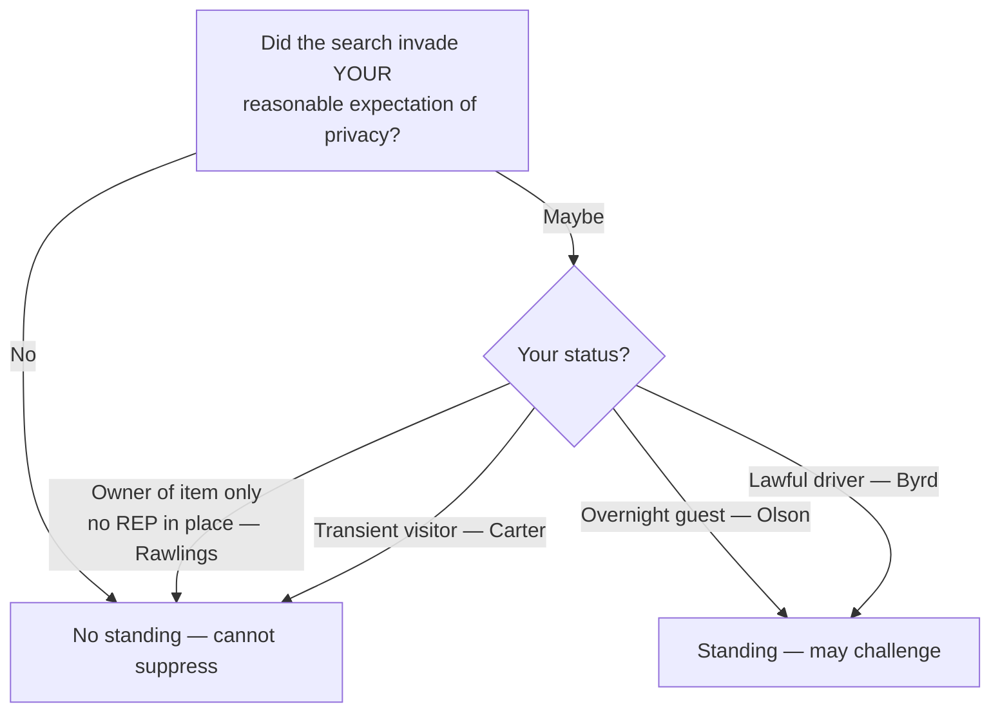

# Standing to Challenge a Search

## Rule

Fourth Amendment rights are personal. Only a defendant whose **own** legitimate expectation of privacy (or possessory interest) was invaded may move to suppress; he cannot ride on someone else's invaded rights. As *Rakas* put it, "Fourth Amendment rights are personal rights which, like some other constitutional rights, may not be vicariously asserted." (439 U.S. at 133-134.) The inquiry is not labeled "standing" but is folded into the merits: did *this* search invade *this* person's reasonable expectation of privacy in the place searched? Ownership of the *item seized* is not a substitute for an expectation of privacy in the *place searched*.

## Key cases

| Case | Holding (one line) | Weight | CourtListener |
| --- | --- | --- | --- |
| *Rakas v. Illinois*, 439 U.S. 128 (1978) | 4A rights are personal; the question is whether *your* expectation of privacy was infringed, not bare "standing" — passengers with no possessory interest cannot challenge a car search. | SCOTUS — binding | [opinion](https://www.courtlistener.com/opinion/109953/rakas-v-illinois/) |
| *United States v. Salvucci*, 448 U.S. 83 (1980) | Abolished automatic standing; a defendant charged with a possessory crime must show his *own* 4A rights were violated — possession of the seized goods is not enough. | SCOTUS — binding | [opinion](https://www.courtlistener.com/opinion/110325/united-states-v-salvucci/) |
| *Rawlings v. Kentucky*, 448 U.S. 98 (1980) | Owning the drugs seized from a companion's purse did not give a reasonable expectation of privacy in the purse, so no standing to challenge its search. | SCOTUS — binding | [opinion](https://www.courtlistener.com/opinion/110326/rawlings-v-kentucky/) |
| *Minnesota v. Olson*, 495 U.S. 91 (1990) | An overnight guest has a reasonable expectation of privacy in the host's home and may challenge a warrantless entry. | SCOTUS — binding | [opinion](https://www.courtlistener.com/opinion/112416/minnesota-v-olson/) |
| *Minnesota v. Carter*, 525 U.S. 83 (1998) | A short-term visitor present purely to bag drugs, with no prior relationship and no overnight stay, has no reasonable expectation of privacy in the home. | SCOTUS — binding | [opinion](https://www.courtlistener.com/opinion/118249/minnesota-v-carter/) |
| *Byrd v. United States*, 584 U.S. 395 (2018) | A driver in lawful possession and control of a rental car generally has a reasonable expectation of privacy in it, even if not listed on the rental agreement. | SCOTUS — binding | [opinion](https://www.courtlistener.com/opinion/4497658/byrd-v-united-states/) |
| *Brendlin v. California*, 551 U.S. 249 (2007) | When a car is stopped, a passenger is seized just as the driver is, and so may challenge the constitutionality of the *stop*. | SCOTUS — binding | [opinion](https://www.courtlistener.com/opinion/145712/brendlin-v-california/) |
| *Katz v. United States*, 389 U.S. 347 (1967) | Electronic eavesdropping that invades a justified expectation of privacy is a search even without a physical trespass; supplies the reasonable-expectation test. | SCOTUS — binding | [opinion](https://www.courtlistener.com/opinion/107564/katz-v-united-states/) |
| *Jones v. United States*, 362 U.S. 257 (1960) | HISTORY — created "automatic standing" and "legitimately on premises" standing; both later rejected (see Nuances). | SCOTUS — binding (historical — overruled) | [opinion](https://www.courtlistener.com/opinion/106022/jones-v-united-states/) |

## Nuances & limits

- **It's really a merits question.** *Rakas* reframed "standing" by tying it to [[Two Definitions of Search]]: the protection of the Amendment "depends not upon a property right in the invaded place but upon whether the person who claims the protection of the Amendment has a legitimate expectation of privacy in the invaded place." (439 U.S. at 143.) The *Katz* reasonable-expectation test thus defines *whose* rights are invaded.
- **Place searched ≠ item seized.** *Rawlings* and *Salvucci* draw the line: a defendant may own the contraband and still have no expectation of privacy in the container or area searched. Establish a privacy or possessory interest in the **place**, not the loot.
- **Status on the premises matters.** Overnight guest → expectation of privacy in the host's home (*Olson*); transient visitor present only for a commercial drug-bagging errand → none (*Carter*). The contrast is one of duration, relationship to the householder, and purpose.
- **Lawful control of a vehicle can suffice.** Under *Byrd*, an unauthorized-but-lawful driver of a rental car can hold a reasonable expectation of privacy in it; not being on the rental contract is not dispositive. (Treatment current; no negative history.) Standing in a car is the threshold before any [[Automobile Exception]] question about the lawfulness of the search itself.
- **Passenger: challenge the stop, not necessarily the search.** *Brendlin* holds a passenger is *seized* during a traffic stop and may attack the [[Traffic Stops|stop]] itself; that is distinct from standing to challenge a *search* of the car, which still turns on the passenger's own privacy/possessory interest under *Rakas*. Keep the two crisp.
- **Standing is a threshold to the [[The Exclusionary Rule|exclusionary remedy]].** Without it, even an unlawful search yields no suppression for *this* defendant. See the [[Fourth Amendment Framework]] for where standing sits in the analysis.

## Common pitfalls

- **Treating ownership of the item as standing.** Officers and prosecutors alike slip into "it's his dope, so he can't complain it was found" — backwards. *Salvucci*/*Rawlings*: owning the seized item neither defeats nor establishes standing; the question is the expectation of privacy in the place searched.
- **Reaching for "automatic standing."** It is gone. *Salvucci* held that "defendants charged with crimes of possession may only claim the benefits of the exclusionary rule if their own Fourth Amendment rights have in fact been violated. The automatic standing rule of *Jones v. United States* ... is therefore overruled." (448 U.S. at 85.) *Jones*'s "anyone legitimately on premises ... may challenge" rule (362 U.S. at 267) was likewise rejected by *Rakas*. Cite *Jones* only as history.
- **Confusing constructive possession with 4A standing.** Constructive possession (and willful blindness) are *substantive criminal-law / mens-rea* concepts going to guilt — they are **not** standing rules. A defendant can constructively possess contraband for conviction purposes yet lack any expectation of privacy in the place it was found, and vice versa. See [[Abandonment]] for the related point that disclaiming an interest can forfeit standing.

## Visual

## Flashcards

What does *Rakas v. Illinois* hold about Fourth Amendment "standing"?::4A rights are personal and may not be vicariously asserted; the question is whether the defendant's *own* legitimate expectation of privacy was invaded, not bare standing.

After *United States v. Salvucci*, can a defendant charged with a possessory crime suppress evidence just by showing he owned the seized goods?::No — *Salvucci* abolished "automatic standing"; he must show his *own* 4A rights (an expectation of privacy in the place searched) were violated.

Why did the defendant in *Rawlings v. Kentucky* lack standing despite owning the drugs?::Owning the seized item is not enough; he had no reasonable expectation of privacy in the *place* searched (a companion's purse).

How do *Minnesota v. Olson* and *Minnesota v. Carter* differ on standing?::*Olson* — an overnight guest has a reasonable expectation of privacy in the host's home; *Carter* — a short-term commercial visitor bagging drugs does not.

Under *Brendlin v. California*, what can a vehicle passenger challenge?::The passenger is seized by the stop and may challenge the *stop's* constitutionality, distinct from standing to challenge a *search* of the car.

## Sources

- [Rakas v. Illinois, 439 U.S. 128 (1978)](https://www.courtlistener.com/opinion/109953/rakas-v-illinois/)
- [United States v. Salvucci, 448 U.S. 83 (1980)](https://www.courtlistener.com/opinion/110325/united-states-v-salvucci/)
- [Rawlings v. Kentucky, 448 U.S. 98 (1980)](https://www.courtlistener.com/opinion/110326/rawlings-v-kentucky/)
- [Minnesota v. Olson, 495 U.S. 91 (1990)](https://www.courtlistener.com/opinion/112416/minnesota-v-olson/)
- [Minnesota v. Carter, 525 U.S. 83 (1998)](https://www.courtlistener.com/opinion/118249/minnesota-v-carter/)
- [Byrd v. United States, 584 U.S. 395 (2018)](https://www.courtlistener.com/opinion/4497658/byrd-v-united-states/)
- [Brendlin v. California, 551 U.S. 249 (2007)](https://www.courtlistener.com/opinion/145712/brendlin-v-california/)
- [Katz v. United States, 389 U.S. 347 (1967)](https://www.courtlistener.com/opinion/107564/katz-v-united-states/)
- [Jones v. United States, 362 U.S. 257 (1960)](https://www.courtlistener.com/opinion/106022/jones-v-united-states/)
