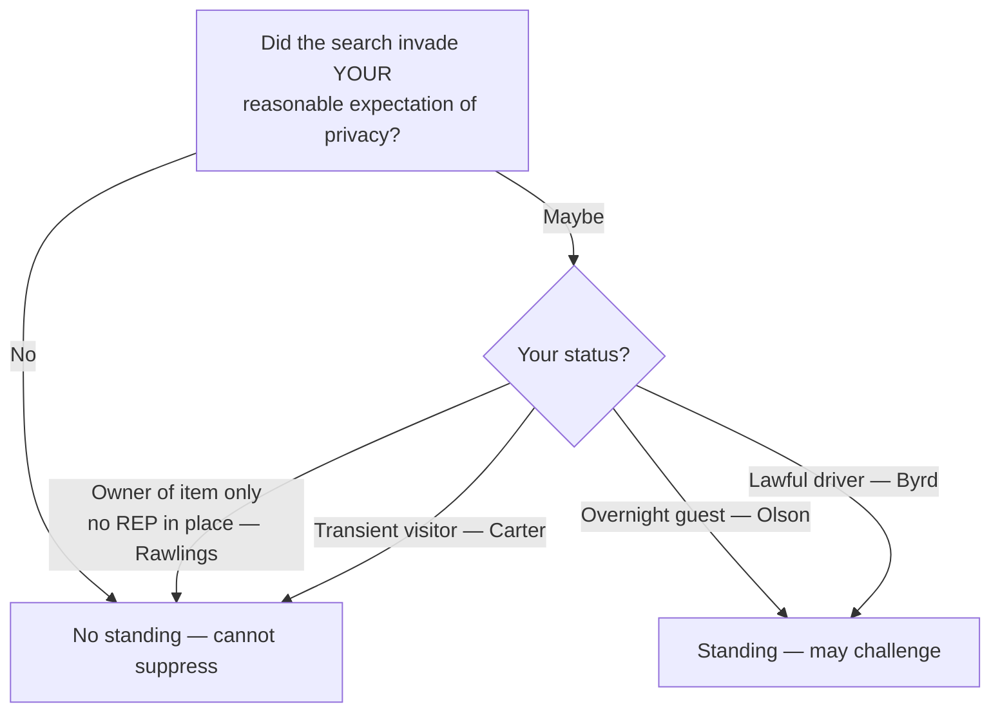

# Standing to Challenge a Search

## Rule

Fourth Amendment rights are personal. Only a defendant whose **own** legitimate expectation of privacy (or possessory interest) was invaded may move to suppress; he cannot ride on someone else's invaded rights. As *Rakas* put it, "Fourth Amendment rights are personal rights which, like some other constitutional rights, may not be vicariously asserted." (439 U.S. at 133-134.) The inquiry is not labeled "standing" but is folded into the merits: did *this* search invade *this* person's reasonable expectation of privacy in the place searched? Ownership of the *item seized* is not a substitute for an expectation of privacy in the *place searched*.

## Key cases

| Case | Holding (one line) | Weight | CourtListener |
| --- | --- | --- | --- |
| *Rakas v. Illinois*, 439 U.S. 128 (1978) | 4A rights are personal; the question is whether *your* expectation of privacy was infringed, not bare "standing" — passengers with no possessory interest cannot challenge a car search. | SCOTUS — binding | [opinion](https://www.courtlistener.com/opinion/109953/rakas-v-illinois/) |
| *United States v. Salvucci*, 448 U.S. 83 (1980) | Abolished automatic standing; a defendant charged with a possessory crime must show his *own* 4A rights were violated — possession of the seized goods is not enough. | SCOTUS — binding | [opinion](https://www.courtlistener.com/opinion/110325/united-states-v-salvucci/) |
| *Rawlings v. Kentucky*, 448 U.S. 98 (1980) | Owning the drugs seized from a companion's purse did not give a reasonable expectation of privacy in the purse, so no standing to challenge its search. | SCOTUS — binding | [opinion](https://www.courtlistener.com/opinion/110326/rawlings-v-kentucky/) |
| *Minnesota v. Olson*, 495 U.S. 91 (1990) | An overnight guest has a reasonable expectation of privacy in the host's home and may challenge a warrantless entry. | SCOTUS — binding | [opinion](https://www.courtlistener.com/opinion/112416/minnesota-v-olson/) |
| *Minnesota v. Carter*, 525 U.S. 83 (1998) | A short-term visitor present purely to bag drugs, with no prior relationship and no overnight stay, has no reasonable expectation of privacy in the home. | SCOTUS — binding | [opinion](https://www.courtlistener.com/opinion/118249/minnesota-v-carter/) |
| *Byrd v. United States*, 584 U.S. 395 (2018) | A driver in lawful possession and control of a rental car generally has a reasonable expectation of privacy in it, even if not listed on the rental agreement. | SCOTUS — binding | [opinion](https://www.courtlistener.com/opinion/4497658/byrd-v-united-states/) |
| *Brendlin v. California*, 551 U.S. 249 (2007) | When a car is stopped, a passenger is seized just as the driver is, and so may challenge the constitutionality of the *stop*. | SCOTUS — binding | [opinion](https://www.courtlistener.com/opinion/145712/brendlin-v-california/) |
| *Katz v. United States*, 389 U.S. 347 (1967) | Electronic eavesdropping that invades a justified expectation of privacy is a search even without a physical trespass; supplies the reasonable-expectation test. | SCOTUS — binding | [opinion](https://www.courtlistener.com/opinion/107564/katz-v-united-states/) |
| *Jones v. United States*, 362 U.S. 257 (1960) | HISTORY — created "automatic standing" and "legitimately on premises" standing; both later rejected (see Nuances). | SCOTUS — binding (historical — overruled) | [opinion](https://www.courtlistener.com/opinion/106022/jones-v-united-states/) |

## Related cases across doctrines

These cases are treated in full on other doctrine pages but bear directly on standing here, framed for this doctrine.

| Case | Relevance to standing | Primary treatment | CourtListener |
| --- | --- | --- | --- |
| *Samson v. California*, 547 U.S. 843 (2006) | A parolee subject to a search condition has a severely diminished (near-zero) reasonable expectation of privacy — the REP that defines standing can be reduced to almost nothing by status. | [[Special Needs and Administrative Searches]] | [opinion](https://www.courtlistener.com/opinion/145640/samson-v-california/) |
| *United States v. Knights*, 534 U.S. 112 (2001) | A probationer's expectation of privacy is significantly diminished by a valid search condition; status on supervision shrinks the REP that grounds any standing to object. | [[Special Needs and Administrative Searches]] | [opinion](https://www.courtlistener.com/opinion/118468/united-states-v-knights/) |
| *Collins v. Virginia*, 584 U.S. 586 (2018) | A resident retains a full reasonable expectation of privacy in the curtilage where his vehicle is parked — the home/curtilage REP that confers standing is not dissolved by the automobile exception. | [[Automobile Exception]] | [opinion](https://www.courtlistener.com/opinion/4501697/collins-v-virginia/) |

## Nuances & limits

- **It's really a merits question.** *Rakas* reframed "standing" by tying it to [[Two Definitions of Search]]: the protection of the Amendment "depends not upon a property right in the invaded place but upon whether the person who claims the protection of the Amendment has a legitimate expectation of privacy in the invaded place." (439 U.S. at 143.) The *Katz* reasonable-expectation test thus defines *whose* rights are invaded.
- **Place searched ≠ item seized.** *Rawlings* and *Salvucci* draw the line: a defendant may own the contraband and still have no expectation of privacy in the container or area searched. Establish a privacy or possessory interest in the **place**, not the loot.
- **Status on the premises matters.** Overnight guest → expectation of privacy in the host's home (*Olson*); transient visitor present only for a commercial drug-bagging errand → none (*Carter*). The contrast is one of duration, relationship to the householder, and purpose.
- **Lawful control of a vehicle can suffice.** Under *Byrd*, an unauthorized-but-lawful driver of a rental car can hold a reasonable expectation of privacy in it; not being on the rental contract is not dispositive. (Treatment current; no negative history.) Standing in a car is the threshold before any [[Automobile Exception]] question about the lawfulness of the search itself.
- **Passenger: challenge the stop, not necessarily the search.** *Brendlin* holds a passenger is *seized* during a traffic stop and may attack the [[Traffic Stops|stop]] itself; that is distinct from standing to challenge a *search* of the car, which still turns on the passenger's own privacy/possessory interest under *Rakas*. Keep the two crisp.
- **Standing is a threshold to the [[The Exclusionary Rule|exclusionary remedy]].** Without it, even an unlawful search yields no suppression for *this* defendant. See the [[Fourth Amendment Framework]] for where standing sits in the analysis.

## Common pitfalls

- **Treating ownership of the item as standing.** Officers and prosecutors alike slip into "it's his dope, so he can't complain it was found" — backwards. *Salvucci*/*Rawlings*: owning the seized item neither defeats nor establishes standing; the question is the expectation of privacy in the place searched.
- **Reaching for "automatic standing."** It is gone. *Salvucci* held that "defendants charged with crimes of possession may only claim the benefits of the exclusionary rule if their own Fourth Amendment rights have in fact been violated. The automatic standing rule of *Jones v. United States* ... is therefore overruled." (448 U.S. at 85.) *Jones*'s "anyone legitimately on premises ... may challenge" rule (362 U.S. at 267) was likewise rejected by *Rakas*. Cite *Jones* only as history.
- **Confusing constructive possession with 4A standing.** Constructive possession (and willful blindness) are *substantive criminal-law / mens-rea* concepts going to guilt — they are **not** standing rules. A defendant can constructively possess contraband for conviction purposes yet lack any expectation of privacy in the place it was found, and vice versa. See [[Abandonment]] for the related point that disclaiming an interest can forfeit standing.

## Recent developments & subsequent treatment

The standing inquiry — *whose* reasonable expectation of privacy was invaded — continues to be worked out at the circuit level, both for traditional places (hotels, rental cars) and for the digital data that *Carpenter* opened up. The newest front is the search-threshold question for bulk location data, where the circuits have fractured and the Supreme Court has now stepped in. The following are circuit decisions and are **persuasive, not binding**; none states nationwide law.

- **United States v. Mendoza (3d Cir. 2026)** — In a precedential opinion, the Third Circuit (**persuasive, not binding**) held a hotel guest has no objectively reasonable expectation of privacy in the room roughly five hours after the posted noon checkout, absent any late-checkout arrangement or other ambiguous circumstances; lawful occupancy (and thus standing) ends when the right to occupy ends, properly extending the *Olson*/*Carter* "status on the premises" line into the hotel-checkout context. The panel did **not** adopt checkout time as a bright-line marker for all cases — it noted circuits disagree on whether a "grace period" exists for stragglers and declined to weigh in, holding only that this unambiguous five-hour case "does not raise a close question." [opinion](https://www.courtlistener.com/opinion/10771114/united-states-v-ryan-mendoza/).
- **United States v. Chatrie (4th Cir. 2024)** — The Fourth Circuit (**persuasive, not binding**) panel (Richardson, J., joined by Wilkinson, J.; Wynn, J., dissenting) held that obtaining a short (~2 hour) window of Google Location History was **not** a Fourth Amendment search — the data is voluntarily shared (Location History is off by default/opt-in; third-party doctrine) and *Carpenter* does not extend. On rehearing en banc the court affirmed on other grounds while fracturing (equally divided) on whether a search occurred, teeing up the question now before the Supreme Court (*Chatrie*, No. 25-112, argued Apr. 27, 2026). ⚖ Circuit split. [opinion](https://www.courtlistener.com/opinion/10265776/united-states-v-okello-chatrie/).
- **United States v. Smith (5th Cir. 2024)** — The Fifth Circuit (**persuasive, not binding**) held that obtaining Google Location History via a geofence invades a reasonable expectation of privacy and **is** a Fourth Amendment search, and that geofence warrants are "modern-day general warrants" and categorically unconstitutional regardless of probable cause — though the evidence was not suppressed under the *Leon* good-faith exception given the novelty of the technology. This squarely conflicts with the Fourth Circuit's en banc *Chatrie*. ⚖ Circuit split. "We hold that geofence warrants are modern-day general warrants and are unconstitutional under the Fourth Amendment. However, considering law enforcement's reasonable conduct in this case in light of the novelty of this type of warrant, we uphold the district court's determination that suppression was unwarranted under the good-faith exception." (110 F.4th at 838.) [opinion](https://www.courtlistener.com/opinion/10036119/united-states-v-smith/).
- **United States v. Lyle (2d Cir. 2019)** — The Second Circuit (**persuasive, not binding**) applied *Byrd*'s "lawful possession" limit: an unlicensed driver operating a rental car without the rental company's permission is, like a car thief, unlawfully in possession and has **no** reasonable expectation of privacy — so no standing — even though the authorized renter (his girlfriend) gave him permission to drive. Reads *Byrd*'s lawful-possession requirement narrowly. The court expressly declined to decide whether an unauthorized-but-licensed driver alone would have standing. [opinion](https://www.courtlistener.com/opinion/8443943/united-states-v-lyle/).

## Visual

## Sources

- [Rakas v. Illinois, 439 U.S. 128 (1978)](https://www.courtlistener.com/opinion/109953/rakas-v-illinois/)
- [United States v. Salvucci, 448 U.S. 83 (1980)](https://www.courtlistener.com/opinion/110325/united-states-v-salvucci/)
- [Rawlings v. Kentucky, 448 U.S. 98 (1980)](https://www.courtlistener.com/opinion/110326/rawlings-v-kentucky/)
- [Minnesota v. Olson, 495 U.S. 91 (1990)](https://www.courtlistener.com/opinion/112416/minnesota-v-olson/)
- [Minnesota v. Carter, 525 U.S. 83 (1998)](https://www.courtlistener.com/opinion/118249/minnesota-v-carter/)
- [Byrd v. United States, 584 U.S. 395 (2018)](https://www.courtlistener.com/opinion/4497658/byrd-v-united-states/)
- [Brendlin v. California, 551 U.S. 249 (2007)](https://www.courtlistener.com/opinion/145712/brendlin-v-california/)
- [Katz v. United States, 389 U.S. 347 (1967)](https://www.courtlistener.com/opinion/107564/katz-v-united-states/)
- [Jones v. United States, 362 U.S. 257 (1960)](https://www.courtlistener.com/opinion/106022/jones-v-united-states/)
