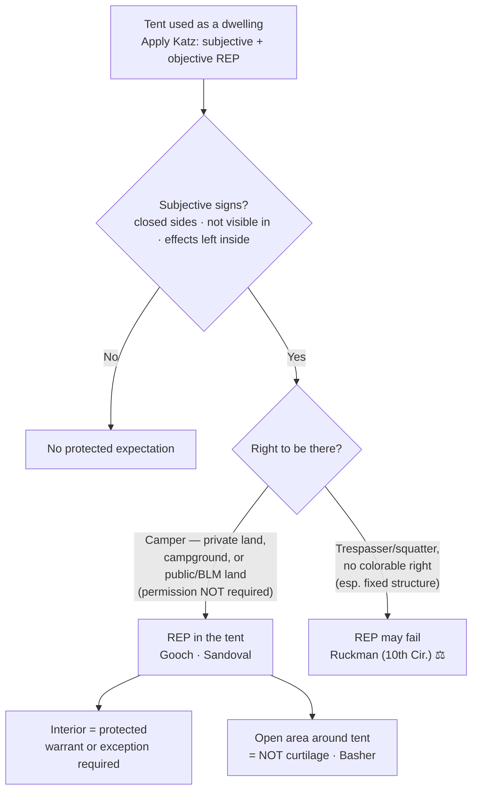

## Rule
A tent used as a temporary dwelling is treated, for Fourth Amendment purposes, far more like a **home** than like a car: its occupant can hold a **reasonable expectation of privacy** in the tent's interior, so a warrantless search is presumptively unreasonable. Whether that expectation exists is the ordinary two-part *Katz* inquiry — a **subjective** expectation of privacy that society accepts as **objectively reasonable**. *Katz v. United States*, 389 U.S. 347, 361 (1967) (Harlan, J., concurring). No Supreme Court decision addresses tents directly; the doctrine has been built in the **federal courts of appeals** (most heavily the Ninth Circuit), which hold a person can have a reasonable expectation of privacy in a tent pitched on private property, in a public campground, and even on undeveloped public land — and that this does **not** turn on whether the camper had permission to be there. *United States v. Gooch*, 6 F.3d 673, 677 (9th Cir. 1993); *United States v. Sandoval*, 200 F.3d 659, 660–61 (9th Cir. 2000). The protection runs to the **inside** of the tent as a dwelling, not to the open ground around it. *United States v. Basher*, 629 F.3d 1161, 1169 (9th Cir. 2011). These are **circuit decisions — persuasive, not binding** outside their own circuits, and they are not perfectly aligned (see the *Sandoval*/*Ruckman* tension below); treat them as the best-developed federal guidance, not a settled nationwide rule.

## Key cases
| Case (Bluebook) | Holding in one line | Weight | CourtListener |
|---|---|---|---|
| *Katz v. United States*, 389 U.S. 347 (1967) | Supplies the controlling test: a search invades a **subjective** expectation of privacy that society recognizes as **objectively reasonable** — "the Fourth Amendment protects people, not places." | SCOTUS — binding | [link](https://www.courtlistener.com/opinion/107564/katz-v-united-states/) |
| *United States v. Gooch*, 6 F.3d 673 (9th Cir. 1993) | An occupant has a reasonable expectation of privacy in a tent in a **public campground**; "a tent is more like a house than a car," so its warrantless search violated the Fourth Amendment. | 9th Cir. — persuasive | [link](https://www.courtlistener.com/opinion/654273/united-states-v-kenneth-d-gooch/) |
| *United States v. Sandoval*, 200 F.3d 659 (9th Cir. 2000) | Reasonable expectation of privacy in a tent on **public (BLM) land** does **not** turn on whether the camper had permission to be there; suppression reversed. | 9th Cir. — persuasive | [link](https://www.courtlistener.com/opinion/767260/united-states-v-rodrigo-sandoval/) |
| *United States v. Basher*, 629 F.3d 1161 (9th Cir. 2011) | Reaffirms privacy **inside** a tent ("comparable to a house, apartment, or hotel room"), but the **area outside** the tent in a dispersed public-land campsite is **not curtilage** — no expectation of privacy there. | 9th Cir. — persuasive | [link](https://www.courtlistener.com/opinion/183144/united-states-v-basher/) |
| *United States v. Ruckman*, 806 F.2d 1471 (10th Cir. 1986) | **Contrast:** a man living in a **cave** on federal land was a trespasser with no legal right to occupy, so no reasonable expectation of privacy arose — the structure was treated as open land, not a "house." | 10th Cir. — persuasive | [link](https://www.courtlistener.com/opinion/480405/united-states-v-frank-william-ruckman/) |

## Related cases across doctrines
These are treated in full elsewhere but frame the tent question.

| Case | Relevance to tents | Primary treatment | CourtListener |
|---|---|---|---|
| *Minnesota v. Olson*, 495 U.S. 91 (1990) | An **overnight guest** has a reasonable expectation of privacy in the place he is staying — the logic that lets a guest sleeping over in another person's tent challenge a warrantless entry, just as in a host's home. | [[Standing to Challenge a Search]] | [opinion](https://www.courtlistener.com/opinion/112416/minnesota-v-olson/) |
| *Payton v. New York*, 445 U.S. 573 (1980) | A warrant is generally required to enter a **dwelling** to make an arrest. Applying that rule, *Gooch* held a **closed tent is a "non-public" place**, so police needed an **arrest warrant** (absent exigent circumstances) to enter and arrest the occupant inside. *Gooch*, 6 F.3d at 678. | [[Arrest in the Home]] · [[The Warrant Requirement]] | [opinion](https://www.courtlistener.com/opinion/110235/payton-v-new-york/) |
| *LaDuke v. Nelson*, 762 F.2d 1318 (9th Cir. 1985) | The Ninth Circuit **origin** of the rule: a person can have an objectively reasonable expectation of privacy in a **tent on private property** (a civil class action; *Gooch* extended it to public campgrounds). | (lineage of *Gooch*) | [opinion](https://www.courtlistener.com/opinion/452994/charles-laduke-v-alan-c-nelson-etc/) |

## Nuances & limits
- **A tent is a dwelling, not a vehicle.** Officers cannot borrow the automobile exception's reduced-privacy logic for a tent. *Gooch* squarely rejected the government's motor-home analogy: "The district court did not err in concluding a tent is more like a house than a car. We hold that Gooch had a reasonable expectation of privacy such that the warrantless search of his tent violated the Fourth Amendment." *Gooch*, 6 F.3d at 677.
- **Subjective expectation — what to articulate.** Courts look for outward signs the occupant treated the tent as private: it was **closed on all sides**, its contents were **not visible from outside**, and the occupant left **personal effects** inside. *Sandoval*, 200 F.3d at 660–61. Conversely, a tent flap left wide open or contents in plain view from a lawful vantage cut against any subjective expectation.
- **Illegality of the camping does not defeat the expectation.** The Ninth Circuit "rejected the argument that a person lacks a subjective expectation of privacy simply because he is engaged in illegal activity," and held the objective reasonableness of a camper's privacy does **not** "turn on whether he had permission to camp on public land." *Sandoval*, 200 F.3d at 660–61. A camper who overstays a permit does not lose Fourth Amendment protection at midnight.
- **The protection is the tent's interior — not a "curtilage" around it.** A tent has no curtilage the way a house does. On the facts of a **dispersed, undeveloped public-land campsite** (the camp was visible from a developed campground), "the area outside of the tent … is not curtilage," and there was "no expectation of privacy in the campsite" itself; the home-like protection attaches to the enclosed dwelling. *Basher*, 629 F.3d at 1169. (Compare [[Curtilage]], where the area around a fixed home **is** protected.)
- **The trespasser/squatter limit.** Where the occupant has **no colorable right to occupy** — especially a permanent or semi-permanent structure — courts have found no reasonable expectation of privacy. *Ruckman* (cave dweller on federal land treated as a trespasser); see also the squatter-in-a-private-residence cases the Ninth Circuit distinguished in *Sandoval*. The circuits are **not perfectly aligned** here: *Ruckman* (10th Cir.) tied the expectation to a legal right to occupy, while *Sandoval* (9th Cir.) held a public-land camper's expectation does not turn on permission. Treat the tension as a ⚖ split and articulate which side your facts fit.
- **A closed tent is a "non-public" place for arrest-warrant purposes.** Working through then-unsettled ground, *Gooch* held that a **closed** tent is a "non-public" place, so officers needed an **arrest warrant** — or **exigent circumstances** — to enter and arrest the occupant inside; the warrantless entry there was unlawful. *Gooch*, 6 F.3d at 678. So the *Payton* arrest-warrant rule (see [[Arrest in the Home]]) can reach a tent, not just a house.
- **Guests sleep over in tents too.** A person staying overnight in another's tent can claim the same standing an overnight houseguest has under *Minnesota v. Olson* — privacy turns on the **expectation**, not on holding title to the tent. See [[Standing to Challenge a Search]].

## Common pitfalls
- **Treating a tent like a car.** The automobile exception's "ready mobility / reduced expectation" rationale does not transfer; a tent is analyzed as a temporary **home**. (*Gooch*.)
- **Assuming unlawful or unpermitted camping forfeits Fourth Amendment rights.** It does not — illegality of the activity and lack of a camping permit do not, by themselves, defeat the expectation of privacy. (*Sandoval*.)
- **Treating the whole campsite as protected.** The ground and area **around** a tent on public land is generally **not** curtilage; plain-view observations and items left outside the tent are a different question from a search of the interior. (*Basher*.)
- **Assuming you can reach into a tent to arrest without a warrant.** *Gooch* held a **closed** tent is a "non-public" place — officers needed an arrest warrant or exigent circumstances to enter and arrest inside it; the tent is not a "public" place. (*Gooch*, 6 F.3d at 678.)
- **Overreading the trespasser limit.** *Ruckman* turned on a long-term cave occupant with no right to be there; it does not license treating every unpermitted overnight camper as a rightless trespasser — *Sandoval* points the other way for tents on public land.

## Visual

## Sources
- *Katz v. United States*, 389 U.S. 347 (1967) — https://www.courtlistener.com/opinion/107564/katz-v-united-states/
- *United States v. Gooch*, 6 F.3d 673 (9th Cir. 1993) — https://www.courtlistener.com/opinion/654273/united-states-v-kenneth-d-gooch/
- *United States v. Sandoval*, 200 F.3d 659 (9th Cir. 2000) — https://www.courtlistener.com/opinion/767260/united-states-v-rodrigo-sandoval/
- *United States v. Basher*, 629 F.3d 1161 (9th Cir. 2011) — https://www.courtlistener.com/opinion/183144/united-states-v-basher/
- *United States v. Ruckman*, 806 F.2d 1471 (10th Cir. 1986) — https://www.courtlistener.com/opinion/480405/united-states-v-frank-william-ruckman/
- *Minnesota v. Olson*, 495 U.S. 91 (1990) — https://www.courtlistener.com/opinion/112416/minnesota-v-olson/
- *Payton v. New York*, 445 U.S. 573 (1980) — https://www.courtlistener.com/opinion/110235/payton-v-new-york/
- *LaDuke v. Nelson*, 762 F.2d 1318 (9th Cir. 1985) — https://www.courtlistener.com/opinion/452994/charles-laduke-v-alan-c-nelson-etc/
