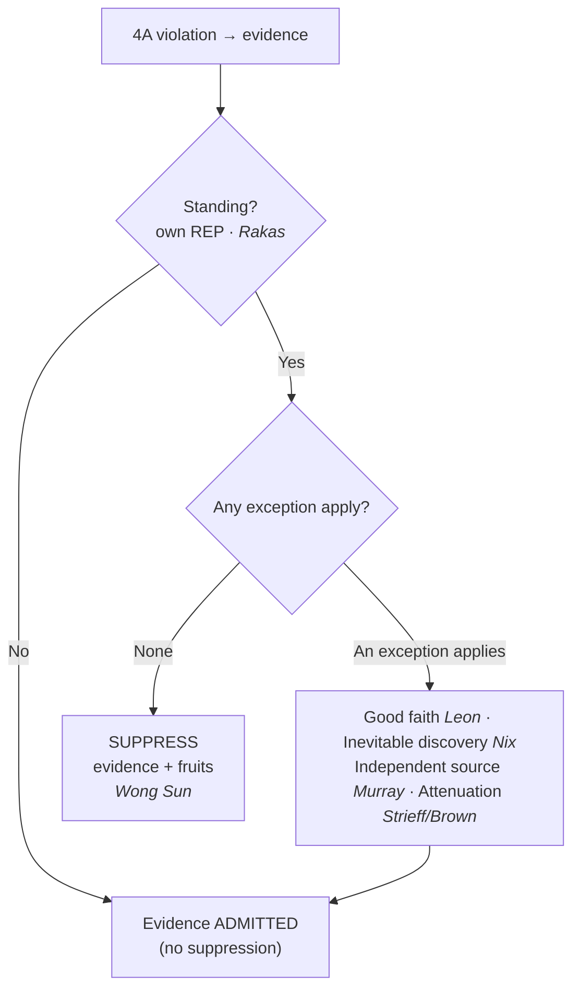

## Rule
The exclusionary rule bars the government from using, in its case-in-chief, evidence obtained in violation of the Fourth Amendment — **and the "fruits" of that violation** (derivative evidence). It is **not a personal constitutional right**; it is a **judicially-created remedy** whose primary modern justification is **deterring police misconduct**, with deterrence of police misconduct as the rule's sole/primary justification. *United States v. Calandra*, 414 U.S. 338, 348 (1974) (exclusionary rule is "a judicially created remedy designed to safeguard Fourth Amendment rights generally through its deterrent effect, rather than a personal constitutional right"). The older "judicial integrity" rationale (courts refusing to become accomplices in unlawfulness) traces to *Elkins v. United States*, 364 U.S. 206, 222 (1960), and *Mapp v. Ohio*; *Calandra* in fact downgraded that rationale. It originated as a **federal** rule in *Weeks v. United States*, 232 U.S. 383 (1914), and was applied to the **states** through the Fourteenth Amendment in *Mapp v. Ohio*, 367 U.S. 643 (1961). The reach of suppression extends to **derivative** evidence under the **fruit-of-the-poisonous-tree** doctrine, but only where the evidence was "come at by exploitation of [the] illegality" rather than by means sufficiently attenuated to purge the taint. *Wong Sun v. United States*, 371 U.S. 471, 487–88 (1963). Because the rule is a deterrent remedy and not a right, the modern Court applies a **cost-benefit test**: suppression follows **only** where its deterrence benefits **outweigh** its substantial social costs. *Herring v. United States*, 555 U.S. 135, 144 (2009). The practical consequence: the rule is **riddled with exceptions** — standing, inevitable discovery, independent source, attenuation, and good faith — each of which can let unlawfully-encountered evidence in.

## Key cases
**Foundations & framing (binding)**
| Case (Bluebook) | Holding in one line | Weight | CourtListener |
|---|---|---|---|
| *Weeks v. United States*, 232 U.S. 383 (1914) | **Origin** of the federal exclusionary rule — 4A-violative evidence is inadmissible in federal court. | SCOTUS — binding | [link](https://www.courtlistener.com/opinion/98094/weeks-v-united-states/) |
| *Mapp v. Ohio*, 367 U.S. 643 (1961) | Applies the exclusionary rule **to the States** through the Fourteenth Amendment. | SCOTUS — binding | [link](https://www.courtlistener.com/opinion/106285/mapp-v-ohio/) |
| *Wong Sun v. United States*, 371 U.S. 471 (1963) | **Fruit of the poisonous tree** — derivative evidence is suppressed if come at by **exploitation** of the illegality, not on mere but-for causation. | SCOTUS — binding | [link](https://www.courtlistener.com/opinion/106515/wong-sun-v-united-states/) |
| *United States v. Calandra*, 414 U.S. 338 (1974) | The rule is a **judicially-created deterrent remedy, not a personal right**; it does **not** apply to grand-jury questioning. | SCOTUS — binding | [link](https://www.courtlistener.com/opinion/108898/united-states-v-calandra/) |
| *Herring v. United States*, 555 U.S. 135 (2009) | **Cost-benefit**: suppression only where deterrence benefits outweigh costs; isolated, attenuated negligence does not trigger exclusion. | SCOTUS — binding | [link](https://www.courtlistener.com/opinion/145922/herring-v-united-states/) |

**The exceptions (binding unless noted)**
| Case (Bluebook) | Holding in one line | Weight | CourtListener |
|---|---|---|---|
| *Rakas v. Illinois*, 439 U.S. 128 (1978) | **Standing** — 4A rights are personal; defendant must show **his own** legitimate expectation of privacy and cannot vicariously assert others'. | SCOTUS — binding | [link](https://www.courtlistener.com/opinion/109953/rakas-v-illinois/) |
| *Nix v. Williams*, 467 U.S. 431 (1984) | **Inevitable discovery** — evidence is admissible if the government proves by a **preponderance** it would inevitably have been found by lawful means. | SCOTUS — binding | [link](https://www.courtlistener.com/opinion/111204/nix-v-williams/) |
| *United States v. Soto-Peguero*, 978 F.3d 13 (1st Cir. 2020) | Inevitable discovery **applied** (warrant would have issued regardless) → evidence admitted; denial of suppression affirmed. | Circuit (1st) — persuasive | [link](https://www.courtlistener.com/opinion/4798028/united-states-v-soto-peguero/) |
| *United States v. Neugin*, 958 F.3d 924 (10th Cir. 2020) | Inevitable discovery **failed** — chain to discovery too speculative; suppression required (denial **reversed**). | Circuit (10th) — persuasive | [link](https://www.courtlistener.com/opinion/4750564/united-states-v-neugin/) |
| *Murray v. United States*, 487 U.S. 533 (1988) | **Independent source** — evidence first seen during an unlawful entry is admissible if later acquired through a **genuinely independent** lawful source. | SCOTUS — binding | [link](https://www.courtlistener.com/opinion/112136/murray-v-united-states/) |
| *State v. Mitcham*, 559 P.3d 1099 (Ariz. 2024) | State illustration of independent source — admissible if also obtained independently of the tainted activity. | State — illustrative, non-binding | [link](https://www.courtlistener.com/opinion/10293607/state-of-arizona-v-ian-mitcham/) |
| *Utah v. Strieff*, 579 U.S. 232 (2016) | **Attenuation** — a valid pre-existing **arrest warrant** found during an unlawful stop is an intervening circumstance that purges the taint. | SCOTUS — binding | [link](https://www.courtlistener.com/opinion/8176208/utah-v-strieff/) |
| *Brown v. Illinois*, 422 U.S. 590 (1975) | Supplies the **attenuation factors**: temporal proximity · intervening circumstances · purpose & flagrancy of the misconduct. | SCOTUS — binding | [link](https://www.courtlistener.com/opinion/109304/brown-v-illinois/) |
| *United States v. Leon*, 468 U.S. 897 (1984) | **Good-faith exception** — objectively reasonable reliance on a warrant later found to lack PC yields admissible evidence; lists **four** situations where good faith fails (at 923). | SCOTUS — binding | [link](https://www.courtlistener.com/opinion/111262/united-states-v-leon/) |
| *Massachusetts v. Sheppard*, 468 U.S. 981 (1984) | *Leon*'s companion — good faith applies where the warrant was defective **in form** but officers reasonably relied on the judge. | SCOTUS — binding | [link](https://www.courtlistener.com/opinion/111263/massachusetts-v-sheppard/) |
| *Arizona v. Evans*, 514 U.S. 1 (1995) | Good faith extends to a mistaken arrest record caused by **clerical errors of court employees**. | SCOTUS — binding | [link](https://www.courtlistener.com/opinion/117905/arizona-v-evans/) |
| *Illinois v. Krull*, 480 U.S. 340 (1987) | Good-faith reliance on a **statute** later held unconstitutional does not trigger exclusion. | SCOTUS — binding | [link](https://www.courtlistener.com/opinion/111835/illinois-v-krull/) |
| *Michigan v. DeFillippo*, 443 U.S. 31 (1979) | Arrest under a presumptively valid **ordinance** later voided was valid; evidence from the search incident to it is admissible. | SCOTUS — binding | [link](https://www.courtlistener.com/opinion/110127/michigan-v-defillippo/) |
| *United States v. Mathis*, 767 F.3d 1264 (11th Cir. 2014) | Good faith **applied** — even assuming the warrant lacked PC, the detective held an objectively reasonable belief in PC. | Circuit (11th) — persuasive | [link](https://www.courtlistener.com/opinion/2736649/united-states-v-arnold-maurice-mathis/) |
| *Franks v. Delaware*, 438 U.S. 154 (1978) | Good faith **fails** — a knowing/reckless **false affidavit** voids the warrant and excludes the fruits (*Leon* limit 1). | SCOTUS — binding | [link](https://www.courtlistener.com/opinion/109925/franks-v-delaware/) |
| *Lo-Ji Sales, Inc. v. New York*, 442 U.S. 319 (1979) | Good faith **fails** — a magistrate who **abandons the neutral-and-detached role** is no valid warrant-issuer (*Leon* limit 2). | SCOTUS — binding | [link](https://www.courtlistener.com/opinion/110100/lo-ji-sales-inc-v-new-york/) |
| *United States v. Leary*, 846 F.2d 592 (10th Cir. 1988) | Good faith **fails** — a **facially overbroad / general warrant** is too deficient for objectively reasonable reliance (*Leon* limit 4). | Circuit (10th) — persuasive | [link](https://www.courtlistener.com/opinion/505922/united-states-v-richard-j-leary-and-fl-kleinberg-co/) |
| *INS v. Lopez-Mendoza*, 468 U.S. 1032 (1984) | The rule generally does **not** apply in **civil removal/deportation** proceedings (cost-benefit). | SCOTUS — binding | [link](https://www.courtlistener.com/opinion/111265/immigration-naturalization-service-v-lopez-mendoza/) |

## Related cases across doctrines
These cases are treated in full on other doctrine pages but bear directly on the exclusionary rule; each is framed below for its bearing on suppression.

| Case | Relevance to the exclusionary rule | Primary treatment | CourtListener |
|---|---|---|---|
| *Hudson v. Michigan*, 547 U.S. 586 (2006) | A knock-and-announce violation does **not** trigger suppression — the interests protected by knock-and-announce are not served by exclusion, and the deterrence benefits do not outweigh the costs (causation / cost-benefit limit on the rule). | [[The Warrant Requirement]] | [opinion](https://www.courtlistener.com/opinion/145646/hudson-v-michigan/) |
| *Segura v. United States*, 468 U.S. 796 (1984) | Independent source applied: evidence seized under a valid warrant is admissible despite an earlier illegal entry, where the warrant was supported wholly by information known to police before the entry — the foundational companion to *Murray*. | [[Securing the Scene]] | [opinion](https://www.courtlistener.com/opinion/111259/segura-v-united-states/) |

## Nuances & limits
Each exception below carries its own rule and its controlling (or illustrative) authority. Together they are the reason a Fourth Amendment violation does **not** automatically suppress.

**1. Standing — a threshold gate (*Rakas*).** Suppression is available **only** to a defendant whose **own** Fourth Amendment rights were violated. "Fourth Amendment rights are personal rights which, like some other constitutional rights, may not be vicariously asserted." *Rakas*, 439 U.S. at 133–34. The inquiry is whether the defendant himself had a legitimate expectation of privacy in the place searched: "capacity to claim the protection of the Fourth Amendment depends not upon a property right in the invaded place but upon whether the person who claims the protection of the Amendment has a legitimate expectation of privacy in the invaded place." *Id.* at 143. No standing → no suppression, even if officers plainly acted unlawfully as to **someone**. (See [[Two Definitions of Search]] for the reasonable-expectation-of-privacy test that drives the standing inquiry.)

> **→ Standing is now treated in full on its own page: [[Standing to Challenge a Search]]** — possession (actual vs. constructive, joint, willful blindness), the overnight guest (*Olson*) vs. transient visitor (*Carter*), the unauthorized rental driver (*Byrd*), the passenger who may challenge the *stop* (*Brendlin*), and the abolition of "automatic standing" (*Salvucci*, overruling *Jones*). This page keeps standing only as the **threshold gate** to suppression.

**2. Inevitable discovery (*Nix*).** Unlawfully obtained evidence comes in if the government shows it would have been found anyway by lawful means. "If the prosecution can establish by a preponderance of the evidence that the information ultimately or inevitably would have been discovered by lawful means … then the deterrence rationale has so little basis that the evidence should be received." *Nix*, 467 U.S. at 444.
- **Applied (admitted) — *Soto-Peguero* (1st Cir., persuasive).** The First Circuit affirmed admission because the agent would have sought and obtained a warrant regardless: "Because Soto-Peguero has not succeeded in establishing that the United States failed to meet the requirements for applying the inevitable discovery doctrine, we affirm the District Court's denial of his motion to suppress." 978 F.3d at 21.
- **LIMITS — *Neugin* (10th Cir., persuasive).** A counter-example where the doctrine **failed**: the chain to discovery was too speculative, so suppression was required and the denial was **reversed**. "Without the violation … Mr. Neugin would not inevitably have been arrested. And without the arrest, the truck would not inevitably have been impounded and searched. … The inevitable discovery exception thus does not apply." 958 F.3d at 933–34. Inevitable discovery demands a real, lawful route to the evidence — not a speculative one.

**3. Independent source (*Murray*).** Distinct from inevitable discovery: the evidence **was** in fact later acquired through a lawful source genuinely independent of the illegality. "The ultimate question … is whether the search pursuant to warrant was in fact a genuinely independent source of the information and tangible evidence at issue here. This would not have been the case if the agents' decision to seek the warrant was prompted by what they had seen during the initial entry, or if information obtained during that entry was presented to the Magistrate and affected his decision to issue the warrant." *Murray*, 487 U.S. at 542. **Illustration — *State v. Mitcham* (Ariz.) `(state — illustrative, non-binding)`**, paired with *Murray*: "The 'independent source' exception permits the admission of evidence discovered during or because of an unlawful search if the evidence was also obtained independently from activities that were tainted by the illegality." *Mitcham*, ¶ 34 (Ariz. 2024). Treat *Mitcham* as a persuasive illustration of the federal principle, not as the rule itself.

**4. Attenuation (*Strieff*, governed by the *Brown* factors).** Even fruit of an illegal stop is admissible if the connection to the illegality is sufficiently attenuated. In *Strieff*, the discovery of a valid pre-existing arrest warrant was the intervening event: "we hold that the evidence discovered on Strieff's person was admissible because the unlawful stop was sufficiently attenuated by the pre-existing arrest warrant. … The outstanding arrest warrant for Strieff's arrest is a critical intervening circumstance that is wholly independent of the illegal stop." *Strieff*, 579 U.S. at 241. The governing factors come from *Brown v. Illinois*: "[t]he temporal proximity of the arrest and the confession, the presence of intervening circumstances, and, particularly, the purpose and flagrancy of the official misconduct are all relevant." 422 U.S. at 603–04. **Purpose and flagrancy** is the heaviest factor — flagrant, purposeful misconduct will not be attenuated.

**5. Good-faith exception (*Leon* + companions).** Objectively reasonable reliance on a warrant later found to lack probable cause does not require suppression, because excluding such evidence deters nothing. "[T]he marginal or nonexistent benefits produced by suppressing evidence obtained in objectively reasonable reliance on a subsequently invalidated search warrant cannot justify the substantial costs of exclusion." *Leon*, 468 U.S. at 922. The companion case, *Massachusetts v. Sheppard*, applies it to a warrant defective **in form**: "[a]n error of constitutional dimensions may have been committed with respect to the issuance of the warrant, but it was the judge, not the police officers, who made the critical mistake." 468 U.S. at 990. The Court has **extended** good faith well beyond search warrants:
- **Clerical errors by court employees — *Arizona v. Evans*.** "Application of the *Leon* framework supports a categorical exception to the exclusionary rule for clerical errors of court employees." 514 U.S. at 16.
- **Reliance on a statute later held unconstitutional — *Illinois v. Krull*.** Excluding such evidence "would have as little deterrent effect on the officer's actions as would the exclusion of evidence when an officer acts in objectively reasonable reliance on a warrant. Unless a statute is clearly unconstitutional, an officer cannot be expected to question the judgment of the legislature that passed the law." 480 U.S. at 349–50.
- **Reliance on an ordinance later voided — *Michigan v. DeFillippo*.** "A prudent officer, in the course of determining whether respondent had committed an offense … should not have been required to anticipate that a court would later hold the ordinance unconstitutional." 443 U.S. at 37–38.
- **Circuit application — *United States v. Mathis* (11th Cir., persuasive).** Arguable PC / objective reasonableness: there was "no indication [the detective] was dishonest or reckless in preparing her affidavit or that she could not have harbored an objectively reasonable belief in the existence of probable cause," so "the *Leon* good faith exception applies." 767 F.3d at 1277.

**6. When good faith FAILS — *Leon*'s four exceptions (468 U.S. at 923).** Good faith is **unavailable** where: (1) the magistrate was **misled by a knowingly or recklessly false affidavit**; (2) the magistrate **wholly abandoned the neutral-and-detached judicial role**; (3) the affidavit was **"so lacking in indicia of probable cause as to render official belief in its existence entirely unreasonable"** (the bare-bones affidavit); or (4) the warrant was **so facially deficient** — failing to particularize the place or things — that no officer could reasonably presume it valid. *Leon*, 468 U.S. at 923. Illustrations:
- **False affidavit (limit 1) — *Franks v. Delaware*.** A knowing/reckless material falsehood, once shown by a preponderance, voids the warrant: "the search warrant must be voided and the fruits of the search excluded to the same extent as if probable cause was lacking on the face of the affidavit." 438 U.S. at 155–56.
- **Abandoned judicial role (limit 2) — *Lo-Ji Sales*.** The town justice "allowed himself to become a member, if not the leader, of the search party … he was not acting as a judicial officer but as an adjunct law enforcement officer." 442 U.S. at 326–27.
- **Bare-bones affidavit (limit 3) — from *Leon* itself**, quoted above (468 U.S. at 923).
- **Facially overbroad / general warrant (limit 4) — *United States v. Leary* (10th Cir., persuasive).** "[T]he government may not rely on the 'good faith' exception in this case … We find the warrant so facially deficient in its description of the items to be seized that the executing officers could not reasonably rely on it." 846 F.2d at 605–06.

**7. Other limits — where the rule does not reach.** The exclusionary rule is a remedy for **criminal** prosecutions; its cost-benefit logic keeps it out of many other settings.
- **Non-criminal proceedings.** It does not apply to **grand-jury** questioning — the witness may not refuse to answer on the ground that the questions are based on illegally seized evidence. *Calandra*, 414 U.S. at 348. And it generally does not apply in **civil removal/deportation** hearings: "We hold that the exclusionary rule need not be applied in such a proceeding." *Lopez-Mendoza*, 468 U.S. at 1034–35.
- **State-law violations are not Fourth Amendment violations.** A search or arrest that violates **state law** does not, for that reason, violate the Fourth Amendment, and so does not trigger federal suppression. See [[Search Incident to Arrest]] for *Virginia v. Moore*. Always separate the **constitutional** question from the **state-law** question — the exclusionary rule turns on the former.

## Common pitfalls
- **Treating exclusion as a personal "right."** It is a **deterrent remedy**, not a right (*Calandra*). That framing is why exceptions and cost-benefit analysis exist.
- **Assuming any 4A violation automatically suppresses.** Suppression follows only where its **deterrence benefits outweigh its costs** (*Herring*) — and only after you clear standing and the exceptions.
- **Forgetting standing is a threshold.** **No standing = no suppression** (*Rakas*), even where officers clearly violated *someone's* rights.
- **Thinking good faith cures everything.** Good faith does **not** rescue a **bare-bones** or **facially overbroad** warrant, a **dishonest affidavit**, or a **biased magistrate** — those are *Leon*'s four limits (468 U.S. at 923).
- **Confusing inevitable discovery with independent source.** *Nix* (inevitable discovery) is about what **would** have happened lawfully; *Murray* (independent source) is about a lawful source that **actually** produced the evidence, untainted.
- **Presenting a state case as the federal rule.** *Mitcham* is an Arizona illustration of independent source — pair it with *Murray*; never cite it as the controlling federal standard.

## Recent developments & subsequent treatment
The modern fight over the rule has migrated to digital-location evidence, where the good-faith exception keeps doing the heavy lifting: even when a court finds a Fourth Amendment violation, officers' reasonable reliance on then-valid warrants, statutes, or court orders (the *Leon*/*Krull* line) often defeats suppression. The circuits have split on the antecedent search question for geofence and Google Location History data, and that split is now before the Supreme Court. The decisions below are **circuit law — persuasive, not binding** — and none states nationwide law.

- **United States v. Chatrie (4th Cir. 2024)** — The panel (Richardson, J., joined by Wilkinson, J.; Wynn, J., dissenting) held that obtaining a short (~2-hour) window of Google Location History was **not** a Fourth Amendment search — the data is voluntarily shared (Location History is off by default / opt-in; third-party doctrine) and *Carpenter* does not extend. On rehearing en banc the court affirmed on other grounds while fracturing (equally divided) on whether a search occurred, teeing up the Supreme Court question. This is **Fourth Circuit law only — persuasive, not binding** (the panel is superseded by the en banc decision, and the en banc affirmance is now under Supreme Court review in *Chatrie*, No. 25-112). ⚖ Circuit split. [opinion](https://www.courtlistener.com/opinion/10265776/united-states-v-okello-chatrie/).
- **United States v. Smith (5th Cir. 2024)** — Obtaining Google Location History via a geofence invades a reasonable expectation of privacy and **is** a Fourth Amendment search; geofence warrants are "modern-day general warrants" and categorically unconstitutional regardless of probable cause — though the evidence was not suppressed here under the *Leon* good-faith exception given the novelty of the technology. This is **Fifth Circuit law only — persuasive, not binding**, and it creates a split with the Fourth Circuit (en banc *Chatrie*) squarely teed up before the Supreme Court in *Chatrie*, No. 25-112. ⚖ Circuit split. "We hold that geofence warrants are modern-day general warrants and are unconstitutional under the Fourth Amendment. However, considering law enforcement's reasonable conduct in this case in light of the novelty of this type of warrant, we uphold the district court's determination that suppression was unwarranted under the good-faith exception." 110 F.4th at 838. [opinion](https://www.courtlistener.com/opinion/10036119/united-states-v-smith/).
- **United States v. Carpenter (6th Cir. 2019)** — On remand from the Supreme Court's *Carpenter* decision, the Sixth Circuit held that although acquiring CSLI without a warrant violated the Fourth Amendment, the FBI relied in good faith on a Stored Communications Act § 2703(d) order; under *Leon* as extended by *Illinois v. Krull* (reliance on a statute later held insufficient), the exclusionary rule does not apply — suppression properly denied, affirmed. The deterrence rationale fails where officers followed then-valid statutory process. This is **Sixth Circuit law — persuasive, not binding**. [opinion](https://www.courtlistener.com/opinion/4628336/united-states-v-timothy-carpenter/).

## Visual

## Sources
- *Weeks v. United States*, 232 U.S. 383 (1914) — https://www.courtlistener.com/opinion/98094/weeks-v-united-states/
- *Mapp v. Ohio*, 367 U.S. 643 (1961) — https://www.courtlistener.com/opinion/106285/mapp-v-ohio/
- *Wong Sun v. United States*, 371 U.S. 471 (1963) — https://www.courtlistener.com/opinion/106515/wong-sun-v-united-states/
- *United States v. Calandra*, 414 U.S. 338 (1974) — https://www.courtlistener.com/opinion/108898/united-states-v-calandra/
- *Herring v. United States*, 555 U.S. 135 (2009) — https://www.courtlistener.com/opinion/145922/herring-v-united-states/
- *Rakas v. Illinois*, 439 U.S. 128 (1978) — https://www.courtlistener.com/opinion/109953/rakas-v-illinois/
- *Nix v. Williams*, 467 U.S. 431 (1984) — https://www.courtlistener.com/opinion/111204/nix-v-williams/
- *United States v. Soto-Peguero*, 978 F.3d 13 (1st Cir. 2020) — https://www.courtlistener.com/opinion/4798028/united-states-v-soto-peguero/ *(persuasive; inevitable discovery applied — admitted)*
- *United States v. Neugin*, 958 F.3d 924 (10th Cir. 2020) — https://www.courtlistener.com/opinion/4750564/united-states-v-neugin/ *(persuasive; inevitable discovery FAILED — suppression required)*
- *Murray v. United States*, 487 U.S. 533 (1988) — https://www.courtlistener.com/opinion/112136/murray-v-united-states/
- *State v. Mitcham*, 559 P.3d 1099 (Ariz. 2024) — https://www.courtlistener.com/opinion/10293607/state-of-arizona-v-ian-mitcham/ *(state — illustrative, non-binding)*
- *Utah v. Strieff*, 579 U.S. 232 (2016) — https://www.courtlistener.com/opinion/8176208/utah-v-strieff/
- *Brown v. Illinois*, 422 U.S. 590 (1975) — https://www.courtlistener.com/opinion/109304/brown-v-illinois/
- *United States v. Leon*, 468 U.S. 897 (1984) — https://www.courtlistener.com/opinion/111262/united-states-v-leon/
- *Massachusetts v. Sheppard*, 468 U.S. 981 (1984) — https://www.courtlistener.com/opinion/111263/massachusetts-v-sheppard/
- *Arizona v. Evans*, 514 U.S. 1 (1995) — https://www.courtlistener.com/opinion/117905/arizona-v-evans/
- *Illinois v. Krull*, 480 U.S. 340 (1987) — https://www.courtlistener.com/opinion/111835/illinois-v-krull/
- *Michigan v. DeFillippo*, 443 U.S. 31 (1979) — https://www.courtlistener.com/opinion/110127/michigan-v-defillippo/
- *United States v. Mathis*, 767 F.3d 1264 (11th Cir. 2014) — https://www.courtlistener.com/opinion/2736649/united-states-v-arnold-maurice-mathis/ *(persuasive; good faith applied)*
- *Franks v. Delaware*, 438 U.S. 154 (1978) — https://www.courtlistener.com/opinion/109925/franks-v-delaware/
- *Lo-Ji Sales, Inc. v. New York*, 442 U.S. 319 (1979) — https://www.courtlistener.com/opinion/110100/lo-ji-sales-inc-v-new-york/
- *United States v. Leary*, 846 F.2d 592 (10th Cir. 1988) — https://www.courtlistener.com/opinion/505922/united-states-v-richard-j-leary-and-fl-kleinberg-co/ *(persuasive; facially overbroad warrant — good faith unavailable)*
- *INS v. Lopez-Mendoza*, 468 U.S. 1032 (1984) — https://www.courtlistener.com/opinion/111265/immigration-naturalization-service-v-lopez-mendoza/
