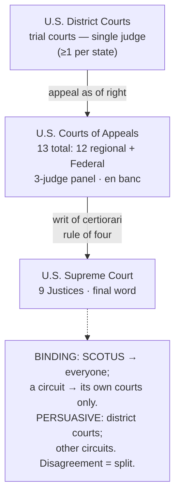

Every doctrine page in this wiki weights authority the same way: **SCOTUS binding, circuits persuasive (flag the splits), state cases illustrative only.** That hierarchy is not a house preference — it is how the federal judiciary actually works. This page is the reference that explains *why* a Ninth Circuit case binds in San Francisco but not in Dallas, why a district-court opinion settles nothing, and why a "circuit split" is a signal rather than a rule. Read it once, then lean on it whenever you decide how much a case is worth.

## The three-tier hierarchy

Federal cases climb one ladder with three rungs:

- **U.S. District Courts — the trial courts.** This is where federal cases *start* — criminal prosecutions and civil suits alike, with trials, evidentiary hearings, and (critically for this course) **suppression motions**. There is **at least one district in every state** (larger states have several), plus the territories and D.C. A case is normally heard by a **single district judge**; a handful of matters by statute go to a **three-judge district panel**.
- **U.S. Courts of Appeals — the circuits.** The intermediate appellate level. A losing party in district court generally has **one appeal as of right** to the court of appeals for that region. Appeals are normally heard by a **three-judge panel**; the most significant cases can be reheard **en banc** (the full active bench of the circuit), which can overrule the panel.
- **U.S. Supreme Court — the top.** One court, sitting over all of them, with the final word on federal law and the Constitution.

**How many courts of appeals?** There are **13**, and the count trips people up:

- **12 *regional* circuits** hear appeals from the district courts in their geographic area: the **11 numbered circuits (1st–11th)** plus the **D.C. Circuit**. *(The class-notes "12 circuits" is this regional count.)*
- **1 Federal Circuit**, which is **subject-matter**, not geographic — it hears specialized appeals nationwide (e.g., patents, certain claims against the United States), not the run of criminal and Fourth Amendment appeals.

For suppression work, the circuit you care about is the **regional** one over the district where the case sits.

## Binding vs. persuasive: stare decisis

*Stare decisis* — "to stand by things decided" — is the rule that courts follow prior decisions. It runs in two directions, and getting them straight is the whole game.

**Vertical stare decisis (up the ladder).** A court is bound by the courts *above it in its own line*:

- District courts are bound by **their circuit** and by **SCOTUS**.
- A circuit's panels are bound by **SCOTUS**.
- **SCOTUS binds everyone** on a question of federal law — every federal court and, on federal questions, every state court too.

**Horizontal stare decisis (a court respecting itself).** A court generally follows its *own* prior published decisions. A **circuit panel is bound by earlier published panel decisions of that same circuit** — one panel cannot overrule another. Only the **full court en banc**, or **SCOTUS**, can change settled circuit law.

From those two rules, four operational facts follow:

- **District-court decisions are *not* binding precedent.** A district opinion is **persuasive only** — even on the same judge, and certainly on other judges. Never teach a search from a lone district-court ruling as if it were the rule.
- **Circuit precedent binds only *within that circuit*.** A Fifth Circuit holding is law in the Fifth Circuit and **merely persuasive** in the Ninth. This is exactly why this course refuses to anchor a multi-jurisdiction point to one circuit.
- **When circuits disagree, that is a *circuit split*.** The same federal question, answered differently in different circuits — which means the governing rule literally depends on where you stand until SCOTUS resolves it. A split is a **classic cert vehicle**, not settled law.
- **State courts are bound by SCOTUS on federal law — but *not* by the federal circuit for their region.** A state court in California must follow SCOTUS on the Fourth Amendment, but it is **not bound by the Ninth Circuit**; only SCOTUS binds it on federal questions. Keep federal and state straight: the regional circuit binds the *federal* courts in its territory, not the *state* courts there.

## The Supreme Court

**Composition.** The Court today has **9 Justices**: one **Chief Justice** and **eight Associate Justices**. The **Constitution mentions only the Chief Justice** (Art. I references the Chief Justice presiding over an impeachment trial of the President); it does **not** fix the Court's size. **Congress sets the number of Associate Justices** by statute — the number has ranged from **6 to 10** over the nation's history and has been **fixed at 9 since 1869**. *(John Roberts is, by the usual count, the 17th Chief Justice — a historical tally, not a count of sitting seats.)*

**Appointment and tenure.** Justices are **nominated by the President** and **confirmed by the Senate**. Under **Article III**, they hold office "during good Behaviour" — in practice, **lifetime tenure** absent resignation, retirement, or impeachment.

**Authority — judicial review.** SCOTUS has the **ultimate authority to say what federal law and the Constitution mean.** That power, *judicial review*, was established in *Marbury v. Madison*, 5 U.S. (1 Cranch) 137 (1803):

> "It is emphatically the province and duty of the judicial department to say what the law is. Those who apply the rule to particular cases, must of necessity expound and interpret that rule. If two laws conflict with each other, the courts must decide on the operation of each."
>
> — *Marbury*, 5 U.S. (1 Cranch) at 177.

When SCOTUS interprets the Fourth Amendment, that interpretation is the binding federal floor — the spine of every doctrine page here.

**How a case reaches the Court.** Almost entirely by the Court's *choice*:

- **Writ of certiorari (the main road).** A party who lost below petitions the Court to hear the case. Review is **discretionary** — the Court grants only a small fraction. In a typical term it receives **several thousand petitions** (commonly **5,000–7,000**) and grants plenary review in only about **60–80** of them — roughly **1%**. Grant is governed by the **"rule of four"**: it takes **four of the nine Justices** voting to grant for a case to be heard. *(Resolving a circuit split is one of the most common reasons the Court grants.)*
- **Original jurisdiction (rare).** A narrow set of cases — chiefly disputes *between states* — may be filed directly in the Supreme Court.
- **Certified questions (very rare).** A court of appeals may formally certify a question of law to the Court.

Because review is discretionary, a **denial of certiorari is not a ruling on the merits** — it leaves the lower court's decision standing **without endorsing it** (see Common pitfalls).

## Key cases

| Case | Holding | Weight | CourtListener |
| --- | --- | --- | --- |
| *Marbury v. Madison*, 5 U.S. (1 Cranch) 137 (1803) | Establishes **judicial review** — it is the province and duty of the judiciary to say what the law is, and a law repugnant to the Constitution is void. | SCOTUS — binding | [link](https://www.courtlistener.com/opinion/84759/marbury-v-madison/) |

## Common pitfalls

- **Citing a district-court decision as if it were binding.** District opinions are persuasive only. One ruling — however well-reasoned — does not make a rule.
- **Citing an out-of-circuit case as binding.** A sister circuit's holding is persuasive, not controlling. Confirm the case is from *your* circuit (or SCOTUS) before you teach a search from it.
- **Treating a circuit split as settled law.** If the circuits disagree, there *is* no single federal answer yet — flag the split and say so, don't pick a side and present it as the rule.
- **Assuming a state court must follow its regional circuit on federal questions.** It must follow **SCOTUS**, not the geographic court of appeals. Mixing this up blurs federal and state authority.
- **Reading "cert denied" as an affirmance.** A denial of certiorari decides nothing on the merits and sets no precedent — it just means the lower court's decision stands. Don't cite it as Supreme Court approval.

## Visual

## Flashcards

- What are the three tiers of the federal court system, bottom to top?::U.S. District Courts (trial) → U.S. Courts of Appeals (circuits) → U.S. Supreme Court.
- How many U.S. courts of appeals are there, and what makes up the count?::13 — the 11 numbered circuits + the D.C. Circuit (the 12 regional circuits) + the Federal Circuit (subject-matter jurisdiction).
- Vertical vs. horizontal stare decisis?::Vertical = a court is bound by the courts above it in its line (districts bound by their circuit and SCOTUS; everyone bound by SCOTUS). Horizontal = a court follows its own prior published decisions (a circuit panel is bound by earlier panels until overruled en banc or by SCOTUS).
- Is a U.S. District Court decision binding precedent?::No — district-court decisions are persuasive only, never binding.
- Does a circuit's precedent bind another circuit?::No — circuit precedent binds only within that circuit; in another circuit it is merely persuasive. Disagreement between circuits is a circuit split.
- Must a state court follow the federal court of appeals for its region on a federal question?::No — state courts are bound by SCOTUS on federal law, but not by their regional circuit. Only SCOTUS binds them federally.
- What is the "rule of four"?::Four of the nine Justices must vote to grant certiorari for the Supreme Court to hear a case.
- Roughly how selective is certiorari?::The Court receives several thousand petitions a term (commonly ~5,000–7,000) and grants plenary review in only about 60–80 — roughly 1%. Review is discretionary.
- Does "cert denied" mean the Supreme Court agreed with the lower court?::No — denial of certiorari decides nothing on the merits and sets no precedent; it just leaves the lower court's decision standing.
- Who sets the number of Justices, and what does the Constitution fix?::Congress sets the number of Associate Justices by statute (ranged 6–10; fixed at 9 since 1869). The Constitution mentions only the Chief Justice and does not fix the Court's size.
- What did *Marbury v. Madison* (1803) establish?::Judicial review — it is "the province and duty of the judicial department to say what the law is," and a law repugnant to the Constitution is void. SCOTUS has the final word on the meaning of federal law and the Constitution.

## Sources

Case authority (verified on CourtListener):

- *Marbury v. Madison*, 5 U.S. (1 Cranch) 137 (1803) — [CourtListener](https://www.courtlistener.com/opinion/84759/marbury-v-madison/)

Civic / structural references (official, for the court-system facts — not case authority):

- [The U.S. Courts — Court Role and Structure (uscourts.gov)](https://www.uscourts.gov/about-federal-courts/court-role-and-structure)
- [Supreme Court of the United States — About the Court (supremecourt.gov)](https://www.supremecourt.gov/about/about.aspx)
- [Supreme Court — The Justices' Caseload (supremecourt.gov)](https://www.supremecourt.gov/about/justicecaseload.aspx)
