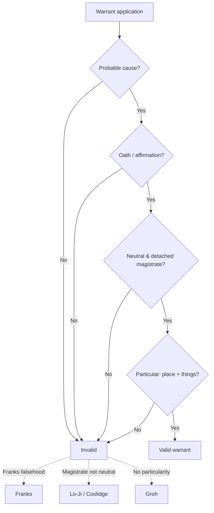

# The Warrant Requirement

## Rule

A valid Fourth Amendment warrant has four parts: **probable cause**, supported by **oath or affirmation**, presented to a **neutral and detached magistrate**, and **particularly describing the place to be searched and the persons or things to be seized.** The Constitution's protection lies in requiring "that those inferences be drawn by a neutral and detached magistrate instead of being judged by the officer engaged in the often competitive enterprise of ferreting out crime." *Johnson v. United States*, 333 U.S. at 13-14. A warrant fails when any element collapses — a falsehood corrupts the probable-cause showing (*Franks*), the magistrate abandons neutrality (*Lo-Ji*, *Coolidge*), or the description is open-ended or absent (*Groh*).

## Key cases

| Case | Holding (one line) | Weight | CourtListener |
| --- | --- | --- | --- |
| *Johnson v. United States*, 333 U.S. 10 (1948) | Probable-cause inferences must be drawn by a neutral magistrate, not the officer hunting for crime. | SCOTUS — binding | [opinion](https://www.courtlistener.com/opinion/104504/johnson-v-united-states/) |
| *Illinois v. Gates*, 462 U.S. 213 (1983) | The magistrate weighs the **totality of the circumstances** for a fair probability of crime; veracity and basis of knowledge are factors, not separate hurdles. | SCOTUS — binding | [opinion](https://www.courtlistener.com/opinion/110959/illinois-v-gates/) |
| *Franks v. Delaware*, 438 U.S. 154 (1978) | A warrant may be voided where a knowing/reckless material falsehood in the affidavit is necessary to probable cause. | SCOTUS — binding | [opinion](https://www.courtlistener.com/opinion/109925/franks-v-delaware/) |
| *Maryland v. Garrison*, 480 U.S. 79 (1987) | Validity is judged on what officers reasonably knew when they sought the warrant; a reasonable mistake about the premises does not invalidate it. | SCOTUS — binding | [opinion](https://www.courtlistener.com/opinion/111823/maryland-v-garrison/) |
| *Groh v. Ramirez*, 540 U.S. 551 (2004) | A warrant that utterly fails to describe the things to be seized is **facially invalid**, even if the affidavit is particular. | SCOTUS — binding | [opinion](https://www.courtlistener.com/opinion/131161/groh-v-ramirez/) |
| *Andresen v. Maryland*, 427 U.S. 463 (1976) | A particularized warrant for business records, and their use in evidence, does **not** violate the Fifth Amendment — the accused is not compelled. | SCOTUS — binding | [opinion](https://www.courtlistener.com/opinion/109522/andresen-v-maryland/) |
| *Wilson v. Arkansas*, 514 U.S. 927 (1995) | **Knock-and-announce** is part of the Fourth Amendment reasonableness inquiry, but yields to countervailing law-enforcement interests. | SCOTUS — binding | [opinion](https://www.courtlistener.com/opinion/117936/wilson-v-arkansas/) |
| *Richards v. Wisconsin*, 520 U.S. 385 (1997) | **No blanket exception** by crime category; a no-knock entry needs **reasonable suspicion** of danger, futility, or destruction of evidence. | SCOTUS — binding | [opinion](https://www.courtlistener.com/opinion/118103/richards-v-wisconsin/) |
| *United States v. Grubbs*, 547 U.S. 90 (2006) | **Anticipatory warrants** are valid where the magistrate finds it now probable the triggering condition will occur and contraband will then be present. | SCOTUS — binding | [opinion](https://www.courtlistener.com/opinion/145670/united-states-v-grubbs/) |
| *Lo-Ji Sales, Inc. v. New York*, 442 U.S. 319 (1979) | An open-ended warrant executed by a magistrate who leads the search is a forbidden general warrant; the search is invalid. | SCOTUS — binding | [opinion](https://www.courtlistener.com/opinion/110100/lo-ji-sales-inc-v-new-york/) |
| *Coolidge v. New Hampshire*, 403 U.S. 443 (1971) | A warrant issued by the State Attorney General — the chief investigator/prosecutor — is invalid because he is not neutral and detached. | SCOTUS — binding | [opinion](https://www.courtlistener.com/opinion/108377/coolidge-v-new-hampshire/) |
| *Hudson v. Michigan*, 547 U.S. 586 (2006) | A knock-and-announce violation does **not** trigger suppression of the evidence found inside. | SCOTUS — binding | [opinion](https://www.courtlistener.com/opinion/145646/hudson-v-michigan/) |
| *United States v. Leon*, 468 U.S. 897 (1984) | A facially-deficient warrant may still be saved by objectively reasonable good-faith reliance — see [[The Exclusionary Rule]]. | SCOTUS — binding | [opinion](https://www.courtlistener.com/opinion/111262/united-states-v-leon/) |

## Nuances & limits

- **Neutral and detached magistrate.** This is the heart of the requirement. *Johnson* puts the inference in judicial hands, not the officer's. The magistrate loses that status by becoming part of the operation — in *Lo-Ji*, the issuing judge "allowed himself to become a member, if not the leader, of the search party ... he was not acting as a judicial officer but as an adjunct law enforcement officer" (442 U.S. at 327) — or by being the prosecutor himself, as the State Attorney General was in *Coolidge*. See [[Probable Cause and Reasonable Suspicion]] for what the magistrate must find.
- **Probable cause is a totality call.** Under *Gates*, the magistrate makes a practical, common-sense judgment of a fair probability of crime; an informant's veracity, reliability, and basis of knowledge inform that judgment but are not rigid, independent tests.
- **Franks challenges.** A defendant who makes a substantial preliminary showing of a knowing/reckless material falsehood gets a hearing; if the falsity is proven by a preponderance and the affidavit's remaining content "is insufficient to establish probable cause, the search warrant must be voided and the fruits of the search excluded" (438 U.S. at 155-156). Franks is also the first hole in *Leon*'s good-faith shield.
- **Particularity / overbreadth.** The warrant itself must describe the things to be seized; a particular affidavit cannot rescue a blank warrant (*Groh*). For business records, a particularized warrant is permissible and raises no Fifth Amendment compulsion problem because nothing is extracted from the accused (*Andresen*, 427 U.S. at 477). Particularity also limits what officers may seize on sight; items not described come in, if at all, under the [[Plain View Doctrine]].
- **Reasonable mistakes about the premises.** *Garrison* judges the warrant on the facts reasonably available when officers applied — a good-faith error (one apartment thought to fill the floor) does not void a search conducted before the mistake became apparent.
- **Knock-and-announce.** Announcement is part of reasonableness (*Wilson*), but there is no categorical drug-case exception (*Richards*) — a no-knock entry needs case-specific **reasonable suspicion** of danger, futility, or evidence destruction. Critically, a knock-and-announce violation does **not** suppress the evidence (*Hudson*); the remedy is civil, not exclusionary. See [[The Exclusionary Rule]].
- **Anticipatory warrants.** Valid under *Grubbs*: the magistrate must find it presently probable both that the triggering condition will occur and that, once it does, the contraband will be at the place to be searched.
- **Once inside the dwelling.** A valid warrant authorizes entry and the search it describes, but securing the premises during execution — detentions, protective sweeps, and evidence freezes — runs on its own reasonableness rules. See [[Securing the Scene]]. For Bluebook form on the cites used here, see [[Legal Research and Case Citations]].

## Common pitfalls

- **Acting as your own magistrate.** Drawing the probable-cause inference yourself, or having the issuing judge ride along on the search, destroys neutrality (*Johnson*; *Lo-Ji*). The reviewing official must be detached from the investigation (*Coolidge*).
- **General or overbroad descriptions.** "All evidence of crime" or a warrant blank as to the things to be seized is facially invalid no matter how detailed the affidavit (*Groh*; *Lo-Ji*). Particularity lives on the face of the warrant.
- **Assuming a knock-and-announce violation suppresses evidence.** It does not (*Hudson*). Officers and instructors routinely overstate the remedy — the entry may be unlawful for civil purposes while the seized evidence stays in.

## Visual

## Flashcards

What four elements does a valid Fourth Amendment warrant require?::Probable cause, oath or affirmation, a neutral and detached magistrate (the *Johnson* principle: inferences drawn by the magistrate, not the officer ferreting out crime), and particularity describing the place and the persons/things to be seized.
*Franks v. Delaware* (1978) — when is a warrant voided?::When a knowing/intentional or reckless material falsehood, necessary to probable cause, is proven by a preponderance and the remaining affidavit is insufficient; the fruits are then excluded.
*Groh v. Ramirez* (2004) — can a particular affidavit save a blank warrant?::No — a warrant that fails to describe the things to be seized is facially invalid even if the affidavit is particular.
*Hudson v. Michigan* (2006) — does a knock-and-announce violation suppress evidence?::No — the exclusionary rule does not apply to knock-and-announce violations.
*United States v. Grubbs* (2006) — what must a magistrate find for an anticipatory warrant?::That it is now probable the triggering condition will occur and that, once it does, contraband will be at the place to be searched.

## Sources

- [Johnson v. United States, 333 U.S. 10 (1948)](https://www.courtlistener.com/opinion/104504/johnson-v-united-states/)
- [Illinois v. Gates, 462 U.S. 213 (1983)](https://www.courtlistener.com/opinion/110959/illinois-v-gates/)
- [Franks v. Delaware, 438 U.S. 154 (1978)](https://www.courtlistener.com/opinion/109925/franks-v-delaware/)
- [Maryland v. Garrison, 480 U.S. 79 (1987)](https://www.courtlistener.com/opinion/111823/maryland-v-garrison/)
- [Groh v. Ramirez, 540 U.S. 551 (2004)](https://www.courtlistener.com/opinion/131161/groh-v-ramirez/)
- [Andresen v. Maryland, 427 U.S. 463 (1976)](https://www.courtlistener.com/opinion/109522/andresen-v-maryland/)
- [Wilson v. Arkansas, 514 U.S. 927 (1995)](https://www.courtlistener.com/opinion/117936/wilson-v-arkansas/)
- [Richards v. Wisconsin, 520 U.S. 385 (1997)](https://www.courtlistener.com/opinion/118103/richards-v-wisconsin/)
- [United States v. Grubbs, 547 U.S. 90 (2006)](https://www.courtlistener.com/opinion/145670/united-states-v-grubbs/)
- [Lo-Ji Sales, Inc. v. New York, 442 U.S. 319 (1979)](https://www.courtlistener.com/opinion/110100/lo-ji-sales-inc-v-new-york/)
- [Coolidge v. New Hampshire, 403 U.S. 443 (1971)](https://www.courtlistener.com/opinion/108377/coolidge-v-new-hampshire/)
- [Hudson v. Michigan, 547 U.S. 586 (2006)](https://www.courtlistener.com/opinion/145646/hudson-v-michigan/)
- [United States v. Leon, 468 U.S. 897 (1984)](https://www.courtlistener.com/opinion/111262/united-states-v-leon/)
