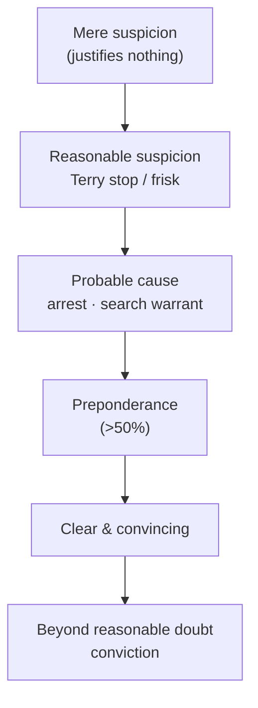

## Rule

Three teaching maxims for building **articulation** — habits of thought, not legal tests. They are heuristics that track how courts actually apply the Fourth Amendment's reasonableness standard; the *law* they rest on is cited and verified below.

1. **The more you articulate *why*, the more likely your action is upheld.** Reasonableness is judged on the **specific, articulable facts** the officer can point to — "the facts available to the officer at the moment of the seizure." *Terry v. Ohio*, 392 U.S. 1, 21–22 (1968). Build the habit with **"Strive for Five"** — name at least five factors for any action (a training device, *not* a five-factor legal requirement) — and state it in the form **opinion first, then "because →" the facts.**
2. **The more serious the crime or circumstance, the more reasonable the action is viewed.** Severity of the offense is an express factor in the objective-reasonableness balance. *Graham v. Connor*, 490 U.S. 386, 396 (1989). The graver and more urgent the situation, the broader the response the Fourth Amendment will tolerate — which is why true emergencies justify warrantless home entry.
3. **The Fourth Amendment deals in PROBABILITIES, not POSSIBILITIES.** "In dealing with probable cause … we deal with probabilities." *Brinegar v. United States*, 338 U.S. 160, 175 (1949). Probable cause is "a fluid concept — turning on the assessment of **probabilities** in particular factual contexts." *Illinois v. Gates*, 462 U.S. 213, 232 (1983). A bare *possibility* is not enough; the standard is a hierarchy of probabilities (the **burden-of-proof ladder**, below).

## Key cases

| Case (Bluebook) | Holding in one line | Weight | CourtListener |
|---|---|---|---|
| *Graham v. Connor*, 490 U.S. 386 (1989) | Seizure reasonableness is judged by an **objective** standard from the officer's on-scene perspective; **"the severity of the crime at issue"** is an express factor. | SCOTUS — binding | [link](https://www.courtlistener.com/opinion/112257/graham-v-connor/) |
| *Brinegar v. United States*, 338 U.S. 160 (1949) | Probable cause "deal[s] with probabilities … the factual and practical considerations of everyday life on which reasonable and prudent men … act." | SCOTUS — binding | [link](https://www.courtlistener.com/opinion/104716/brinegar-v-united-states/) |
| *Illinois v. Gates*, 462 U.S. 213 (1983) | Probable cause is "a fluid concept — turning on the assessment of **probabilities** in particular factual contexts"; adopts the **totality-of-the-circumstances** test. | SCOTUS — binding | [link](https://www.courtlistener.com/opinion/110959/illinois-v-gates/) |
| *Maryland v. Buie*, 494 U.S. 325 (1990) | A **protective sweep** requires "articulable facts" warranting a reasonable belief a dangerous person may be present; it is **not automatic**. | SCOTUS — binding | [link](https://www.courtlistener.com/opinion/112384/maryland-v-buie/) |
| *Gaetjens v. Winnebago County*, 4 F.4th 487 (7th Cir. 2021) | **Emergency-aid** exigency: a warrantless home entry is lawful on an **objectively reasonable basis** to believe someone inside needs immediate help. | Circuit — persuasive | [link](https://www.courtlistener.com/opinion/4899427/sally-gaetjens-v-winnebago-county-illinois/) |

## Nuances & limits

- **Rule 1 — articulation is the whole game.** Courts test the **facts the officer can name**, not the hunch. The *Terry* standard asks whether "the facts available to the officer at the moment of the seizure or the search 'warrant a man of reasonable caution in the belief' that the action taken was appropriate." *Terry*, 392 U.S. at 21–22. "Strive for Five" and "opinion, then *because →* facts" are **articulation drills**, not legal thresholds — there is no magic number of factors; one decisive fact can suffice and ten weak ones may not. The point is to make the officer surface the reasons *contemporaneously*, because that is exactly what a suppression court reconstructs.
- **Rule 2 — seriousness widens the lens, it does not remove the requirement.** *Graham* directs courts to judge force "from the perspective of a reasonable officer on the scene," weighing "the severity of the crime at issue, whether the suspect poses an immediate threat … and whether he is actively resisting." *Graham*, 490 U.S. at 396. The same logic runs through exigency: the graver and more urgent the threat to life, the more a warrantless entry is tolerated.
  > In an "emergency-aid" situation, officials may enter a home without a warrant "to 'render assistance or prevent harm to persons or property within'"; the entry is lawful where the officer had "an objectively reasonable basis for believing that [the occupant] was experiencing a medical emergency that required immediate action." — *Gaetjens*, 4 F.4th at 493–94 *(7th Cir. — persuasive)*.

  Seriousness/urgency is a **multiplier on reasonableness, not a bypass.** The officer still needs an objectively reasonable basis **and** a nexus between the emergency and the place entered — and the entry's **scope is limited to the emergency**. Once the protective purpose is satisfied, the justification ends.
- **Rule 3 — probabilities, on a sliding scale.** The Fourth Amendment never demands certainty, but it demands more than a hunch. The burdens stack: **mere suspicion** (not enough for anything) → **reasonable suspicion** (a brief *Terry* stop/frisk) → **probable cause** (arrest, search warrant) → **preponderance** → **clear and convincing** → **beyond a reasonable doubt** (conviction). *Gates* fixed probable cause as a **totality-of-the-circumstances** probability judgment, 462 U.S. at 230–32; *Brinegar* grounded it in "the factual and practical considerations of everyday life," 338 U.S. at 175. Translate every action up that ladder: *which* rung does this fact pattern reach, and is the action it authorizes on the same rung?
- **Protective sweeps test all three rules at once.** *Buie* is the controlling federal rule: officers may, incident to an in-home arrest, look in spaces immediately adjoining the place of arrest as a precaution, but a sweep **beyond** that requires "articulable facts which, taken together with the rational inferences from those facts, would warrant a reasonably prudent officer in believing that the area to be swept harbors an individual posing a danger to those on the arrest scene." *Buie*, 494 U.S. at 334. Critically, a sweep "is decidedly not 'automati[c],'" but is justified "only when … a reasonable, articulable suspicion that the house is harboring a person posing a danger." *Buie*, 494 U.S. at 336. That is Rule 1 (articulate the danger), Rule 2 (a real safety threat), and Rule 3 (a probability of danger, not a bare possibility) in a single doctrine.
  - **State applications are illustrative only.** State courts routinely apply *Buie* — striking sweeps run as a matter of routine and upholding those grounded in specific, articulable facts of danger. Such decisions are persuasive illustrations, never the rule: the controlling federal authority is *Maryland v. Buie*, 494 U.S. at 334, 336. *(state — illustrative, non-binding)*

## Common pitfalls

- **Articulating after the fact.** Reasonableness is judged on the facts **known at the moment** of the action (*Terry*, 392 U.S. at 21–22). Reasons invented for the report — or for the stand — are worth little. "Strive for Five" is meant to force the articulation in real time, not to manufacture a count later.
- **Treating "Strive for Five" as a legal rule.** There is no five-factor requirement anywhere in Fourth Amendment law. It is a habit. Don't teach it as an element; don't let officers think four factors fails and five passes.
- **Letting "serious crime" do all the work.** Severity is *a* factor (*Graham*), not a warrant exception. A grave offense does not by itself authorize a sweep, an entry, or prolonged detention without the facts that the specific exception requires.
- **Routine protective sweeps.** A sweep "as a matter of course" is unlawful — *Buie* requires articulable facts of danger and is "not 'automati[c].'" 494 U.S. at 336. The scope is "a cursory inspection of those spaces where a person may be found" and lasts no longer than needed to dispel the danger. *Buie*, 494 U.S. at 335–36.
- **Confusing possibility with probability.** "Someone *could* be inside," "drugs *might* be there" — that is the language of *possibility*. The Fourth Amendment runs on **probability** (*Brinegar*; *Gates*). Push every justification onto the burden ladder and name the rung.
- **Exceeding the scope of an exigency.** An emergency justifies entry **for the emergency** — and no further. Stay inside the nexus and purpose that justified going in; evidence gathered after the protective/aid purpose is satisfied risks suppression as exceeding the exception's scope.

## Visual

## Flashcards

- What does Golden Rule #1 say, and what is "Strive for Five"?::The more you articulate *why*, the more likely the action is upheld; reasonableness turns on articulable facts (*Terry*, 392 U.S. at 21–22). "Strive for Five" = a habit of naming ≥5 factors — a training device, not a legal requirement.
- How does crime seriousness affect reasonableness (Rule #2)?::It is an express factor in the objective balance — "the severity of the crime at issue" (*Graham*, 490 U.S. at 396). Greater seriousness/urgency widens what's reasonable (e.g., emergency-aid entry), but never removes the need for articulable facts.
- Probabilities vs. possibilities — what's the rule and the authority?::The Fourth Amendment deals in **probabilities**, not possibilities. *Brinegar* (338 U.S. at 175) and *Gates* (462 U.S. at 232: probable cause is "a fluid concept — turning on the assessment of probabilities").
- Name the burden-of-proof ladder.::Mere suspicion → reasonable suspicion → probable cause → preponderance → clear and convincing → beyond a reasonable doubt.
- What does a protective sweep require under *Buie*?::Articulable facts warranting a reasonable belief the area harbors a person dangerous to those on scene (*Buie*, 494 U.S. at 334); it is **not automatic** and routine sweeps are unlawful (494 U.S. at 336).

## Sources

- *Graham v. Connor*, 490 U.S. 386 (1989) — https://www.courtlistener.com/opinion/112257/graham-v-connor/
- *Terry v. Ohio*, 392 U.S. 1 (1968) — https://www.courtlistener.com/opinion/107729/terry-v-ohio/
- *Brinegar v. United States*, 338 U.S. 160 (1949) — https://www.courtlistener.com/opinion/104716/brinegar-v-united-states/
- *Illinois v. Gates*, 462 U.S. 213 (1983) — https://www.courtlistener.com/opinion/110959/illinois-v-gates/
- *Maryland v. Buie*, 494 U.S. 325 (1990) — https://www.courtlistener.com/opinion/112384/maryland-v-buie/
- *Gaetjens v. Winnebago County*, 4 F.4th 487 (7th Cir. 2021) — https://www.courtlistener.com/opinion/4899427/sally-gaetjens-v-winnebago-county-illinois/
