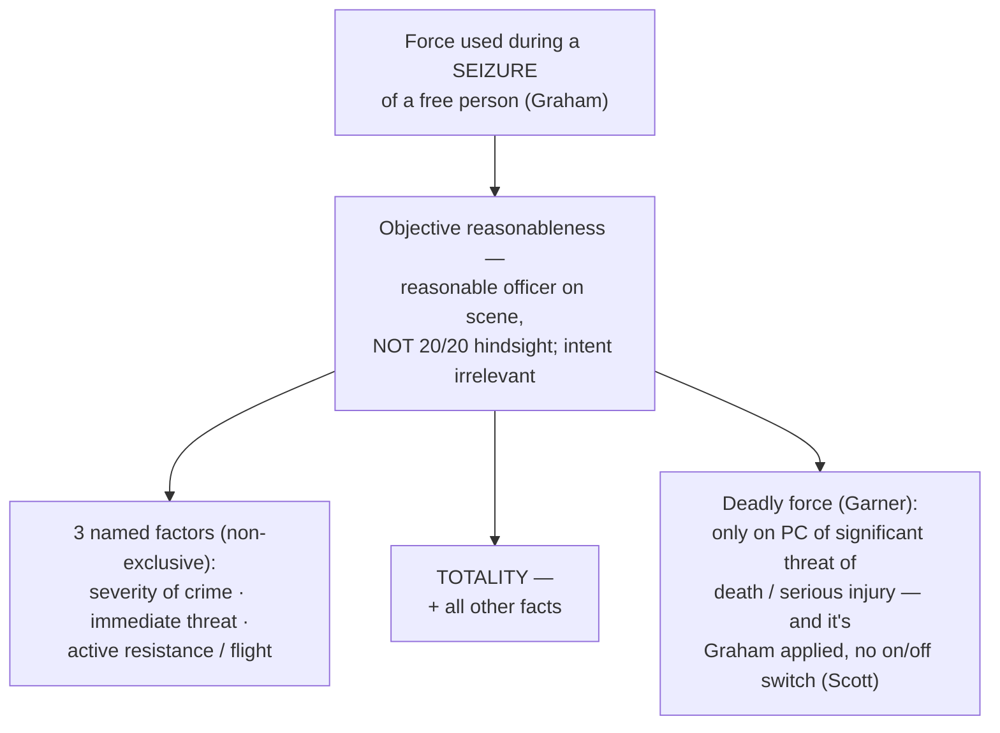

## Rule
Using force to make an arrest, an investigatory stop, or any other **seizure of a free person** is itself a Fourth Amendment event, so the force is measured by the Amendment's **objective-reasonableness** standard — not by substantive due process. *Graham v. Connor*, 490 U.S. 386, 395 (1989) (all excessive-force claims arising "in the course of an arrest, investigatory stop, or other 'seizure' of a free citizen should be analyzed under the Fourth Amendment and its 'reasonableness' standard"). Reasonableness is gauged "from the perspective of a reasonable officer on the scene, rather than with the 20/20 vision of hindsight," and it turns on the totality of the facts — guided, but not limited, by three named factors. *Graham*, 490 U.S. at 396. The inquiry is purely objective: "whether the officers' actions are 'objectively reasonable' in light of the facts and circumstances confronting them, without regard to their underlying intent or motivation." *Id.* at 397. (*Graham* itself is a civil suit under 42 U.S.C. § 1983, but it supplies the governing Fourth Amendment force standard; whether an officer is personally liable is a separate question — qualified immunity — that this suppression-focused page does not pursue.)

## Key cases
| Case (Bluebook) | Holding in one line | Weight | CourtListener |
|---|---|---|---|
| *Graham v. Connor*, 490 U.S. 386 (1989) | Excessive force used during any "seizure" of a free person is judged under the Fourth Amendment's **objective-reasonableness** standard (from the on-scene officer's perspective, no hindsight, no regard to intent), not substantive due process. | SCOTUS — binding | [link](https://www.courtlistener.com/opinion/112257/graham-v-connor/) |
| *Tennessee v. Garner*, 471 U.S. 1 (1985) | Deadly force against an apparently unarmed, non-dangerous fleeing suspect is an **unreasonable seizure**; deadly force needs probable cause to believe the suspect poses a significant threat of death or serious physical injury. | SCOTUS — binding | [link](https://www.courtlistener.com/opinion/111397/tennessee-v-garner/) |
| *Scott v. Harris*, 550 U.S. 372 (2007) | *Garner* is not a rigid separate test but "simply an application" of *Graham* reasonableness — there is no "magical on/off switch"; ramming a fleeing motorist who endangered the public was reasonable. | SCOTUS — binding | [link](https://www.courtlistener.com/opinion/145738/scott-v-harris/) |

## Related cases across doctrines
These cases are treated in full on other pages but bear directly on the use-of-force / objective-reasonableness inquiry, framed here for that doctrine.

| Case | Relevance to use of force (objective reasonableness) | Primary treatment | CourtListener |
|---|---|---|---|
| *Wright v. City of Euclid*, 962 F.3d 852 (6th Cir. 2020) | Applies *Graham* objective-reasonableness to deny qualified immunity: tasing, macing, and dragging a cooperative, seated suspect during a stop was excessive on the totality — a worked circuit example of the *Graham* factors (low offense severity, no immediate threat, no active resistance) cutting against the force used. (6th Cir. — persuasive, not binding.) | [[Section 1983 Liability and Qualified Immunity]] | [opinion](https://www.courtlistener.com/opinion/4762133/lamar-wright-v-city-of-euclid/) |

## Nuances & limits
- **The three named factors — "plus everything else."** Reasonableness "requires careful attention to the facts and circumstances of each particular case, including the severity of the crime at issue, whether the suspect poses an immediate threat to the safety of the officers or others, and whether he is actively resisting arrest or attempting to evade arrest by flight." *Graham*, 490 U.S. at 396. These three are **non-exclusive** — the word is "including." Force is judged on the **totality of the circumstances**, so the named factors are the starting point, not a closed checklist. This is exactly where the articulation habit pays off: name every fact that made the force reasonable, the way [[Three Golden Rules]] (Strive for Five) trains you to.
- **On-scene perspective, not hindsight.** "The 'reasonableness' of a particular use of force must be judged from the perspective of a reasonable officer on the scene, rather than with the 20/20 vision of hindsight." *Graham*, 490 U.S. at 396.
- **Allowance for split-second judgments.** "The calculus of reasonableness must embody allowance for the fact that police officers are often forced to make split-second judgments — in circumstances that are tense, uncertain, and rapidly evolving — about the amount of force that is necessary in a particular situation." *Graham*, 490 U.S. at 396–97.
- **Objective only — intent is irrelevant.** "An officer's evil intentions will not make a Fourth Amendment violation out of an objectively reasonable use of force; nor will an officer's good intentions make an objectively unreasonable use of force constitutional." *Graham*, 490 U.S. at 397.
- **Deadly force is the same standard at its sharpest.** "[A]pprehension by the use of deadly force is a seizure subject to the reasonableness requirement of the Fourth Amendment." *Garner*, 471 U.S. at 7. Deadly force on a fleeing suspect "may not be used unless it is necessary to prevent the escape and the officer has probable cause to believe that the suspect poses a significant threat of death or serious physical injury to the officer or others." *Garner*, 471 U.S. at 3, 11.
- **Garner is not a rigid precondition — it is Graham applied.** "*Garner* did not establish a magical on/off switch that triggers rigid preconditions whenever an officer's actions constitute 'deadly force.' *Garner* was simply an application of the Fourth Amendment's 'reasonableness' test … to the use of a particular type of force." *Scott v. Harris*, 550 U.S. at 382. So *Garner*'s factors inform reasonableness; they are not a separate two-prong gate. Where a fleeing motorist's reckless flight endangered the public, the Court "had little difficulty in concluding it was reasonable for [the officer] to take the action that he did" — ramming the fleeing car off the road. *Scott*, 550 U.S. at 386.

## Common pitfalls
- **Treating the three factors as a closed test.** *Graham* says "including" — they are illustrative. Judging force only against severity / threat / resistance and ignoring the rest of the scene misstates the standard. It is the totality.
- **Judging with hindsight.** Asking "what could the officer have done differently with time to reflect" inverts *Graham*. The question is what a reasonable officer on the scene perceived in a tense, rapidly evolving moment.
- **Smuggling in intent.** A "good faith" defense or a "malicious/sadistic" attack both miss the mark — *Graham* rejected the *Johnson v. Glick* good-faith test; reasonableness is objective.
- **Reading *Garner* as a rigid two-part precondition for any deadly force.** *Scott* corrects this: there is no on/off switch. *Garner* is *Graham* reasonableness applied to a fleeing, non-dangerous suspect; a dangerous fleeing suspect (e.g., a reckless high-speed driver) is a different totality.
- **Confusing the standard with liability.** *Graham* fixes the constitutional force standard; qualified immunity and § 1983 damages are separate civil questions and do not change what the Fourth Amendment requires.

## Visual

## Recent developments & subsequent treatment
The Supreme Court has recently sharpened how the *Graham* reasonableness inquiry is framed, rejecting attempts to compress it into a single instant and reaffirming that force is judged on the full totality of the circumstances over time.
- **Barnes v. Felix (SCOTUS 2025)** — A unanimous Court (Kagan, J.) rejects the Fifth Circuit's "moment of threat" rule and **vacated and remanded**; it did not itself decide whether Felix's use of force was reasonable. The reasonableness of force used to effect a seizure is judged on the totality of the circumstances, an inquiry that "has no time limit" and may consider the events leading up to the use of force, not just the isolated instant of danger. ⚖ Circuit split (resolved: 5th Cir.'s moment-of-threat approach vs. other circuits' totality view). "Most notable here, the 'totality of the circumstances' inquiry into a use of force has no time limit." 605 U.S. at 80. [opinion](https://www.courtlistener.com/opinion/10584846/barnes-v-felix/).

## Sources
- *Graham v. Connor*, 490 U.S. 386 (1989) — https://www.courtlistener.com/opinion/112257/graham-v-connor/
- *Tennessee v. Garner*, 471 U.S. 1 (1985) — https://www.courtlistener.com/opinion/111397/tennessee-v-garner/
- *Scott v. Harris*, 550 U.S. 372 (2007) — https://www.courtlistener.com/opinion/145738/scott-v-harris/
